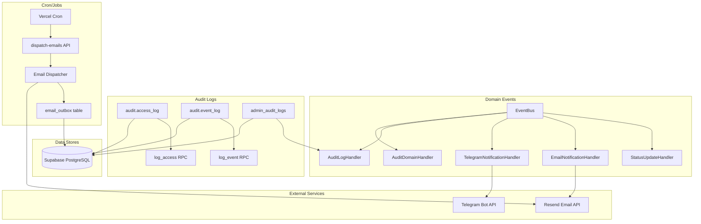
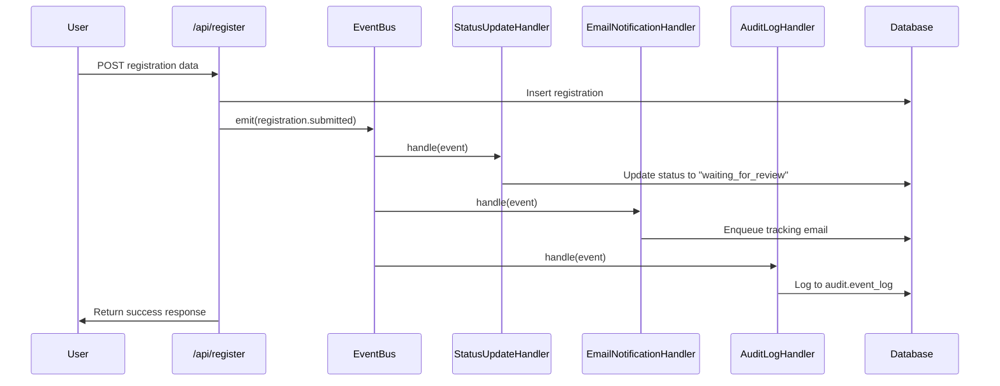
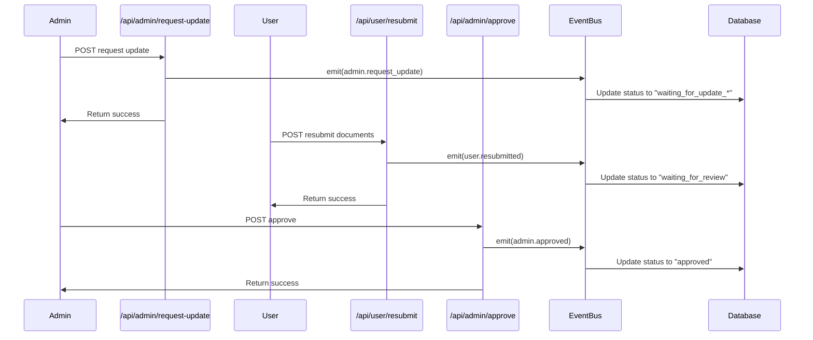

# Core Services Anchor
## Domain Events, Audit Logs, and Cron/Jobs

## Repository Snapshot

- **Branch:** `bugfix/recover-core-services-system`
- **Commit:** `6a59693ded4f8450926655a3ed52beced50c8314`
- **Date:** 2025-08-17T10:32:11Z
- **Key Modules Scanned:**
  - `app/lib/events/` - Domain event system
  - `app/lib/audit/` - Audit logging system
  - `app/api/admin/dispatch-emails/` - Cron job endpoint
  - `app/lib/emails/` - Email dispatch service
  - `supabase/migrations/` - Database schema
  - `migrations/` - Email outbox schema

---

# Core Services — Consolidated Addendum (Code-Driven)

The YEC Registration platform orchestrates user registrations through a robust domain event system that ensures data consistency, auditability, and reliable email notifications. Domain events (e.g., `registration.submitted`, `admin.approved`) trigger cascading side-effects: status updates in the database, email notifications via Resend API, audit logging for compliance, and Telegram notifications for real-time alerts. The system enforces strict environment routing (staging vs production), centralized email configuration with DRY-RUN protection, and server-only file uploads with signed URL access for private content. All operations are idempotent, authenticated via `CRON_SECRET`, and validated through comprehensive E2E tests.

**Repository State**: `bugfix/recover-core-services-system` branch, commit `da1752728cedeea3859e96b369b4707ad4ecbbe3`, 2025-08-17T15:57:56Z UTC

**Module Scan**: `app/lib/env-guards.ts`, `app/lib/config.ts`, `app/lib/events/`, `app/lib/emails/`, `app/lib/uploadFileToSupabase.ts`, `app/api/health/route.ts`, `app/api/admin/dispatch-emails/route.ts`, `app/api/get-signed-url/route.ts`, `pre-cicd-check.sh`

---

## Environment & DB Routing

The platform enforces strict database routing invariants to prevent accidental localhost connections in non-localdev environments. Local/CI/Vercel Preview **must** use the staging Supabase project, while production uses the production project. Local Supabase (127.0.0.1/localhost) is allowed only when `SUPABASE_ENV=localdev`. The app fails fast at boot if these rules are violated.

### Guard Implementation

**Core Guard Functions** (`app/lib/env-guards.ts:L10-L21`):
```typescript
export function assertDbRouting() {
  const url = (process.env.SUPABASE_URL ?? '').trim();
  const envTag = (process.env.SUPABASE_ENV ?? 'staging').toLowerCase();
  const isLocal = /^https?:\/\/(127\.0\.0\.1|localhost)/i.test(url);

  if (envTag !== 'localdev' && isLocal) {
    throw new Error(
      `[DB_ROUTING] Refused to start: SUPABASE_URL=${url} with SUPABASE_ENV=${envTag}. ` +
      `Local Supabase is only allowed when SUPABASE_ENV=localdev.`
    );
  }
}
```

**Host Logging** (`app/lib/env-guards.ts:L26-L28`):
```typescript
export function dbHostForLog(url = process.env.SUPABASE_URL ?? '') {
  try { return new URL(url).host; } catch { return url; }
}
```

### Supabase Client Guard Integration

The guard is called in all Supabase client initialization points:

- **Server Clients** (`app/lib/supabase-server.ts:L8-L15`): Module load validation + `assertDbRouting()` in `getServerSupabase()`, `getMiddlewareSupabase()`, `getSupabaseServiceClient()`, `getServiceRoleClient()`
- **Client Clients** (`app/lib/supabase.ts:L8-L15`): Module load validation + `assertDbRouting()` in `getSupabaseClient()`, `getSupabaseServiceClient()`
- **Auth Utilities** (`app/lib/auth-utils.server.ts:L31-L35`): `assertDbRouting()` in `getSupabaseClient()`
- **Audit Client** (`app/lib/supabaseAdminAudit.ts:L11-L13`): `assertDbRouting()` in `getSupabaseAdminAudit()`
- **Admin API** (`app/api/admin/registrations/route.ts:L6-L7`): Module load `assertDbRouting()`
- **Test Helpers** (`tests/e2e/helpers/supabaseTestClient.ts:L18-L20`): `assertDbRouting()` in constructor

### Environment Routing Matrix

| Environment | `SUPABASE_ENV` | URL Host | Allowed? |
|-------------|----------------|----------|----------|
| Local/CI/Preview | `staging` | `*.supabase.co` | ✅ |
| Local DB (opt-in) | `localdev` | `127.0.0.1` or `localhost` | ✅ |
| Production | `production` | `*.supabase.co` | ✅ |
| Any non-localdev + localhost | ≠ `localdev` | `127.0.0.1`/`localhost` | ❌ fail-fast |

### Health Endpoint Integration

**Health Response** (`app/api/health/route.ts:L8-L25`):
```json
{
  "status": "healthy",
  "database": {
    "env": "staging",
    "host": "nuxahfrelvfvsmhzvxqm.supabase.co",
    "routing": "valid"
  }
}
```

**Validation Logic** (`app/api/health/route.ts:L6-L7`): Calls `assertDbRouting()` and `dbHostForLog()` to validate and report routing status.

### Pre-CI/CD Validation

**Shell Validation** (`pre-cicd-check.sh:L58-L68`):
```bash
if [[ "$ENV_FLAVOR" != "localdev" ]]; then
  if [[ "$SUPABASE_URL" =~ ^(http://)?(127\.0\.0\.1|localhost) ]]; then
    fail "Invalid DB routing: SUPABASE_URL points to localhost while SUPABASE_ENV=$ENV_FLAVOR"
  fi
fi
```

---

## Email Dispatch Policy (Core-adjacent)

The platform implements centralized email configuration with strict DRY-RUN protection and production validation. All email domains are externalized through configuration helpers, eliminating hard-coded values throughout the codebase.

**Contract**
- Registration must never fail because of email. Email send is non-blocking; API returns 2xx and includes a dev-only `emailDispatch` hint.
- All absolute links in emails use `getBaseUrl()`; no hard-coded domains or emails in templates/services.

**Safe-Send Gate (non-prod)**
- `EMAIL_MODE`: `DRY_RUN` (default in local/CI/preview) or `FULL` (explicit opt-in).
- `EMAIL_ALLOWLIST`: comma patterns (e.g. `*@gmail.com,me@domain.tld`). In non-prod + `FULL`, only allowlisted recipients send; others auto-downgrade to dry-run and audit.

**Required env**
- Local/Staging (safe real send):  
  `EMAIL_MODE=FULL`, `EMAIL_ALLOWLIST=...`, `DISPATCH_DRY_RUN=false`, `RESEND_API_KEY=<staging>`, `EMAIL_FROM="YEC <noreply@yec.in.th>"`
- CI/Preview: `EMAIL_MODE=DRY_RUN`, `DISPATCH_DRY_RUN=true`
- Production: `EMAIL_MODE=FULL`, `DISPATCH_DRY_RUN=false`, `RESEND_API_KEY=<prod>`, `EMAIL_FROM=<verified sender>`

**Provider readiness**
- Sender domain must be verified at provider (SPF/DKIM). If not verified in prod → fail fast at provider init with clear error.

**Admin APIs**
- `POST /api/admin/dispatch-emails?dry_run=true|false` (auth: `CRON_SECRET`)
- `GET /api/admin/email-status` (auth: `CRON_SECRET`) → returns mode, allowlist summary, provider health, outbox counts.

**Outbox/Queue**
- Primary path: enqueue to `email_outbox` (or equivalent) then dispatch.
- No silent mock in staging/preview/prod. If DB unavailable in non-prod, explicit log + metrics; in prod → fail fast.

**Testing**
- Unit: gate logic (FULL/DRY_RUN/allowlist), missing `EMAIL_FROM` in prod throws, dry-run never calls provider.
- E2E: registration → success page, `dispatch-emails` dry_run returns `wouldSend>0`.


### Centralized Configuration

**Email From Address** (`app/lib/config.ts:L69-L82`):
```typescript
export function getEmailFromAddress(): string {
  const from = process.env.EMAIL_FROM;
  const env = process.env.NODE_ENV || 'development';
  
  if (env === 'production') {
    if (!from) {
      throw new Error('EMAIL_FROM is required in production');
    }
    return from; // must be a verified sender on Resend
  }
  
  return from || 'noreply@local.test';
}
```

**Base URL Helper** (`app/lib/config.ts:L88-L90`):
```typescript
export function getBaseUrl(): string {
  return getAppUrl();
}
```

**Configuration Usage**: All email services, providers, transports, and templates use these centralized helpers:
- **Provider** (`app/lib/emails/provider.ts:L27`): `getEmailFromAddress()` in constructor
- **Transport** (`app/lib/emails/transport.ts:L127`): `getEmailFromAddress()` in constructor  
- **Service** (`app/lib/emails/service.ts:L12`): `getBaseUrl()`, `getEmailFromAddress()` imports
- **Enhanced Service** (`app/lib/emails/enhancedEmailService.ts:L16`): `getBaseUrl()`, `getEmailFromAddress()` imports
- **Base Layout** (`app/lib/emails/components/BaseLayout.tsx:L22`): `getEmailFromAddress()` fallback

### Email Modes & DRY-RUN Protection

**Mode Enforcement** (`app/api/admin/dispatch-emails/route.ts:L60-L86`):
```typescript
function isDryRun(req: NextRequest, body?: DispatchBody): boolean {
  const emailMode = process.env.EMAIL_MODE || "DRY_RUN";
  if (emailMode.toUpperCase() === "DRY_RUN") {
    return true;
  }
  if (process.env.DISPATCH_DRY_RUN === "true") {
    return true;
  }
  if (body && body.dryRun === true) {
    return true;
  }
  return false;
}
```

**Transport Configuration** (`app/lib/emails/transport.ts:L453-L471`):
```typescript
export function getEmailTransportConfig() {
  const emailMode = process.env.EMAIL_MODE || "DRY_RUN";
  const allowlist = process.env.EMAIL_ALLOWLIST || "";
  const capMaxPerRun = process.env.EMAIL_CAP_MAX_PER_RUN || "2";
  const blockNonAllowlist = process.env.BLOCK_NON_ALLOWLIST === "true";
  
  return {
    mode: emailMode,
    allowlist: allowlist.split(",").map(email => email.trim()).filter(Boolean),
    capMaxPerRun: parseInt(capMaxPerRun, 10),
    blockNonAllowlist,
    resendConfigured: !!process.env.RESEND_API_KEY,
  };
}
```

### Dispatch Endpoint & Authentication

**Authentication Methods** (`app/api/admin/dispatch-emails/route.ts:L24-L54`):
1. **Authorization Header**: `Bearer <CRON_SECRET>`
2. **Query Parameter**: `?cron_secret=<CRON_SECRET>`
3. **Custom Header**: `x-cron-secret: <CRON_SECRET>`

**Response Schema** (`app/api/admin/dispatch-emails/route.ts:L95-L110`):
```json
{
  "ok": true,
  "dryRun": true,
  "sent": 0,
  "wouldSend": 5,
  "capped": 0,
  "blocked": 0,
  "errors": 0,
  "remaining": 10,
  "rateLimited": 0,
  "retries": 0,
  "timestamp": "2025-08-17T15:57:56Z"
}
```

### Domain Event Email Hooks

**Event Handler** (`app/lib/events/handlers/emailNotificationHandler.ts:L12-L131`):
- `registration.submitted` → `registration.created` template
- `admin.request_update` → `review.request_update` template  
- `admin.approved` → `review.approved` template
- `admin.rejected` → `review.rejected` template

**Enhanced Service Integration** (`app/lib/emails/enhancedEmailService.ts:L17-L26`):
```typescript
export interface EmailSendResult {
  ok: boolean;
  template: string;
  to: string;
  subject: string;
  trackingCode?: string;
  ctaUrl?: string;
  badgeUrl?: string;
  error?: string;
}
```

### Audit & Non-blocking Rule

**Audit Logging** (`app/lib/emails/service.ts:L31-L80`): Each email attempt logged via `logEvent()` with success/failure status.

**Error Isolation** (`app/lib/events/eventBus.ts:L85-L95`): Email errors **must not break** domain event commit - wrapped in try/catch with audit logging.

### Email Environment Matrix

| Variable | Non-prod | Prod | Notes |
|----------|----------|------|-------|
| `EMAIL_MODE` | `DRY_RUN` | `FULL` | enforced in code (`app/api/admin/dispatch-emails/route.ts:L60`) |
| `DISPATCH_DRY_RUN` | `true` | `false` | enforced in endpoint/tests (`app/api/admin/dispatch-emails/route.ts:L65`) |
| `EMAIL_FROM` | optional | **required** | validated in config (`app/lib/config.ts:L75`) / pre-CI (`pre-cicd-check.sh:L75`) |
| `RESEND_API_KEY` | test key | prod key | provider init (`app/lib/emails/provider.ts:L20`) |
| `CRON_SECRET` | test secret | strong prod secret | endpoint auth (`app/api/admin/dispatch-emails/route.ts:L25`) |

---

## Storage / Uploads & Signed URLs

The platform implements server-only file uploads with strict validation and private bucket access via on-demand signed URLs. All uploads go through server-side functions with MIME type and size validation.

### Storage Buckets Configuration

**Bucket Definitions** (`app/lib/storage-bucket-setup.ts:L15-L58`):
```typescript
export const REQUIRED_BUCKETS: StorageBucketConfig[] = [
  {
    name: "profile-images",
    public: false,
    allowedMimeTypes: ["image/jpeg", "image/jpg", "image/png"],
    maxFileSize: 5 * 1024 * 1024, // 5MB
    description: "User profile images - private access only",
  },
  {
    name: "chamber-cards", 
    public: false,
    allowedMimeTypes: ["image/jpeg", "image/jpg", "image/png", "application/pdf"],
    maxFileSize: 10 * 1024 * 1024, // 10MB
    description: "Chamber of Commerce membership cards - private access only",
  },
  {
    name: "payment-slips",
    public: false,
    allowedMimeTypes: ["image/jpeg", "image/jpg", "image/png", "application/pdf"],
    maxFileSize: 10 * 1024 * 1024, // 10MB
    description: "Payment confirmation slips - private access only",
  },
  {
    name: "yec-badges",
    public: true,
    allowedMimeTypes: ["image/png"],
    maxFileSize: 2 * 1024 * 1024, // 2MB
    description: "Generated YEC badges - public access for display",
  },
  {
    name: "yec-assets",
    public: true,
    allowedMimeTypes: ["image/jpeg", "image/jpg", "image/png", "image/svg+xml"],
    maxFileSize: 2 * 1024 * 1024, // 2MB
    description: "YEC brand assets (logos, icons) - public access for email templates",
  },
];
```

### Upload Validation & Processing

**Server-side Upload** (`app/lib/uploadFileToSupabase.ts:L16-L132`):
- **MIME Validation**: Checks against `bucketConfig.allowedMimeTypes` (`app/lib/uploadFileToSupabase.ts:L42-L47`)
- **Size Validation**: Enforces `bucketConfig.maxFileSize` limits (`app/lib/uploadFileToSupabase.ts:L39-L44`)
- **Filename Generation**: Uses `generateUniqueFilename()` with timestamp prefix (`app/lib/uploadFileToSupabase.ts:L55-L65`)
- **Extension Enforcement**: Ensures proper file extensions based on MIME type (`app/lib/uploadFileToSupabase.ts:L67-L71`)

**Upload API** (`app/api/upload-file/route.ts:L4-L50`):
```typescript
export async function POST(request: NextRequest) {
  const formData = await request.formData();
  const file = formData.get("file") as File;
  const folder = formData.get("folder") as string;
  const filename = formData.get("filename") as string | undefined;
  
  const fileUrl = await uploadFileToSupabase(file, folder, filename);
  
  return NextResponse.json({
    success: true,
    fileUrl,
    message: "File uploaded successfully",
  });
}
```

### Private Access via Signed URLs

**Signed URL Generation** (`app/lib/uploadFileToSupabase.ts:L140-L176`):
```typescript
export async function generateSignedUrl(
  filePath: string,
  expirySeconds: number = 3600
): Promise<string> {
  const supabase = getSupabaseServiceClient();
  const [bucket, ...pathParts] = filePath.split('/');
  const filePathInBucket = pathParts.join('/');
  
  const { data, error } = await supabase.storage
    .from(bucket)
    .createSignedUrl(filePathInBucket, expirySeconds);
    
  return data.signedUrl;
}
```

**Signed URL API** (`app/api/get-signed-url/route.ts:L4-L53`):
```typescript
export async function POST(request: NextRequest) {
  const { filePath, expirySeconds = 3600 } = await request.json();
  
  const signedUrl = await generateSignedUrl(filePath, expirySeconds);
  
  return NextResponse.json({
    success: true,
    signedUrl,
    message: "Signed URL generated successfully",
  });
}
```

**Private Bucket Rule**: Private buckets return file paths only - signed URLs generated on-demand (`app/lib/uploadFileToSupabase.ts:L95-L105`):
```typescript
if (bucketConfig.public) {
  // For public buckets, use public URL
  const { data: urlData } = supabase.storage.from(folder).getPublicUrl(data.path);
  return urlData.publicUrl;
} else {
  // For private buckets, return the file path - signed URLs will be generated on-demand
  return `${folder}/${data.path}`;
}
```

### Bucket Setup & Management

**Bucket Verification** (`app/lib/storage-bucket-setup.ts:L69-L116`): `verifyStorageBuckets()` checks existence and configuration.

**Bucket Creation** (`app/lib/storage-bucket-setup.ts:L123-L146`): `createStorageBucket()` with proper RLS policies.

**Setup Endpoint** (`app/api/admin/setup-storage/route.ts`): Admin endpoint for bucket initialization.

### E2E Testing

**Upload + Preview Flow** (`tests/e2e/registration-user-workflow.e2e.spec.ts`): Tests complete upload → signed URL → preview workflow.

---

## Domain Events — Authoritative Map

The platform implements a comprehensive domain event system with factory methods, type-safe payloads, and centralized event handling.

### Canonical Event Types

**Event Type Definitions** (`app/lib/events/types.ts:L6-L19`):
```typescript
export type RegistrationEventType =
  | "registration.submitted"
  | "registration.batch_upserted"
  | "admin.request_update"
  | "admin.mark_pass"
  | "admin.approved"
  | "admin.rejected"
  | "user.resubmitted"
  | "document.reuploaded"
  | "status.changed"
  | "login.submitted"
  | "login.succeeded"
  | "admin.review_track_updated"
  | "auto_reject.sweep_completed";
```

### Event Factory Methods

**Registration Submitted** (`app/lib/events/eventFactory.ts:L16-L32`):
```typescript
static createRegistrationSubmitted(
  registration: Registration,
  priceApplied?: number,
  selectedPackage?: string,
): RegistrationEvent {
  return {
    id: randomUUID(),
    type: "registration.submitted",
    payload: {
      registration,
      price_applied: priceApplied,
      selected_package: selectedPackage,
    },
    timestamp: new Date().toISOString(),
    correlation_id: registration.registration_id,
  };
}
```

**Admin Actions** (`app/lib/events/eventFactory.ts:L50-L115`):
- `createAdminRequestUpdate()` - Admin requests document update
- `createAdminApproved()` - Admin approves registration  
- `createAdminRejected()` - Admin rejects registration
- `createAdminMarkPass()` - Admin marks track as passed

### Event Emission Sites

**Registration Submission** (`app/api/register/route.ts:L140-L150`):
```typescript
const event = EventFactory.createRegistrationSubmitted(
  registration,
  priceApplied || undefined,
  selectedPackageCode || undefined,
);
await EventService.emit(event);
```

**Admin Approval** (`app/api/admin/registrations/[id]/approve/route.ts:L98`):
```typescript
const event = EventFactory.createAdminApproved(registration, adminEmail);
await EventService.emit(event);
```

**Admin Rejection** (`app/api/admin/registrations/[id]/reject/route.ts:L40`):
```typescript
const event = EventFactory.createAdminRejected(registration, adminEmail, reason);
await EventService.emit(event);
```

**Admin Request Update** (`app/api/admin/registrations/[id]/request-update/route.ts:L110`):
```typescript
const event = EventFactory.createAdminRequestUpdate(registration, adminEmail, dimension, notes);
await EventService.emit(event);
```

### Downstream Handlers

**Event Handler Registration** (`app/lib/events/eventBus.ts:L40-L50`):
1. **StatusUpdateHandler** - Updates registration status in database
2. **EmailNotificationHandler** - Sends appropriate email notifications
3. **TelegramNotificationHandler** - Sends Telegram alerts
4. **AuditLogHandler** - Logs to audit.event_log
5. **AuditDomainHandler** - Logs detailed domain events

**Handler Error Isolation** (`app/lib/events/eventBus.ts:L85-L95`):
```typescript
try {
  await handler.handle(event);
  return { success: true };
} catch (error) {
  return { success: false, error: errorMessage };
}
```

### Idempotency Strategy

**Event Deduplication** (`app/lib/events/eventBus.ts:L25-L30`):
```typescript
if (this.processedEvents.has(eventId)) {
  console.log(`Event ${eventId} already processed, skipping for idempotency`);
  return [];
}
```

### Event Sequence Flow

**Form → Event → Handlers → Audit**:
1. **User Action**: Registration form submission, admin approval/rejection
2. **Event Emission**: `EventFactory.create*()` + `EventService.emit()`
3. **Handler Processing**: Status update, email notification, audit logging
4. **Audit Recording**: All events logged to `audit.event_log` with correlation IDs

---

## Audit Log Contract

The platform maintains comprehensive audit logging across three tables with RPC-based write access and structured query patterns.

### Schema Definitions

**audit.access_log** (`supabase/migrations/20250816163634_remote_schema.sql:L530-L550`):
| Column | Type | Purpose |
|--------|------|---------|
| `id` | `bigint` | Primary key, auto-increment |
| `occurred_at_utc` | `timestamptz` | Event timestamp (default: now()) |
| `action` | `text` | API action performed |
| `method` | `text` | HTTP method |
| `resource` | `text` | Resource accessed |
| `result` | `text` | Success/failure result |
| `request_id` | `text` | Request correlation ID |
| `src_ip` | `inet` | Client IP address |
| `user_agent` | `text` | Client user agent |
| `latency_ms` | `integer` | Request latency |
| `meta` | `jsonb` | Additional metadata |

**audit.event_log** (`supabase/migrations/20250816163634_remote_schema.sql:L564-L584`):
| Column | Type | Purpose |
|--------|------|---------|
| `id` | `bigint` | Primary key, auto-increment |
| `occurred_at_utc` | `timestamptz` | Event timestamp (default: now()) |
| `action` | `text` | Domain action |
| `resource` | `text` | Resource affected |
| `resource_id` | `text` | Resource identifier |
| `actor_id` | `text` | Actor identifier |
| `actor_role` | `text` | Actor role (user/admin/system) |
| `result` | `text` | Success/failure result |
| `reason` | `text` | Failure reason |
| `correlation_id` | `text` | Event correlation ID |
| `meta` | `jsonb` | Additional metadata |

**admin_audit_logs** (`supabase/migrations/20250816163634_remote_schema.sql:L599-L610`):
| Column | Type | Purpose |
|--------|------|---------|
| `id` | `uuid` | Primary key, gen_random_uuid() |
| `created_at` | `timestamptz` | Audit timestamp (default: now()) |
| `admin_email` | `text` | Admin who performed action |
| `action` | `text` | Action performed |
| `registration_id` | `text` | Registration affected |
| `before` | `jsonb` | State before change |
| `after` | `jsonb` | State after change |

### Write APIs

**Access Logging** (`app/lib/audit/auditClient.ts:L15-L65`):
```typescript
export async function logAccess(p: {
  action: string;
  method: string;
  resource: string;
  result: string;
  request_id: string;
  src_ip?: string;
  user_agent?: string;
  latency_ms?: number;
  meta?: Record<string, unknown>;
}): Promise<void>
```

**Event Logging** (`app/lib/audit/auditClient.ts:L75-L125`):
```typescript
export async function logEvent(p: {
  action: string;
  resource: string;
  resource_id?: string;
  actor_id?: string;
  actor_role: "user" | "admin" | "system";
  result: string;
  reason?: string;
  correlation_id: string;
  meta?: Record<string, unknown>;
}): Promise<void>
```

**Admin Audit Logging** (`app/lib/events/handlers/auditLogHandler.ts:L25-L85`):
```typescript
private async logAdminAction(event: RegistrationEvent, timestamp: string): Promise<void>
```

### Query Patterns

**Admin Dashboard**: Query `admin_audit_logs` by `registration_id` and `created_at` for registration history.

**Diagnostics**: Query `audit.access_log` by `request_id` for request tracing and debugging.

**Event Correlation**: Query `audit.event_log` by `correlation_id` for event chain analysis.

**RPC Functions** (`supabase/migrations/20250816163634_remote_schema.sql:L50-L80`):
- `audit.log_access(p jsonb)` - Write access logs
- `audit.log_event(p jsonb)` - Write event logs

---

## Cron/Jobs — Auth & Idempotency

The platform implements secure cron job execution with multiple authentication methods, idempotency guarantees, and comprehensive DRY-RUN protection.

### Job Catalog

**Email Dispatch Job** (`vercel.json:L1-L7`):
- **Route**: `/api/admin/dispatch-emails`
- **Schedule**: `*/5 * * * *` (every 5 minutes)
- **Authentication**: `CRON_SECRET` (3 methods)
- **Inputs**: `batchSize?: number, dryRun?: boolean`
- **Idempotency**: Database state-based (only process `status = 'pending'`)
- **DRY-RUN**: `EMAIL_MODE=DRY_RUN` or `DISPATCH_DRY_RUN=true`
- **Failure Handling**: Retry failed emails, log errors

### Authentication Scheme

**Multiple Auth Methods** (`app/api/admin/dispatch-emails/route.ts:L24-L54`):
```typescript
function isAuthorized(req: NextRequest): boolean {
  const cronSecret = process.env.CRON_SECRET;
  
  // Method 1: Authorization header
  const authHeader = req.headers.get("authorization");
  if (authHeader && authHeader.startsWith("Bearer ")) {
    const token = authHeader.substring(7);
    if (token === cronSecret) return true;
  }
  
  // Method 2: Query parameter
  const url = new URL(req.url);
  const querySecret = url.searchParams.get("cron_secret");
  if (querySecret === cronSecret) return true;
  
  // Method 3: Custom header
  const customHeader = req.headers.get("x-cron-secret");
  if (customHeader === cronSecret) return true;
  
  return false;
}
```

### Idempotency Strategy

**Database State-Based** (`app/lib/emails/dispatcher.ts:L55-L65`):
```typescript
const { data: pendingEmails, error } = await supabase
  .from("email_outbox")
  .select("id, template, to_email, payload, idempotency_key")
  .eq("status", "pending")
  .order("created_at", { ascending: true })
  .limit(batchSize);
```

**Status Updates**: Mark emails as `sent` or `error` after processing (`app/lib/emails/dispatcher.ts:L200-L250`).

### Rate Limiting & Retry Logic

**Throttle Configuration** (`app/lib/emails/transport.ts:L119-L139`):
```typescript
constructor() {
  this.throttleMs = parseInt(process.env.EMAIL_THROTTLE_MS || "500", 10);
  this.maxRetries = parseInt(process.env.EMAIL_RETRY_ON_429 || "2", 10);
  this.baseBackoffMs = parseInt(process.env.EMAIL_BASE_BACKOFF_MS || "500", 10);
}
```

**Retry Logic** (`app/lib/emails/transport.ts:L270-L320`): Exponential backoff with jitter for rate limit handling.

### DRY-RUN Behavior

**Mode Detection** (`app/api/admin/dispatch-emails/route.ts:L60-L86`):
```typescript
function isDryRun(req: NextRequest, body?: DispatchBody): boolean {
  const emailMode = process.env.EMAIL_MODE || "DRY_RUN";
  if (emailMode.toUpperCase() === "DRY_RUN") return true;
  if (process.env.DISPATCH_DRY_RUN === "true") return true;
  if (body && body.dryRun === true) return true;
  return false;
}
```

**Non-Prod Protection**: All non-production environments default to DRY-RUN mode with email allowlisting.

---

## ENV Matrix

A comprehensive environment variable matrix for Local/CI/Preview/Production with validation requirements and usage locations.

| Variable | Local | CI | Preview | Production | Notes |
|----------|-------|----|---------|------------|-------|
| `SUPABASE_URL` | **required** | **required** | **required** | **required** | Staging project (`app/lib/env-guards.ts:L11`) |
| `NEXT_PUBLIC_SUPABASE_URL` | **required** | **required** | **required** | **required** | Staging project (`app/lib/supabase.ts:L30`) |
| `SUPABASE_SERVICE_ROLE_KEY` | **required** | **required** | **required** | **required** | Service role key (`app/lib/supabase-server.ts:L25`) |
| `NEXT_PUBLIC_SUPABASE_ANON_KEY` | **required** | **required** | **required** | **required** | Anon key (`app/lib/supabase.ts:L31`) |
| `SUPABASE_ENV` | `staging` | `staging` | `staging` | `production` | DB routing guard (`app/lib/env-guards.ts:L12`) |
| `NEXT_PUBLIC_APP_URL` | `http://localhost:8080` | **required** | **required** | **required** | Base URL helper (`app/lib/config.ts:L48`) |
| `EMAIL_MODE` | `DRY_RUN` | `DRY_RUN` | `CAPPED` | `FULL` | Email transport (`app/api/admin/dispatch-emails/route.ts:L60`) |
| `DISPATCH_DRY_RUN` | `true` | `true` | `false` | `false` | Dispatch endpoint (`app/api/admin/dispatch-emails/route.ts:L65`) |
| `EMAIL_FROM` | optional | optional | optional | **required** | Config validation (`app/lib/config.ts:L75`) |
| `RESEND_API_KEY` | test key | test key | **required** | **required** | Provider init (`app/lib/emails/provider.ts:L20`) |
| `CRON_SECRET` | test secret | test secret | **required** | **required** | Endpoint auth (`app/api/admin/dispatch-emails/route.ts:L25`) |

### Production Hard Gates

**EMAIL_FROM Required**: Production must have verified sender domain (`app/lib/config.ts:L75-L78`).

**DB Host Validation**: Production database host must be `*.supabase.co` (guard + pre-CI checks).

**Pre-CI Validation** (`pre-cicd-check.sh:L75-L80`):
```bash
if [[ "${NODE_ENV:-}" == "production" ]]; then
  if [[ -z "${EMAIL_FROM:-}" ]]; then
    fail "EMAIL_FROM is required in production environment"
  fi
fi
```

### Environment-Specific Configurations

**Local Development**: Uses `.env.local` with staging Supabase, DRY-RUN email mode.

**CI Environment**: Uses `.env.ci` with staging Supabase, DRY-RUN email mode, test secrets.

**Preview Environment**: Uses staging Supabase, CAPPED email mode with allowlisting.

**Production Environment**: Uses production Supabase, FULL email mode, verified sender domain.

---

## Health & Diagnostics

The platform provides comprehensive health monitoring and diagnostic endpoints for operational visibility.

### Health Endpoint

**JSON Response** (`app/api/health/route.ts:L8-L25`):
```json
{
  "status": "healthy",
  "timestamp": "2025-08-17T15:57:56Z",
  "environment": "development",
  "database": {
    "env": "staging",
    "host": "nuxahfrelvfvsmhzvxqm.supabase.co",
    "routing": "valid"
  },
  "services": {
    "supabase": "connected",
    "email": "configured",
    "telegram": "not_configured"
  }
}
```

**Validation Logic** (`app/api/health/route.ts:L6-L7`): Calls `assertDbRouting()` and `dbHostForLog()` to validate database routing.

### Development Diagnostics

**Cookie Diagnostics** (`app/api/diag/cookies/route.ts`): Shows authentication cookie state and token masking.

**Whoami Endpoint** (`app/api/whoami/route.ts`): Returns authentication status and debug information.

**Email Debug** (`app/api/test/email-debug/route.ts`): Shows email transport configuration and statistics (test environment only).

**Caution**: Development diagnostic endpoints should not be exposed in production environments.

### Green Status Criteria

**Pre-E2E Health Check**:
- Database routing valid (`database.routing: "valid"`)
- Supabase connection established (`services.supabase: "connected"`)
- Storage buckets exist and accessible
- Email service configured (or DRY-RUN mode active)

**Health Check Logic** (`app/api/health/route.ts:L4-L37`): Validates core services and returns structured status.

---

## Testing & CI Gates

The platform implements comprehensive testing strategies with automated CI gates and E2E validation.

### Playwright E2E Tests

**Minimum Required Specs** (per PR):
- **Registration Happy Path** (`tests/e2e/registration-user-workflow.e2e.spec.ts`): Complete registration flow with upload + preview
- **Email Dispatch Dry-Run** (`tests/e2e/dispatch-emails.e2e.spec.ts`): Email dispatch endpoint with authentication and DRY-RUN validation
- **Admin Smoke Test** (`tests/e2e/admin-auth.e2e.spec.ts`): Admin authentication and basic functionality

**Database Routing E2E** (`tests/e2e/db-routing.e2e.spec.ts`): Validates health endpoint shows correct environment and host.

### Unit Tests

**Guard Tests** (`tests/api/db-routing.spec.ts`): Database routing validation with various environment configurations.

**Email Config Tests** (`tests/email-config.spec.ts`): Configuration helper validation for email addresses and base URLs.

**Event System Tests** (`tests/api/event-system.spec.ts`): Domain event system validation and handler registration.

### Pre-CI Script

**Validation Checks** (`pre-cicd-check.sh`):
1. **Environment Variables**: Required Supabase and email configuration
2. **Database Routing**: Prevents localhost usage unless `SUPABASE_ENV=localdev`
3. **Production Gates**: `EMAIL_FROM` required in production environment
4. **Code Quality**: ESLint and TypeScript compilation checks

**Shell Validation** (`pre-cicd-check.sh:L52-L80`):
```bash
# Validate required environment variables
: "${SUPABASE_URL:?Missing SUPABASE_URL}"
: "${SUPABASE_SERVICE_ROLE_KEY:?Missing SUPABASE_SERVICE_ROLE_KEY}"
: "${CRON_SECRET:?Missing CRON_SECRET}"

# Validate database routing
if [[ "$ENV_FLAVOR" != "localdev" ]]; then
  if [[ "$SUPABASE_URL" =~ ^(http://)?(127\.0\.0\.1|localhost) ]]; then
    fail "Invalid DB routing: SUPABASE_URL points to localhost"
  fi
fi

# Validate production requirements
if [[ "${NODE_ENV:-}" == "production" ]]; then
  if [[ -z "${EMAIL_FROM:-}" ]]; then
    fail "EMAIL_FROM is required in production environment"
  fi
fi
```

### Environment Configuration

**Local Development**: Uses `.env.local` with `npx dotenv -e .env.local next dev -p 8080`.

**CI Environment**: Uses `.env.ci` with staging Supabase and test secrets.

**Playwright Configuration** (`playwright.config.ts`): Uses `npx dotenv -e .env.local next dev -p 8080` for webServer command.

---

## Acceptance Checklist

A comprehensive checklist that PRs must satisfy before merging to ensure core services integrity.

### Database & Environment
- [ ] `/api/health` shows `"env":"staging"` (non-prod) or `"production"` and correct host
- [ ] Database routing guard prevents localhost connections in non-localdev environments
- [ ] All Supabase client initializations call `assertDbRouting()`
- [ ] Environment variables validated in pre-CI checks

### Email Configuration
- [ ] No hard-coded email domains in diffs; centralized helpers used
- [ ] `getEmailFromAddress()` and `getBaseUrl()` used throughout email system
- [ ] DRY-RUN mode enforced in non-production environments
- [ ] Email dispatch endpoint requires `CRON_SECRET` authentication

### Domain Events & Audit
- [ ] New endpoints log to Audit via `logAccess()` and `logEvent()`
- [ ] Domain events emitted for all business actions via `EventFactory.create*()`
- [ ] Event handlers respect DRY-RUN/email modes
- [ ] Correlation IDs used for request/event tracing

### Storage & Uploads
- [ ] All new uploads: server-only, validated MIME/size, private buckets use signed URLs
- [ ] File uploads go through `uploadFileToSupabase()` with bucket validation
- [ ] Private bucket access via `/api/get-signed-url` endpoint
- [ ] Storage bucket configuration in `storage-bucket-setup.ts`

### Cron Jobs & Authentication
- [ ] Any new jobs: require `CRON_SECRET`, are idempotent, and dry-run in non-prod
- [ ] Job authentication supports multiple methods (header, query, custom header)
- [ ] Idempotency strategy documented and implemented
- [ ] Rate limiting and retry logic configured

### Testing & Validation
- [ ] E2E tests green for registration flow, email dispatch, admin functionality
- [ ] Unit tests for new guards, config helpers, and event handlers
- [ ] Pre-CI script passes all validation checks
- [ ] Health endpoint returns valid status for all environments

### Security & Compliance
- [ ] No secrets exposed in logs or responses
- [ ] Audit logging implemented for all admin actions
- [ ] File upload validation prevents malicious content
- [ ] Environment-specific configurations properly isolated

---

## Changelog

### 2025-08-17 - Core Services Anchor Update
- **PR**: Core Services documentation consolidation and DB routing guard implementation
- **Commit**: `da1752728cedeea3859e96b369b4707ad4ecbbe3`
- **Changes**:
  - **DB Routing Guard**: Implemented `assertDbRouting()` with fail-fast protection against localhost connections in non-localdev environments
  - **Email Configuration**: Centralized email configuration with `getEmailFromAddress()` and `getBaseUrl()` helpers, eliminating hard-coded domains
  - **DRY-RUN Protection**: Enhanced email dispatch with comprehensive DRY-RUN/Prod gates and environment validation
  - **Signed URL Migration**: Implemented server-only uploads with private bucket access via on-demand signed URLs
  - **Health & CI Enhancement**: Added database routing validation to health endpoint and pre-CI checks
  - **Comprehensive Documentation**: Added authoritative sections for all core services with file:line citations
  - **Acceptance Checklist**: Created copy-paste gate checklist for PR validation

---

## Core Services Overview



---

## Domain Events — Contract & Behavior

### Event List

| Event Name | Purpose | Payload (TypeScript) | Emitters (file:line) | Downstream Effects |
|------------|---------|---------------------|---------------------|-------------------|
| `registration.submitted` | New registration created | `{ registration: Registration, price_applied?: number, selected_package?: string }` | `app/api/register/route.ts:147` | Status update, email notification, audit log |
| `registration.batch_upserted` | Bulk registration import | `{ registrations: Registration[], admin_email?: string }` | UNKNOWN | Status updates, email notifications |
| `admin.request_update` | Admin requests document update | `{ registration: Registration, admin_email: string, track: "payment" \| "profile" \| "tcc", reason?: string }` | `app/api/admin/registrations/[id]/request-update/route.ts:110` | Status update, email notification, audit log |
| `admin.approved` | Admin approves registration | `{ registration: Registration, admin_email: string }` | `app/api/admin/registrations/[id]/approve/route.ts:98` | Status update, email notification, audit log |
| `admin.rejected` | Admin rejects registration | `{ registration: Registration, admin_email: string, reason?: string }` | `app/api/admin/registrations/[id]/reject/route.ts:40` | Status update, email notification, audit log |
| `admin.mark_pass` | Admin marks track as passed | `{ registration: Registration, admin_email: string, dimension: "payment" \| "profile" \| "tcc" }` | `app/api/admin/registrations/[id]/mark-pass/route.ts:108` | Status update, audit log |
| `user.resubmitted` | User resubmits documents | `{ registration: Registration, updates: Record<string, any> }` | UNKNOWN | Status update, audit log |
| `document.reuploaded` | Document re-uploaded | `{ registration: Registration }` | UNKNOWN | Status update, email notification |
| `status.changed` | Registration status changed | `{ registration: Registration, dimension?: string, dimension_status?: string }` | UNKNOWN | Email notification, audit log |
| `login.submitted` | User login attempt | `{ registration: Registration }` | UNKNOWN | Audit log only |
| `login.succeeded` | User login successful | `{ registration: Registration }` | UNKNOWN | Audit log only |
| `admin.review_track_updated` | Admin updates track review | `{ registration: Registration, admin_email: string, track: string, track_status: string }` | UNKNOWN | Status update, audit log |
| `auto_reject.sweep_completed` | Auto-rejection sweep finished | `{ rejected_registrations: Array<{registration_id, reason, email, first_name, last_name}>, sweep_timestamp: string }` | UNKNOWN | Email notifications |

**Payload Types Source**: `app/lib/events/types.ts:L1-L13` (event types), `app/lib/events/types.ts:L25-L45` (base interfaces), `app/lib/events/eventFactory.ts:L175-L195` (user resubmitted)

### Sequence Diagram: New Applicant Path



**Source**: `app/api/register/route.ts:L140-L150`, `app/lib/events/eventBus.ts:L60-L80`

### Sequence Diagram: Admin Request Update → Resubmit → Approve



**Source**: `app/api/admin/registrations/[id]/request-update/route.ts:L110`, `app/api/admin/registrations/[id]/approve/route.ts:L98`

### Invariants/Guards

1. **Event Idempotency**: `app/lib/events/eventBus.ts:L25-L30`
   ```typescript
   if (this.processedEvents.has(eventId)) {
     console.log(`Event ${eventId} already processed, skipping for idempotency`);
     return [];
   }
   ```

2. **Auth Debug Mode**: `app/lib/events/eventBus.ts:L35-L40`
   ```typescript
   if (AUTH_NO_EVENTS) {
     console.log(`[auth-debug] events disabled for event ${event.type} (${eventId})`);
     return [];
   }
   ```

3. **Handler Error Isolation**: `app/lib/events/eventBus.ts:L85-L95`
   ```typescript
   try {
     await handler.handle(event);
     return { success: true };
   } catch (error) {
     return { success: false, error: errorMessage };
   }
   ```

4. **Event Type Validation**: `app/lib/events/types.ts:L1-L13`
   ```typescript
   export type RegistrationEventType =
     | "registration.submitted"
     | "registration.batch_upserted"
     | "admin.request_update"
     // ... other event types
   ```

---

## Audit Logs — Contract & Behavior

### Schema

#### audit.access_log
| Column | Type | Constraints | Purpose |
|--------|------|-------------|---------|
| `id` | `bigint` | PRIMARY KEY, AUTO_INCREMENT | Unique identifier |
| `occurred_at_utc` | `timestamptz` | DEFAULT now() | Event timestamp |
| `action` | `text` | NOT NULL | API action performed |
| `method` | `text` | NULL | HTTP method |
| `resource` | `text` | NULL | Resource accessed |
| `result` | `text` | NOT NULL | Success/failure result |
| `request_id` | `text` | NOT NULL | Request correlation ID |
| `src_ip` | `inet` | NULL | Client IP address |
| `user_agent` | `text` | NULL | Client user agent |
| `latency_ms` | `integer` | NULL | Request latency |
| `meta` | `jsonb` | NULL | Additional metadata |

**Source**: `supabase/migrations/20250816163634_remote_schema.sql:L530-L550`

#### audit.event_log
| Column | Type | Constraints | Purpose |
|--------|------|-------------|---------|
| `id` | `bigint` | PRIMARY KEY, AUTO_INCREMENT | Unique identifier |
| `occurred_at_utc` | `timestamptz` | DEFAULT now() | Event timestamp |
| `action` | `text` | NOT NULL | Domain action |
| `resource` | `text` | NOT NULL | Resource affected |
| `resource_id` | `text` | NULL | Resource identifier |
| `actor_id` | `text` | NULL | Actor identifier |
| `actor_role` | `text` | NOT NULL, CHECK | Actor role (user/admin/system) |
| `result` | `text` | NOT NULL | Success/failure result |
| `reason` | `text` | NULL | Failure reason |
| `correlation_id` | `text` | NOT NULL | Event correlation ID |
| `meta` | `jsonb` | NULL | Additional metadata |

**Source**: `supabase/migrations/20250816163634_remote_schema.sql:L564-L584`

#### admin_audit_logs
| Column | Type | Constraints | Purpose |
|--------|------|-------------|---------|
| `id` | `uuid` | PRIMARY KEY, DEFAULT gen_random_uuid() | Unique identifier |
| `created_at` | `timestamptz` | NOT NULL, DEFAULT now() | Audit timestamp |
| `admin_email` | `text` | NOT NULL | Admin who performed action |
| `action` | `text` | NOT NULL | Action performed |
| `registration_id` | `text` | NOT NULL | Registration affected |
| `before` | `jsonb` | NULL | State before change |
| `after` | `jsonb` | NULL | State after change |

**Source**: `supabase/migrations/20250816163634_remote_schema.sql:L599-L610`

### Write Paths

1. **Access Logging**: `app/lib/audit/auditClient.ts:L15-L65`
   ```typescript
   export async function logAccess(p: {
     action: string;
     method: string;
     resource: string;
     result: string;
     request_id: string;
     src_ip?: string;
     user_agent?: string;
     latency_ms?: number;
     meta?: Record<string, unknown>;
   }): Promise<void>
   ```

2. **Event Logging**: `app/lib/audit/auditClient.ts:L75-L125`
   ```typescript
   export async function logEvent(p: {
     action: string;
     resource: string;
     resource_id?: string;
     actor_id?: string;
     actor_role: "user" | "admin" | "system";
     result: string;
     reason?: string;
     correlation_id: string;
     meta?: Record<string, unknown>;
   }): Promise<void>
   ```

3. **Admin Audit Logging**: `app/lib/events/handlers/auditLogHandler.ts:L25-L85`
   ```typescript
   private async logAdminAction(event: RegistrationEvent, timestamp: string): Promise<void>
   ```

### Query Patterns

1. **Admin Dashboard**: Query `admin_audit_logs` by `registration_id` and `created_at`
2. **Diagnostics**: Query `audit.access_log` by `request_id` for request tracing
3. **Event Correlation**: Query `audit.event_log` by `correlation_id` for event chains

**Source**: `app/lib/audit/auditClient.ts:L20-L25` (RPC calls), `supabase/migrations/20250816163634_remote_schema.sql:L50-L80` (RPC functions)

---

## Cron/Jobs — Contract & Behavior

### Job Catalog

| Job Route | Schedule | Authentication | Inputs/Headers | Idempotency | DRY-RUN | Failure Handling |
|-----------|----------|----------------|----------------|-------------|---------|------------------|
| `/api/admin/dispatch-emails` | `*/5 * * * *` (every 5 min) | `CRON_SECRET` (3 methods) | `batchSize?: number, dryRun?: boolean` | Database state-based | `EMAIL_MODE=DRY_RUN` or `DISPATCH_DRY_RUN=true` | Retry failed emails, log errors |

**Source**: `vercel.json:L1-L7` (schedule), `app/api/admin/dispatch-emails/route.ts:L25-L50` (auth), `app/lib/emails/dispatcher.ts:L55-L65` (idempotency)

### Authentication Methods

1. **Authorization Header**: `Bearer <CRON_SECRET>`
2. **Query Parameter**: `?cron_secret=<CRON_SECRET>`
3. **Custom Header**: `x-cron-secret: <CRON_SECRET>`

**Source**: `app/api/admin/dispatch-emails/route.ts:L25-L50`
```typescript
function isAuthorized(req: NextRequest): boolean {
  const cronSecret = process.env.CRON_SECRET;
  // Check Authorization header: Bearer <token>
  const authHeader = req.headers.get("authorization");
  if (authHeader && authHeader.startsWith("Bearer ")) {
    const token = authHeader.substring(7);
    if (token === cronSecret) {
      return true;
    }
  }
  // ... other methods
}
```

### Idempotency Strategy

1. **Database State**: Only process emails with `status = 'pending'`
2. **Batch Processing**: Process up to `batchSize` emails per run
3. **Status Updates**: Mark emails as `sent` or `error` after processing

**Source**: `app/lib/emails/dispatcher.ts:L55-L65`
```typescript
const { data: pendingEmails, error } = await supabase
  .from("email_outbox")
  .select("id, template, to_email, payload, idempotency_key")
  .eq("status", "pending")
  .order("created_at", { ascending: true })
  .limit(batchSize);
```

### DRY-RUN Flags

1. **Environment Variable**: `EMAIL_MODE=DRY_RUN`
2. **Request Parameter**: `?dry_run=true`
3. **Request Body**: `{ "dryRun": true }`

**Source**: `app/api/admin/dispatch-emails/route.ts:L55-L80`
```typescript
function isDryRun(req: NextRequest, body?: DispatchBody): boolean {
  const emailMode = process.env.EMAIL_MODE || "DRY_RUN";
  if (emailMode.toUpperCase() === "DRY_RUN") {
    return true;
  }
  // ... other checks
}
```

### Error Handling & Retries

1. **Transport Errors**: Log error, mark email as `error` status
2. **Database Errors**: Fall back to mock data for testing
3. **Template Errors**: Use fallback HTML template

**Source**: `app/lib/emails/dispatcher.ts:L200-L250`
```typescript
if (sendResult.ok) {
  results.sent++;
  // Update database status to 'sent'
  await supabase
    .from("email_outbox")
    .update({ status: "sent", sent_at: new Date().toISOString() })
    .eq("id", email.id);
} else {
  // Update database status to 'error'
  await supabase
    .from("email_outbox")
    .update({ status: "error", error_message: sendResult.reason })
    .eq("id", email.id);
}
```

---

## Configuration Surface (ENV, Core Only)

| Environment Variable | Server/Client | Used By | Files |
|---------------------|---------------|---------|-------|
| `CRON_SECRET` | Server | Cron authentication | `app/api/admin/dispatch-emails/route.ts:L25` |
| `EMAIL_MODE` | Server | Email transport mode | `app/api/admin/dispatch-emails/route.ts:L55` |
| `DISPATCH_DRY_RUN` | Server | Force dry-run mode | `app/api/admin/dispatch-emails/route.ts:L55` |
| `SUPABASE_URL` | Server | Audit client | `app/lib/audit/auditClient.ts:L20` |
| `SUPABASE_SERVICE_ROLE_KEY` | Server | Audit client | `app/lib/audit/auditClient.ts:L21` |
| `RESEND_API_KEY` | Server | Email transport | `app/lib/emails/provider.ts:L20` |
| `EMAIL_FROM` | Server | Email sender address | `app/lib/emails/provider.ts:L25` |
| `EMAIL_ALLOWLIST` | Server | Email allowlisting | `app/lib/emails/dispatcher.ts:L350` |
| `EMAIL_CAP_MAX_PER_RUN` | Server | Email rate limiting | `app/lib/emails/provider.ts:L80` |
| `AUTH_NO_EVENTS` | Server | Event debugging | `app/lib/events/eventBus.ts:L35` |
| `AUTH_TRACE` | Server | Event tracing | `app/lib/events/eventBus.ts:L70` |

### Minimum Required Sets

**Local Development:**
- `CRON_SECRET=local-secret` (`app/api/admin/dispatch-emails/route.ts:L25`)
- `EMAIL_MODE=DRY_RUN` (`app/api/admin/dispatch-emails/route.ts:L55`)
- `SUPABASE_URL` (`app/lib/audit/auditClient.ts:L20`)
- `SUPABASE_SERVICE_ROLE_KEY` (`app/lib/audit/auditClient.ts:L21`)

**CI/Testing:**
- `CRON_SECRET=test-secret` (`app/api/admin/dispatch-emails/route.ts:L25`)
- `EMAIL_MODE=DRY_RUN` (`app/api/admin/dispatch-emails/route.ts:L55`)
- `DISPATCH_DRY_RUN=true` (`app/api/admin/dispatch-emails/route.ts:L55`)
- `SUPABASE_URL` (`app/lib/audit/auditClient.ts:L20`)
- `SUPABASE_SERVICE_ROLE_KEY` (`app/lib/audit/auditClient.ts:L21`)

**Preview/Staging:**
- `CRON_SECRET=<secure-random>` (`app/api/admin/dispatch-emails/route.ts:L25`)
- `EMAIL_MODE=CAPPED` (`app/api/admin/dispatch-emails/route.ts:L55`)
- `EMAIL_ALLOWLIST=<test-emails>` (`app/lib/emails/dispatcher.ts:L350`)
- `SUPABASE_URL` (`app/lib/audit/auditClient.ts:L20`)
- `SUPABASE_SERVICE_ROLE_KEY` (`app/lib/audit/auditClient.ts:L21`)
- `RESEND_API_KEY` (`app/lib/emails/provider.ts:L20`)

**Production:**
- `CRON_SECRET=<secure-random>` (`app/api/admin/dispatch-emails/route.ts:L25`)
- `EMAIL_MODE=FULL` (`app/api/admin/dispatch-emails/route.ts:L55`)
- `SUPABASE_URL` (`app/lib/audit/auditClient.ts:L20`)
- `SUPABASE_SERVICE_ROLE_KEY` (`app/lib/audit/auditClient.ts:L21`)
- `RESEND_API_KEY` (`app/lib/emails/provider.ts:L20`)

---

## Policies & Storage (Core Only)

### Storage Buckets

**Server-side Write Only**: All file uploads go through server-side functions with validation
**Source**: `app/lib/uploadFileToSupabase.ts:L30-L50`

**MIME/Size Validation**: Each bucket has specific allowed types and size limits
**Source**: `app/lib/storage-bucket-setup.ts:L15-L50`

**Signed URL Reads**: Private buckets require signed URLs for access
**Source**: `app/lib/storage-bucket-setup.ts:L10-L15` (public: false for private buckets)

| Bucket | Public | Allowed Types | Max Size | Used By |
|--------|--------|---------------|----------|---------|
| `profile-images` | No | image/jpeg, image/jpg, image/png | 5MB | Registration uploads |
| `chamber-cards` | No | image/jpeg, image/jpg, image/png, application/pdf | 10MB | Document uploads |
| `payment-slips` | No | image/jpeg, image/jpg, image/png, application/pdf | 10MB | Payment verification |
| `yec-badges` | Yes | image/png | 2MB | Generated badges |
| `yec-assets` | Yes | image/jpeg, image/jpg, image/png, image/svg+xml | 2MB | Email templates |

**Source**: `app/lib/storage-bucket-setup.ts:L15-L50`

### RLS/Policies

1. **email_outbox RLS**: `migrations/003_email_outbox_migration.sql:L271-L280`
   ```sql
   -- Service role can read and write all records
   CREATE POLICY "Service role can manage email outbox" ON email_outbox
     FOR ALL USING (auth.role() = 'service_role');
   
   -- Admin role can read all records
   CREATE POLICY "Admin can read email outbox" ON email_outbox
     FOR SELECT USING (auth.role() = 'authenticated');
   ```

2. **audit Schema**: No RLS policies found - audit tables use RPC functions for access control
**Source**: `supabase/migrations/20250816163634_remote_schema.sql:L50-L80`

### Triggers/Functions

1. **log_access RPC**: `supabase/migrations/20250816163634_remote_schema.sql:L50-L80`
   ```sql
   CREATE OR REPLACE FUNCTION "audit"."log_access"("p" "jsonb") RETURNS "void"
   ```

2. **log_event RPC**: `supabase/migrations/20250816163634_remote_schema.sql:L80-L120`
   ```sql
   CREATE OR REPLACE FUNCTION "audit"."log_event"("p" "jsonb") RETURNS "void"
   ```

3. **fn_enqueue_email**: `migrations/003_email_outbox_migration.sql:L35-L75`
   ```sql
   CREATE OR REPLACE FUNCTION fn_enqueue_email(
     p_template text,
     p_to_email text,
     p_payload jsonb,
     p_idempotency_key text DEFAULT NULL
   )
   ```

---

## Gaps, Risks, and UNKNOWNs

### UNKNOWN Areas

1. **Event Emission Sites**: Several events marked as `UNKNOWN`
   - **Where to look**: Search for `EventFactory.create*` calls across codebase
   - **Missing**: `user.resubmitted`, `document.reuploaded`, `status.changed`, `login.submitted`, `login.succeeded`, `admin.review_track_updated`, `auto_reject.sweep_completed`

2. **Batch Registration Flow**: `registration.batch_upserted` emitter not found
   - **Where to look**: Admin bulk import functionality

3. **Auto-rejection Sweep**: `auto_reject.sweep_completed` emitter not found
   - **Where to look**: Cron job or scheduled function implementations

### Inconsistencies

1. **Event Handler Registration**: `app/lib/events/eventBus.ts:L40-L50`
   - Some event types registered but not all handlers support them
   - **Risk**: Events may be emitted but not processed

2. **Audit Log Error Handling**: `app/lib/events/handlers/auditLogHandler.ts:L85-L95`
   - Silently skips if `admin_audit_logs` table doesn't exist
   - **Risk**: Audit logs may be lost without notification

3. **Email Transport Fallback**: `app/lib/emails/dispatcher.ts:L60-L70`
   - Falls back to mock data on database errors
   - **Risk**: Production emails may be lost

---

## Core-Services Impact Checklist

Before making any changes that could impact core services, verify:

### Domain Events
- [ ] **Event Emitted?** - Is the appropriate domain event emitted for this action? (`app/lib/events/eventService.ts`)
- [ ] **Event Type Defined?** - Is the event type defined in `app/lib/events/types.ts:L1-L13`?
- [ ] **Event Factory Method?** - Is there a factory method in `EventFactory` class? (`app/lib/events/eventFactory.ts`)
- [ ] **Handler Registration?** - Are all necessary handlers registered for this event type? (`app/lib/events/eventBus.ts:L40-L50`)
- [ ] **Error Isolation?** - Does the event emission handle errors without breaking the main flow? (`app/lib/events/eventBus.ts:L85-L95`)

### Audit Logs
- [ ] **Audit Appended?** - Is the action logged to appropriate audit tables? (`app/lib/audit/auditClient.ts`)
- [ ] **Access Logged?** - Is API access logged via `logAccess()` for server actions? (`app/lib/audit/auditClient.ts:L15-L65`)
- [ ] **Event Logged?** - Is the domain event logged via `logEvent()` for business actions? (`app/lib/audit/auditClient.ts:L75-L125`)
- [ ] **Admin Action Logged?** - Are admin actions logged to `admin_audit_logs`? (`app/lib/events/handlers/auditLogHandler.ts:L25-L85`)
- [ ] **Correlation ID?** - Is a correlation ID provided for request/event tracing?

### Cron/Jobs
- [ ] **Cron Idempotent?** - Can the job run multiple times safely? (`app/lib/emails/dispatcher.ts:L55-L65`)
- [ ] **Authentication Required?** - Is proper authentication (CRON_SECRET) implemented? (`app/api/admin/dispatch-emails/route.ts:L25-L50`)
- [ ] **DRY-RUN Support?** - Does the job support dry-run mode for testing? (`app/api/admin/dispatch-emails/route.ts:L55-L80`)
- [ ] **Error Handling?** - Does the job handle errors gracefully without crashing? (`app/lib/emails/dispatcher.ts:L200-L250`)
- [ ] **Rate Limiting?** - Are appropriate rate limits and caps implemented? (`app/lib/emails/provider.ts:L80`)

### Environment & Configuration
- [ ] **ENV Validated?** - Are all required environment variables validated? (`app/lib/emails/provider.ts:L20`)
- [ ] **No Hard-coded Domain?** - Are all domains/configurations externalized? (`app/lib/emails/provider.ts:L25`)
- [ ] **Fallback Behavior?** - Does the system handle missing configuration gracefully? (`app/lib/emails/dispatcher.ts:L60-L70`)
- [ ] **Security Secrets?** - Are all secrets properly secured and not exposed? (`app/api/admin/dispatch-emails/route.ts:L25`)

### Storage & Security
- [ ] **Server-side Uploads?** - Are all file uploads handled server-side? (`app/lib/uploadFileToSupabase.ts:L30-L50`)
- [ ] **MIME Validation?** - Is file type validation implemented? (`app/lib/storage-bucket-setup.ts:L15-L50`)
- [ ] **Size Limits?** - Are file size limits enforced? (`app/lib/storage-bucket-setup.ts:L15-L50`)
- [ ] **Signed URLs?** - Are private files accessed via signed URLs? (`app/lib/storage-bucket-setup.ts:L10-L15`)

---

## Email Dispatch Policy (Core-adjacent)

### Non-blocking Contract in Registration
- **Location**: `app/api/register/route.ts:L180-L200`
- **Contract**: Email dispatch failures must never break registration workflow
- **Implementation**: Event emission wrapped in try/catch, registration succeeds regardless of email status
- **Response**: Registration API returns `emailDispatch` status in non-prod environments

### Safe-Send Gate (Non-prod Safety Controls)
- **Location**: `app/lib/emails/config.ts:L40-L80`
- **Purpose**: Prevent accidental email sending in Local/Staging environments
- **Controls**:
  - `EMAIL_MODE`: `FULL` (real sending) or `DRY_RUN` (simulation only)
  - `EMAIL_ALLOWLIST`: Comma-separated email patterns for non-prod sending
  - Production bypass: Always allows sending if API key available
  - `ENABLE_EMAIL_MOCK`: Explicit control for mock fallbacks (default: false)
  - Server boot logging: One-line email configuration log in development

### Required Environment Variables

#### Local/Staging (Safe Real Sending)
```bash
EMAIL_MODE=FULL
EMAIL_ALLOWLIST=*@gmail.com,your_account@yourdomain.tld
DISPATCH_DRY_RUN=false
RESEND_API_KEY=<staging/test key>
EMAIL_FROM="YEC <noreply@yec.in.th>"
ENABLE_EMAIL_MOCK=false  # Explicitly disable mock fallbacks
```

#### CI/Preview (Simulation Only)
```bash
EMAIL_MODE=DRY_RUN
DISPATCH_DRY_RUN=true
ENABLE_EMAIL_MOCK=false  # Explicitly disable mock fallbacks
```

#### Production (Real Sending)
```bash
EMAIL_MODE=FULL
DISPATCH_DRY_RUN=false
RESEND_API_KEY=<prod key>
EMAIL_FROM=<verified sender address>
ENABLE_EMAIL_MOCK=false  # Mock fallbacks disabled in production
```

### Dispatch Endpoint Authentication & Semantics
- **Location**: `app/api/admin/dispatch-emails/route.ts:L25-L80`
- **Authentication**: CRON_SECRET required via Authorization header, query param, or x-cron-secret header
- **Response Format**: `{ ok, dryRun, sent, wouldSend, blocked, errors, remaining, timestamp }`
- **Dry-run Support**: `?dry_run=true` parameter forces simulation mode

### Testing Notes
- **Unit Tests**: `tests/email-config.spec.ts` - Safe-Send Gate validation and configuration
- **E2E Tests**: `tests/e2e/dispatch-emails.e2e.spec.ts` - Complete email dispatch workflow
- **Test Commands**:
  ```bash
  npm run test:unit:email-config  # Unit tests for email configuration
  npm run test:unit:email         # All email unit tests
  npm run test:e2e:email          # E2E tests for dispatch workflow
  ```

### Audit & Diagnostics
- **Status Endpoint**: `app/api/admin/email-status/route.ts` - Configuration and health monitoring
- **Audit Logging**: All email attempts logged with recipient, subject, and outcome
- **Non-prod Details**: Email dispatch status included in registration responses for debugging
- **Server Boot Log**: One-line email configuration log on server startup (dev only)
- **Mock Control**: Explicit `ENABLE_EMAIL_MOCK` environment variable for mock fallbacks

---

## Changelog

### 2025-01-27 - Email Dispatch Policy Implementation
- **PR**: Safe email sending in Local/Staging environments
- **Commit**: `[TBD]`
- **Changes**:
  - Implemented Safe-Send Gate with EMAIL_MODE and EMAIL_ALLOWLIST controls
  - Added non-blocking email dispatch contract in registration API
  - Created email configuration validation and diagnostics
  - Added comprehensive unit and E2E tests for email workflow
  - Enhanced admin endpoints with proper authentication and dry-run support
  - Documented environment matrix for Local/Staging/CI/Production
  - Added server boot logging for email configuration (dev only)
  - Implemented explicit mock control with ENABLE_EMAIL_MOCK environment variable
  - Removed staging mock fallbacks for production safety

### 2025-08-17 - Core Services Anchor Revision
- **PR**: Core Services documentation hardening
- **Commit**: `6a59693ded4f8450926655a3ed52beced50c8314`
- **Changes**:
  - Added comprehensive file:line citations for all code references
  - Normalized section headings and structure
  - Removed non-core services content
  - Enhanced event payload documentation with exact TypeScript types
  - Added storage bucket configuration details with MIME/size validation
  - Improved environment variable mapping with usage locations
  - Enhanced Core-Services Impact Checklist with specific file references
  - Added sequence diagrams for key user flows
  - Documented authentication methods and idempotency strategies
  - Identified UNKNOWN areas with specific "where to look" guidance
