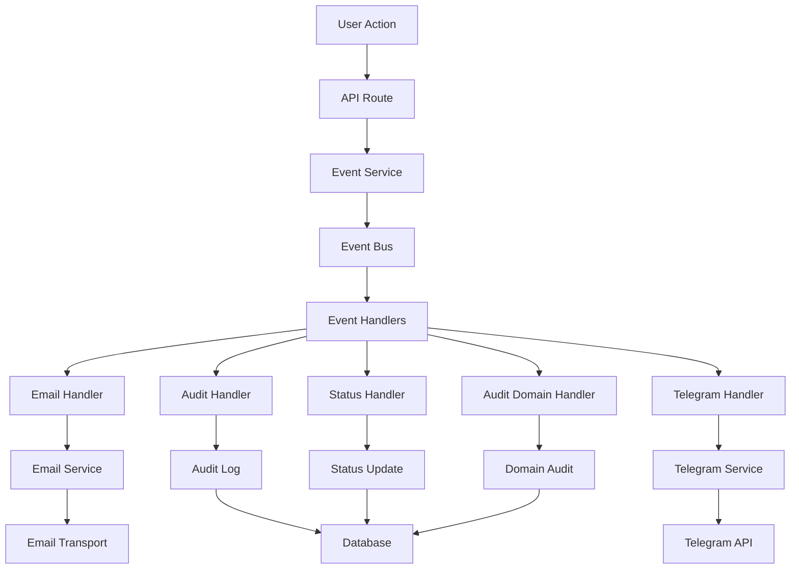
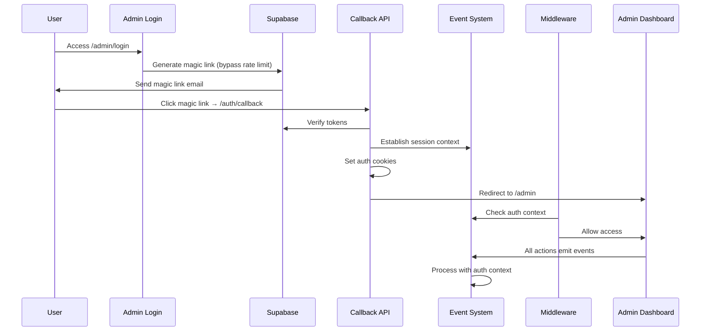

# YEC Registration System - Core Architecture Documentation
*Version: 1.0*  
*Created: 2025-01-27*  
*Last Updated: 2025-01-27*

## 🎯 Overview

The YEC Registration System is built on a **Domain Event-Driven Architecture** that controls all system activities through a centralized event system. This architecture ensures consistency, auditability, and proper workflow management across all operations.

## 🏗️ Core Architecture Principles

### 1. Event-Driven Everything
- **All activities are events**: Every user action, system operation, and business process is represented as a domain event
- **Centralized event bus**: All events flow through a single `EventBus` for consistent processing
- **Event handlers**: Specialized handlers process different types of events (email, audit, status updates, etc.)
- **Event correlation**: All events within a request share the same correlation ID for traceability

### 2. Dual-Layer Audit System
- **Access Layer**: Tracks all API requests and responses (`audit.access_log`)
- **Event Layer**: Tracks domain-specific business events (`audit.event_log`)
- **Complete traceability**: Every action is logged with full context and metadata

### 3. Authentication Integration
- **Event-aware authentication**: Authentication state is integrated with the event system
- **Session context**: All events within a session share authentication context
- **Admin privileges**: Admin actions are tracked and validated through the event system

## 🔄 Event System Architecture

### Event Flow Diagram



### Core Components

#### 1. Event Service (`app/lib/events/eventService.ts`)
**Purpose**: Provides a clean API for emitting domain events

```typescript
// Example: Emit registration submitted event
await EventService.emitRegistrationSubmitted(
  registration,
  priceApplied,
  selectedPackage,
  requestId
);

// Example: Emit admin approval event
await EventService.emitAdminApproved(
  registration,
  adminEmail
);
```

**Key Methods**:
- `emitRegistrationSubmitted()` - New registration created
- `emitAdminApproved()` - Registration approved by admin
- `emitAdminRejected()` - Registration rejected by admin
- `emitAdminRequestUpdate()` - Admin requests user update
- `emitDocumentReuploaded()` - User re-uploads document
- `emitUserResubmitted()` - User resubmits registration

#### 2. Event Bus (`app/lib/events/eventBus.ts`)
**Purpose**: Centralized event routing and handler management

```typescript
// Event bus automatically routes events to all registered handlers
const results = await eventBus.emit(event);

// Handlers are registered for specific event types
this.registerHandler('registration.submitted', emailHandler);
this.registerHandler('registration.submitted', auditHandler);
```

**Features**:
- **Idempotency**: Prevents duplicate event processing
- **Concurrent processing**: All handlers run concurrently for performance
- **Error isolation**: Handler failures don't affect other handlers
- **Event correlation**: Links related events with correlation IDs

#### 3. Event Handlers

##### Email Notification Handler (`app/lib/events/handlers/emailNotificationHandler.ts`)
- **Purpose**: Sends email notifications based on events
- **Event Types**: `registration.submitted`, `admin.approved`, `admin.rejected`, `admin.request_update`
- **Integration**: Uses enhanced email service with proper templates

##### Audit Log Handler (`app/lib/events/handlers/auditLogHandler.ts`)
- **Purpose**: Logs all events to audit system
- **Storage**: Writes to `audit.event_log` table
- **Context**: Captures actor, resource, action, and metadata

##### Status Update Handler (`app/lib/events/handlers/statusUpdateHandler.ts`)
- **Purpose**: Updates registration status based on events
- **Workflow**: Manages status transitions (waiting_for_review → approved/rejected)
- **Integration**: Updates database and triggers follow-up events

##### Telegram Notification Handler (`app/lib/events/handlers/telegramNotificationHandler.ts`)
- **Purpose**: Sends Telegram notifications for important events
- **Test Mode**: Captures payloads in test environment
- **Production**: Sends real notifications with proper credentials

##### Audit Domain Handler (`app/lib/events/handlers/auditDomainHandler.ts`)
- **Purpose**: Domain-specific audit logging
- **Business Logic**: Captures business context and domain rules
- **Compliance**: Ensures regulatory and compliance requirements

## 🔐 Authentication System Integration

### Authentication Flow with Events



### Key Authentication Components

#### 1. Authentication Utilities (`app/lib/auth-utils.server.ts`)
```typescript
// Get current authenticated user with fallback support
export async function getCurrentUser(): Promise<AuthenticatedUser | null> {
  // Primary: Check Supabase session
  const session = await supabase.auth.getSession();
  if (session.data.session) {
    // Get user from admin_users table using Supabase session
  }
  
  // Fallback: Check custom admin-email cookie
  const adminEmail = cookieStore.get('admin-email')?.value;
  if (adminEmail) {
    // Get user from admin_users table using email
  }
  
  return null;
}
```

#### 2. Admin Authentication API (`app/api/admin/auth/route.ts`)
```typescript
// Bypass Supabase rate limiting for admin users
const { error } = await supabase.auth.admin.generateLink({
  type: 'magiclink',
  email,
  options: {
    redirectTo: redirectUrl,
  },
});
```

#### 3. Middleware Protection (`middleware.ts`)
```typescript
// Check for admin authentication
const adminEmail = request.cookies.get('admin-email')?.value;
if (!adminEmail || !isAdmin(adminEmail)) {
  return NextResponse.redirect(new URL('/admin/login?next=' + encodeURIComponent(pathname), request.url));
}
```

## 📊 Audit System Architecture

### Dual-Layer Audit System

#### 1. Access Layer (`audit.access_log`)
**Purpose**: Track all API requests and responses

```sql
CREATE TABLE audit.access_log (
    id BIGSERIAL PRIMARY KEY,
    occurred_at_utc TIMESTAMP WITH TIME ZONE DEFAULT NOW(),
    action TEXT NOT NULL,           -- e.g., "GET", "POST", "PUT"
    method TEXT,                    -- HTTP method
    resource TEXT,                  -- e.g., "api", "admin"
    result TEXT NOT NULL,           -- "success", "error", "unauthorized"
    request_id TEXT NOT NULL,       -- Unique request identifier
    src_ip INET,                    -- Client IP address
    user_agent TEXT,                -- Browser/client information
    latency_ms INTEGER,             -- Request processing time
    meta JSONB,                     -- Additional metadata
    created_at TIMESTAMP WITH TIME ZONE DEFAULT NOW()
);
```

#### 2. Event Layer (`audit.event_log`)
**Purpose**: Track domain-specific business events

```sql
CREATE TABLE audit.event_log (
    id BIGSERIAL PRIMARY KEY,
    occurred_at_utc TIMESTAMP WITH TIME ZONE DEFAULT NOW(),
    action TEXT NOT NULL,           -- e.g., "registration.submitted", "admin.approved"
    resource TEXT NOT NULL,         -- e.g., "registration", "user"
    resource_id TEXT,               -- ID of the affected resource
    actor_id TEXT,                  -- User ID performing the action
    actor_role TEXT NOT NULL,       -- "user", "admin", "system"
    result TEXT NOT NULL,           -- "success", "failed", "pending"
    reason TEXT,                    -- Optional reason for the action
    correlation_id TEXT NOT NULL,   -- Links related events
    meta JSONB,                     -- Additional context data
    created_at TIMESTAMP WITH TIME ZONE DEFAULT NOW()
);
```

### Audit Integration

#### 1. Automatic API Logging (`app/lib/audit/withAuditAccess.ts`)
```typescript
// All API routes are automatically wrapped with audit logging
export const GET = withAuditLogging(async (request: NextRequest) => {
  // Your API logic here
  return NextResponse.json({ success: true });
});
```

#### 2. Request Context Correlation (`app/lib/audit/requestContext.ts`)
```typescript
// All events within a single request are correlated
await withRequestContext(requestContext, async () => {
  // All events in this context share the same correlation ID
  await EventService.emitRegistrationSubmitted(registration);
  await EventService.emitEmailSent(registration.email);
});
```

## 📧 Email System Integration

### Event-Driven Email System

#### 1. Enhanced Email Service (`app/lib/emails/enhancedEmailService.ts`)
```typescript
// Event-driven email processing
export class EventDrivenEmailService {
  async processEvent(
    eventType: EmailEventType,
    registration: any,
    adminEmail?: string,
    dimension?: string,
    notes?: string,
    badgeUrl?: string,
    rejectionReason?: string,
    brandTokens?: BrandTokens
  ): Promise<EmailResult> {
    // Process event and send appropriate email
  }
}
```

#### 2. Email Templates
- **Tracking Template**: Sent when registration is submitted
- **Update Templates**: Sent when admin requests updates (payment, profile, tcc)
- **Approval Template**: Sent when registration is approved
- **Rejection Template**: Sent when registration is rejected

#### 3. Deep-Link Token System
```sql
-- Secure deep-link tokens for update requests
CREATE TABLE deep_link_tokens (
    id UUID PRIMARY KEY DEFAULT gen_random_uuid(),
    token_hash TEXT UNIQUE NOT NULL,
    registration_id TEXT NOT NULL,
    dimension TEXT NOT NULL,
    expires_at TIMESTAMP WITH TIME ZONE NOT NULL,
    used_at TIMESTAMP WITH TIME ZONE,
    created_at TIMESTAMP WITH TIME ZONE DEFAULT NOW()
);
```

## 🔧 How to Work with the Core System

### 1. Creating New Events

#### Step 1: Define Event Type
```typescript
// In app/lib/events/types.ts
export type RegistrationEvent = {
  id: string;
  type: 'registration.submitted' | 'admin.approved' | 'admin.rejected';
  payload: any;
  correlation_id: string;
  occurred_at: string;
};
```

#### Step 2: Add Event Method to EventService
```typescript
// In app/lib/events/eventService.ts
static async emitNewEvent(
  registration: any,
  adminEmail: string
): Promise<EventHandlerResult[]> {
  const event = EventFactory.createNewEvent(registration, adminEmail);
  return await this.emitEvent(event);
}
```

#### Step 3: Create Event Factory Method
```typescript
// In app/lib/events/eventFactory.ts
static createNewEvent(registration: any, adminEmail: string): RegistrationEvent {
  return {
    id: generateEventId(),
    type: 'new.event.type',
    payload: {
      registration,
      admin_email: adminEmail,
    },
    correlation_id: getCurrentCorrelationId(),
    occurred_at: new Date().toISOString(),
  };
}
```

#### Step 4: Register Handler (if needed)
```typescript
// In app/lib/events/eventBus.ts
const newHandler = new NewEventHandler();
this.registerHandler('new.event.type', newHandler);
```

### 2. Adding New Event Handlers

#### Step 1: Create Handler Class
```typescript
// app/lib/events/handlers/newEventHandler.ts
export class NewEventHandler implements EventHandler<RegistrationEvent> {
  async handle(event: RegistrationEvent): Promise<void> {
    // Handle the event
    console.log(`Processing ${event.type} for registration ${event.payload.registration.id}`);
    
    // Your business logic here
  }
}
```

#### Step 2: Register Handler
```typescript
// In app/lib/events/eventBus.ts
private registerDefaultHandlers(): void {
  const newHandler = new NewEventHandler();
  
  // Register for specific event types
  this.registerHandler('registration.submitted', newHandler);
  this.registerHandler('admin.approved', newHandler);
}
```

### 3. Working with Authentication Context

#### Step 1: Get Current User
```typescript
// In API routes
import { getCurrentUser } from '@/lib/auth-utils.server';

export async function POST(request: NextRequest) {
  const user = await getCurrentUser();
  if (!user) {
    return NextResponse.json({ error: 'Unauthorized' }, { status: 401 });
  }
  
  // Use user context in events
  await EventService.emitSomeEvent(data, user.email);
}
```

#### Step 2: Use Request Context
```typescript
// In API routes
import { withRequestContext } from '@/lib/audit/requestContext';

export async function POST(request: NextRequest) {
  return await withRequestContext(request, async () => {
    // All events in this context will be correlated
    await EventService.emitEvent1(data);
    await EventService.emitEvent2(data);
  });
}
```

### 4. Adding New API Routes

#### Step 1: Create Route with Audit Logging
```typescript
// app/api/new-endpoint/route.ts
import { withAuditLogging } from '@/lib/audit/withAuditAccess';

export const POST = withAuditLogging(async (request: NextRequest) => {
  // Your API logic here
  
  // Emit events
  await EventService.emitSomeEvent(data);
  
  return NextResponse.json({ success: true });
});
```

#### Step 2: Add Authentication (if needed)
```typescript
// For admin-only endpoints
import { validateAdminAccess } from '@/lib/admin-guard-server';

export const POST = withAuditLogging(async (request: NextRequest) => {
  // Validate admin access
  const adminEmail = await validateAdminAccess(request);
  if (!adminEmail) {
    return NextResponse.json({ error: 'Unauthorized' }, { status: 401 });
  }
  
  // Your API logic here
  await EventService.emitAdminEvent(data, adminEmail);
});
```

## 🧪 Testing the Core System

### 1. Event System Testing
```typescript
// Test event emission
const results = await EventService.emitRegistrationSubmitted(registration);
expect(results).toHaveLength(5); // 5 handlers should process the event
expect(results.every(r => r.success)).toBe(true);
```

### 2. Authentication Testing
```typescript
// Test authentication flow
const user = await getCurrentUser();
expect(user).toBeTruthy();
expect(user.email).toBe('admin@example.com');
```

### 3. Audit System Testing
```typescript
// Test audit logging
const auditResponse = await request.get('/api/diag/audit-smoke');
expect(auditResponse.status()).toBe(200);
const auditData = await auditResponse.json();
expect(auditData.ok).toBe(true);
```

### 4. E2E Testing with Events
```typescript
// Test complete workflow with events
test('should process registration with events', async ({ request }) => {
  // Create registration
  const regResponse = await request.post('/api/register', { data: registrationData });
  expect(regResponse.ok()).toBe(true);
  
  // Check audit logs
  const auditResponse = await request.get('/api/diag/audit-smoke');
  expect(auditResponse.ok()).toBe(true);
});
```

## 🚨 Common Issues and Solutions

### 1. Authentication State Not Established
**Problem**: API shows `isAuthenticated: false` but dashboard is accessible
**Solution**: Check event system integration with authentication context

```typescript
// Ensure authentication context is properly set in events
await withRequestContext(request, async () => {
  const user = await getCurrentUser();
  if (user) {
    await EventService.emitEvent(data, user.email);
  }
});
```

### 2. Events Not Processing
**Problem**: Events are emitted but handlers are not executing
**Solution**: Check event handler registration and correlation

```typescript
// Verify handlers are registered
const stats = EventService.getStats();
console.log('Registered handlers:', stats.registeredHandlers);
console.log('Event types:', stats.eventTypes);
```

### 3. Audit Logging Missing
**Problem**: Actions are not being logged to audit system
**Solution**: Ensure API routes are wrapped with audit logging

```typescript
// Wrap all API routes with audit logging
export const GET = withAuditLogging(async (request: NextRequest) => {
  // Your API logic here
});
```

### 4. Email Not Sending
**Problem**: Events are processed but emails are not sent
**Solution**: Check email configuration and event handler

```typescript
// Verify email configuration
import { hasEmailConfig } from '@/lib/config';
if (!hasEmailConfig()) {
  console.warn('Email configuration not available');
  return;
}
```

## 📋 Best Practices

### 1. Event Design
- **Use descriptive event types**: `registration.submitted` not `event1`
- **Include all necessary data**: Ensure payload contains all required information
- **Maintain correlation**: Use correlation IDs to link related events
- **Handle errors gracefully**: Don't let handler failures break the system

### 2. Authentication Integration
- **Always check authentication**: Validate user permissions before actions
- **Use request context**: Ensure events are correlated within requests
- **Maintain session state**: Keep authentication state consistent across events

### 3. Audit Compliance
- **Log all actions**: Every user action should be audited
- **Include context**: Log relevant metadata and context
- **Maintain integrity**: Ensure audit logs are immutable and secure

### 4. Testing
- **Test event flow**: Verify events are emitted and processed correctly
- **Test authentication**: Ensure authentication works with events
- **Test audit logging**: Verify all actions are properly logged
- **Use E2E tests**: Test complete workflows end-to-end

## 🔄 System Maintenance

### 1. Monitoring Event System
```typescript
// Get event system statistics
const stats = EventService.getStats();
console.log('Event system stats:', stats);
```

### 2. Checking Audit Logs
```sql
-- Recent API access logs
SELECT 
    action, method, resource, result, 
    occurred_at_utc AT TIME ZONE 'Asia/Bangkok' as th_time,
    latency_ms
FROM audit.access_log 
ORDER BY occurred_at_utc DESC 
LIMIT 20;

-- Admin actions in the last 24 hours
SELECT 
    action, resource, actor_role, result,
    occurred_at_utc AT TIME ZONE 'Asia/Bangkok' as th_time
FROM audit.event_log 
WHERE actor_role = 'admin' 
    AND occurred_at_utc > NOW() - INTERVAL '24 hours'
ORDER BY occurred_at_utc DESC;
```

### 3. Database Maintenance
```sql
-- Clean up old audit logs (keep last 30 days)
DELETE FROM audit.access_log 
WHERE occurred_at_utc < NOW() - INTERVAL '30 days';

DELETE FROM audit.event_log 
WHERE occurred_at_utc < NOW() - INTERVAL '30 days';
```

## 📚 Additional Resources

### Documentation Files
- `docs/audit-system-feature-guide.md` - Detailed audit system documentation
- `docs/authentication-system.md` - Authentication system documentation
- `docs/EMAIL_TEMPLATE_SYSTEM.md` - Email system documentation
- `docs/SESSION_TRACKING_SYSTEM.md` - Session tracking documentation

### Key Configuration Files
- `app/lib/config.ts` - System configuration
- `app/lib/constants.ts` - System constants
- `docker-compose.dev.yml` - Environment configuration
- `.env.template` - Environment variables template

### Testing Files
- `tests/e2e/` - End-to-end tests
- `tests/api/` - API tests
- `tests/enhanced-email-system.spec.ts` - Email system tests

---

*This document provides a comprehensive overview of the YEC Registration System's core architecture. For specific implementation details, refer to the individual component documentation files.*
