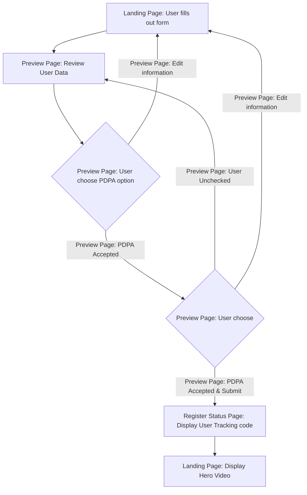
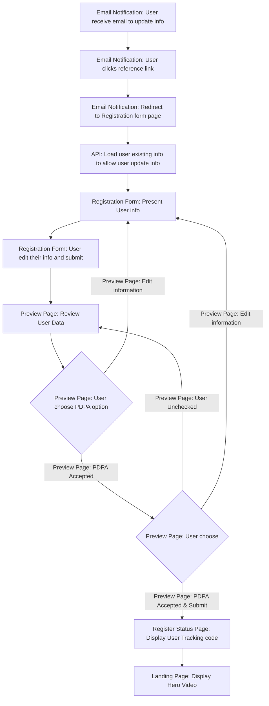
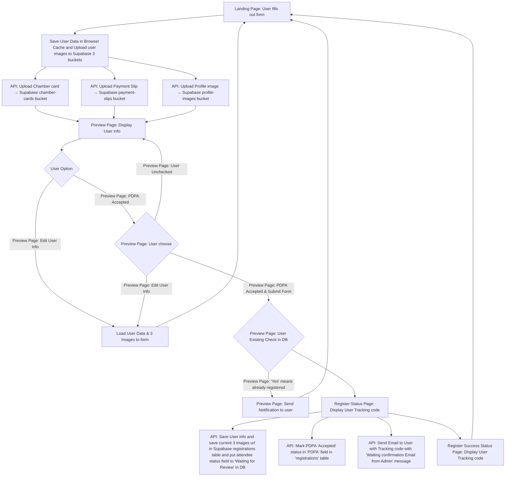
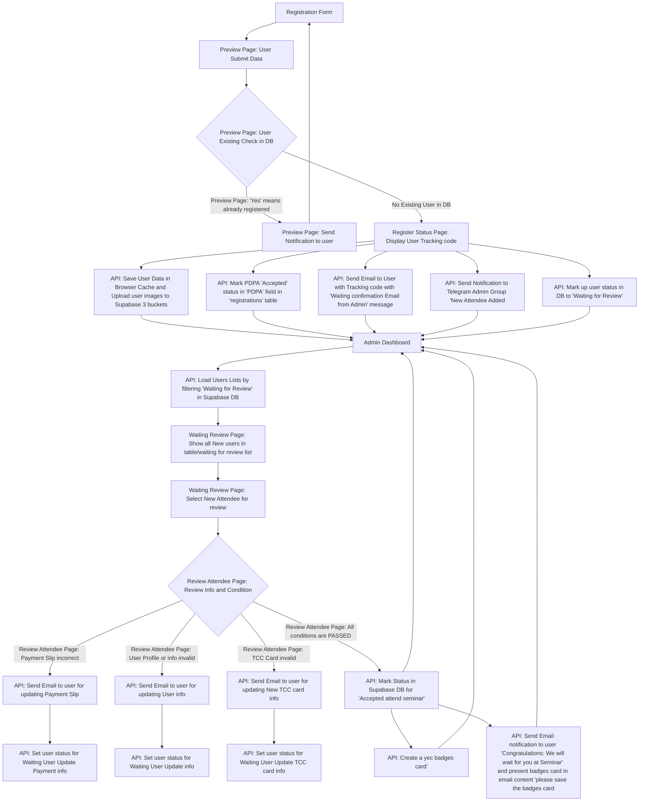

# YEC Registration System - Next Phase Guide

## 🎯 Executive Summary

The YEC Registration System has successfully completed **Phase 1** with a fully functional production deployment. This document serves as the comprehensive guide for transitioning to **Phase 2** and beyond, consolidating all critical information, lessons learned, and next steps.

### Current Status: ✅ **PRODUCTION READY**
- **Authentication**: Magic link authentication fully working
- **Registration System**: Complete with badge generation and email delivery
- **Admin Dashboard**: Functional with comprehensive management tools
- **Code Quality**: Zero TypeScript errors, zero ESLint warnings
- **Deployment**: Clean Vercel deployments with optimized environment management

---

## 🏗️ System Architecture Overview

### Technology Stack
- **Frontend**: Next.js 15.4.5 with React 19.1.0
- **Backend**: Next.js API Routes with TypeScript
- **Database**: Supabase PostgreSQL with real-time capabilities
- **Authentication**: Supabase Auth with Magic Link
- **File Storage**: Supabase Storage
- **Email Service**: Resend API
- **Styling**: Tailwind CSS 4
- **Testing**: Playwright E2E testing
- **Deployment**: Vercel with GitHub Actions CI/CD

### Key Dependencies
```json
{
  "@supabase/ssr": "^0.6.1",
  "@supabase/supabase-js": "^2.53.0",
  "canvas": "^3.1.2",
  "qrcode": "^1.5.3",
  "resend": "^4.8.0",
  "lucide-react": "^0.539.0"
}
```

---

## 🔄 Core Workflow Control System

### 🎯 User Journey Workflows

#### 1. New Attendee Registration Flow


#### 2. User Info Update Flow (Email Link)


### 🏢 System Processing Workflows

#### 1. Registration Submission System Flow


#### 2. Admin Dashboard Processing Flow


---

## 🎯 Domain Event Architecture & Workflow Control

### Event-Driven System Overview
The system uses a centralized event-driven architecture for all side-effects, ensuring deterministic and auditable flows:

```
┌─────────────────┐    ┌─────────────────┐    ┌─────────────────┐
│   API Routes    │    │   Event Bus     │    │   Event Handlers│
│                 │    │                 │    │                 │
│ • Emit Events   │───►│ • Route Events  │───►│ • Status Update │
│ • Thin Logic    │    │ • Idempotency   │    │ • Email Notify  │
│ • No Side-Effects│   │ • Error Handling│    │ • Telegram Notify│
└─────────────────┘    └─────────────────┘    │ • Audit Logging │
                                              └─────────────────┘
```

### Event Types & Status Transitions

| Event Type | Status Transition | Database Action | Email Template | Telegram Notification |
|------------|------------------|-----------------|----------------|---------------------|
| `registration.submitted` | `pending` → `waiting_for_review` | Update status + Set PDPA accepted | `received` | "New registration received" |
| `registration.batch_upserted` | `pending` → `waiting_for_review` | Batch status update | `received` | "Batch registration processed" |
| `admin.request_update` | `waiting_for_review` → `pending` | Update status + Set reason | `request_update` | "Update requested" |
| `admin.approved` | `waiting_for_review` → `approved` | Update status + Generate badge | `approved` | "Registration approved" |
| `admin.rejected` | `waiting_for_review` → `rejected` | Update status + Set reason | `rejected` | "Registration rejected" |

### Event Handler Implementation

#### 1. StatusUpdateHandler
```typescript
// Updates registration status in database
export class StatusUpdateHandler implements EventHandler<RegistrationEvent> {
  async handle(event: RegistrationEvent): Promise<void> {
    const newStatus = STATUS_TRANSITIONS[event.type];
    
    // Single registration update
    await supabase
      .from('registrations')
      .update({ 
        status: newStatus,
        updated_at: now
      })
      .eq('id', event.payload.registration.id);
  }
}
```

#### 2. EmailNotificationHandler
```typescript
// Sends appropriate email notifications
export class EmailNotificationHandler implements EventHandler<RegistrationEvent> {
  async handle(event: RegistrationEvent): Promise<void> {
    const template = EMAIL_TEMPLATES[event.type];
    
    // Send email based on event type
    await sendEmail({
      to: event.payload.registration.email,
      template: template,
      data: event.payload.registration
    });
  }
}
```

#### 3. TelegramNotificationHandler
```typescript
// Sends Telegram notifications to admin group
export class TelegramNotificationHandler implements EventHandler<RegistrationEvent> {
  async handle(event: RegistrationEvent): Promise<void> {
    const message = this.formatMessage(event);
    
    await sendTelegramMessage({
      chatId: TELEGRAM_CHAT_ID,
      message: message
    });
  }
}
```

#### 4. AuditLogHandler
```typescript
// Logs admin actions to audit table
export class AuditLogHandler implements EventHandler<RegistrationEvent> {
  async handle(event: RegistrationEvent): Promise<void> {
    await supabase
      .from('audit_logs')
      .insert({
        registration_id: event.payload.registration.registration_id,
        action: event.type,
        admin_email: event.payload.adminEmail,
        details: event.payload
      });
  }
}
```

### Event Emission Examples

#### Registration Submission
```typescript
// In API route: /api/register
await EventService.emitRegistrationSubmitted({
  registration: registrationData,
  adminEmail: null
});
```

#### Admin Approval
```typescript
// In API route: /api/admin/registrations/[id]/approve
await EventService.emitAdminApproved({
  registration: registrationData,
  adminEmail: adminEmail
});
```

#### Admin Rejection
```typescript
// In API route: /api/admin/registrations/[id]/reject
await EventService.emitAdminRejected({
  registration: registrationData,
  adminEmail: adminEmail,
  reason: rejectionReason
});
```

---

## 🗄️ Database Integration & Schema Management

### Core Database Schema

#### Registrations Table
```sql
CREATE TABLE registrations (
    id BIGSERIAL PRIMARY KEY,
    registration_id VARCHAR(50) UNIQUE NOT NULL,
    title VARCHAR(10) NOT NULL,
    first_name VARCHAR(100) NOT NULL,
    last_name VARCHAR(100) NOT NULL,
    nickname VARCHAR(100) NOT NULL,
    phone VARCHAR(20) NOT NULL,
    line_id VARCHAR(50) NOT NULL,
    email VARCHAR(255) NOT NULL,
    company_name VARCHAR(200) NOT NULL,
    business_type VARCHAR(100) NOT NULL,
    business_type_other VARCHAR(200),
    yec_province VARCHAR(100) NOT NULL,
    hotel_choice VARCHAR(20) NOT NULL CHECK (hotel_choice IN ('in-quota', 'out-of-quota')),
    room_type VARCHAR(20) CHECK (room_type IN ('single', 'double', 'suite', 'no-accommodation')),
    roommate_info TEXT,
    roommate_phone VARCHAR(20),
    external_hotel_name VARCHAR(200),
    travel_type VARCHAR(20) NOT NULL CHECK (travel_type IN ('private-car', 'van')),
    profile_image_url TEXT,
    chamber_card_url TEXT,
    payment_slip_url TEXT,
    badge_url TEXT,
    email_sent BOOLEAN DEFAULT FALSE,
    email_sent_at TIMESTAMPTZ,
    status VARCHAR(20) DEFAULT 'pending' CHECK (status IN ('pending', 'waiting_for_review', 'approved', 'rejected')),
    ip_address VARCHAR(45),
    user_agent TEXT,
    form_data JSONB,
    created_at TIMESTAMPTZ DEFAULT NOW(),
    updated_at TIMESTAMPTZ DEFAULT NOW()
);
```

#### Admin Audit Logs Table
```sql
CREATE TABLE admin_audit_logs (
    id UUID PRIMARY KEY DEFAULT gen_random_uuid(),
    admin_email VARCHAR(255) NOT NULL,
    action VARCHAR(50) NOT NULL, -- 'approve', 'reject', 'request-update'
    registration_id VARCHAR(50) NOT NULL,
    before JSONB, -- Previous registration state
    after JSONB,  -- New registration state
    timestamp TIMESTAMPTZ DEFAULT NOW(),
    metadata JSONB -- Additional context (event_id, reason, etc.)
);
```

#### Event Logs Table
```sql
CREATE TABLE event_logs (
    id UUID PRIMARY KEY DEFAULT gen_random_uuid(),
    registration_id VARCHAR(50) REFERENCES registrations(registration_id),
    scan_type VARCHAR(20) NOT NULL CHECK (scan_type IN ('entry', 'exit')),
    scanned_at TIMESTAMPTZ DEFAULT NOW(),
    scanner_id VARCHAR(50),
    location VARCHAR(100),
    notes TEXT,
    created_at TIMESTAMPTZ DEFAULT NOW()
);
```

### Database Triggers & Functions

#### Registration ID Generator
```sql
CREATE OR REPLACE FUNCTION generate_registration_id()
RETURNS TRIGGER AS $$
BEGIN
    NEW.registration_id := 'YEC-' || 
                          EXTRACT(EPOCH FROM NOW())::BIGINT || '-' || 
                          SUBSTRING(MD5(RANDOM()::TEXT) FROM 1 FOR 8);
    RETURN NEW;
END;
$$ LANGUAGE plpgsql;

CREATE TRIGGER generate_registration_id_trigger
    BEFORE INSERT ON registrations
    FOR EACH ROW
    WHEN (NEW.registration_id IS NULL)
    EXECUTE FUNCTION generate_registration_id();
```

#### Updated At Trigger
```sql
CREATE OR REPLACE FUNCTION update_updated_at_column()
RETURNS TRIGGER AS $$
BEGIN
    NEW.updated_at = NOW();
    RETURN NEW;
END;
$$ language 'plpgsql';

CREATE TRIGGER update_registrations_updated_at 
    BEFORE UPDATE ON registrations 
    FOR EACH ROW EXECUTE FUNCTION update_updated_at_column();
```

### Storage Bucket Configuration

#### Supabase Storage Buckets
```sql
-- Profile images bucket
INSERT INTO storage.buckets (id, name, public) 
VALUES ('profile-images', 'profile-images', true);

-- Chamber cards bucket
INSERT INTO storage.buckets (id, name, public) 
VALUES ('chamber-cards', 'chamber-cards', true);

-- Payment slips bucket
INSERT INTO storage.buckets (id, name, public) 
VALUES ('payment-slips', 'payment-slips', true);

-- Badges bucket
INSERT INTO storage.buckets (id, name, public) 
VALUES ('yec-badges', 'yec-badges', true);
```

### Database Query Optimization

#### Common Queries with Indexes
```sql
-- Performance indexes
CREATE INDEX idx_registrations_email ON registrations(email);
CREATE INDEX idx_registrations_status ON registrations(status);
CREATE INDEX idx_registrations_province ON registrations(yec_province);
CREATE INDEX idx_registrations_created_at ON registrations(created_at);
CREATE INDEX idx_registrations_registration_id ON registrations(registration_id);

-- Composite indexes for filtering
CREATE INDEX idx_registrations_status_province ON registrations(status, yec_province);
CREATE INDEX idx_registrations_created_status ON registrations(created_at, status);

-- Audit logs indexes
CREATE INDEX idx_admin_audit_logs_admin_email ON admin_audit_logs(admin_email);
CREATE INDEX idx_admin_audit_logs_action ON admin_audit_logs(action);
CREATE INDEX idx_admin_audit_logs_timestamp ON admin_audit_logs(timestamp);
CREATE INDEX idx_admin_audit_logs_registration_id ON admin_audit_logs(registration_id);
```

#### Optimized Queries
```sql
-- Get registrations with filters
SELECT * FROM registrations 
WHERE status = ANY($1) 
  AND yec_province = ANY($2)
  AND created_at >= $3
  AND created_at <= $4
ORDER BY created_at DESC
LIMIT $5 OFFSET $6;

-- Get status counts
SELECT 
    COUNT(*) as total,
    COUNT(*) FILTER (WHERE status = 'pending') as pending,
    COUNT(*) FILTER (WHERE status = 'waiting_for_review') as waiting_for_review,
    COUNT(*) FILTER (WHERE status = 'approved') as approved,
    COUNT(*) FILTER (WHERE status = 'rejected') as rejected
FROM registrations
WHERE status = ANY($1) 
  AND yec_province = ANY($2);

-- Get audit trail for a registration
SELECT * FROM admin_audit_logs 
WHERE registration_id = $1 
ORDER BY timestamp DESC;
```

---

## 🔍 Audit & Compliance System

### Audit Log Architecture
- **Event-Driven Logging**: All admin actions automatically logged
- **Before/After States**: Complete state tracking for compliance
- **Metadata Storage**: Rich context including reasons and event IDs
- **PDPA Compliance**: Complete audit trail for data protection

### Audit Log Handler Implementation
```typescript
// Logs admin actions to audit table
export class AuditLogHandler implements EventHandler<RegistrationEvent> {
  async handle(event: RegistrationEvent): Promise<void> {
    // Only log admin actions
    if (!event.type.startsWith('admin.')) {
      return;
    }

    const auditEntry = {
      admin_email: adminEmail,
      action: action, // 'approve', 'reject', 'request-update'
      registration_id: registration.registration_id,
      before: registration, // Previous state
      after: { ...registration, status: newStatus }, // New state
      timestamp: timestamp,
      metadata: { 
        event_id: event.id, 
        event_type: event.type, 
        reason: reason || null 
      }
    };

    await supabase.from('admin_audit_logs').insert([auditEntry]);
  }
}
```

### Compliance Features
- **Complete Action Tracking**: Every admin action logged
- **State Change History**: Before/after registration states
- **Admin Accountability**: All actions tied to admin email
- **Data Protection**: PDPA compliance audit trail

---

## 📱 Real-Time Notification System

### Telegram Integration
- **Event-Driven Notifications**: Automatic notifications for all events
- **Rich Message Formatting**: Emojis and structured messages
- **Admin Group Updates**: Real-time updates to admin team
- **Configuration-Based**: Environment variable setup

### Telegram Handler Implementation
```typescript
// Sends Telegram notifications to admin group
export class TelegramNotificationHandler implements EventHandler<RegistrationEvent> {
  async handle(event: RegistrationEvent): Promise<void> {
    // Check if Telegram configuration is available
    if (!hasTelegramConfig()) {
      console.warn('Telegram configuration not available, skipping Telegram notification');
      return;
    }

    switch (event.type) {
      case 'registration.submitted':
        // 🆕 New Registration Submitted
        await sendTelegram(`🆕 New Registration Submitted\n\nName: ${fullName}\nEmail: ${email}\nRegistration ID: ${registration_id}`);
        break;
        
      case 'admin.approved':
        // ✅ Registration Approved
        await sendTelegram(`✅ Registration Approved\n\nName: ${fullName}\nApproved by: ${adminEmail}`);
        break;
        
      case 'admin.rejected':
        // ❌ Registration Rejected
        await sendTelegram(`❌ Registration Rejected\n\nName: ${fullName}\nReason: ${reason}`);
        break;
    }
  }
}
```

### Telegram Configuration
```typescript
// Environment variables required
TELEGRAM_BOT_TOKEN=your_bot_token
TELEGRAM_CHAT_ID=your_chat_id

// Configuration validation
export const hasTelegramConfig = (): boolean => {
  return !!(process.env.TELEGRAM_BOT_TOKEN && process.env.TELEGRAM_CHAT_ID);
};
```

### Notification Types
- **Registration Events**: New submissions, updates, completions
- **Admin Actions**: Approvals, rejections, update requests
- **Batch Operations**: Summary notifications for bulk actions
- **System Events**: Error alerts and system status updates

---

## 🚀 Completed Features (Phase 1)

### ✅ Core Registration System
- **Multi-step Registration Form**: Dynamic fields with real-time validation
- **File Upload System**: Profile images, chamber cards, payment slips
- **Hotel Choice System**: In-quota/out-of-quota with roommate management
- **Badge Generation**: Dynamic PNG badges with QR codes and profile photos
- **Email Delivery**: Confirmation emails with inline badge images
- **PDPA Compliance**: Complete consent management and data protection

### ✅ Admin Dashboard
- **Authentication**: Secure magic link authentication with role-based access
- **Registration Management**: View, filter, sort, and manage registrations
- **Status Management**: Approve, reject, request updates
- **Export Functionality**: CSV export with filtered results
- **Real-time Updates**: Optimistic UI with server-side validation

### ✅ Technical Infrastructure
- **Domain Event System**: Centralized event-driven architecture
- **Error Handling**: Comprehensive error management and logging
- **TypeScript Integration**: Full type safety across the application
- **Code Quality**: ESLint compliance with clean codebase
- **Environment Management**: Optimized dev/prod configuration

---

## 🔧 Critical Implementation Details

### Authentication System
**🚨 CRITICAL**: Magic Link authentication is fully functional but requires careful configuration.

**Key Configuration Points:**
1. **Supabase Project Settings**:
   - Site URL: `https://yec.rajagadget.live`
   - Redirect URLs: 
     - `https://yec.rajagadget.live/auth/callback`
     - `http://localhost:8080/auth/callback`

2. **Environment Variables**:
   - Production: `NEXT_PUBLIC_APP_URL=https://yec.rajagadget.live`
   - Development: `NEXT_PUBLIC_APP_URL=http://localhost:8080`

**Reference**: [Magic Link Authentication Knowledge Base](MAGIC_LINK_AUTHENTICATION_KNOWLEDGE_BASE.md)

### File Upload Workflow
**🚨 CRITICAL**: File upload system follows specific workflow patterns.

**Upload Process:**
1. **Client-side**: Files uploaded to browser cache during form filling
2. **Preview Stage**: Files displayed for user review
3. **Submission**: Files uploaded to Supabase Storage buckets
4. **Database Update**: File URLs stored in registrations table
5. **Event Trigger**: `registration.submitted` event emitted

**Storage Buckets:**
- `profile-images`: User profile photos
- `chamber-cards`: TCC membership cards
- `payment-slips`: Payment confirmation documents
- `yec-badges`: Generated event badges

### Badge Generation Workflow
**🚨 CRITICAL**: Badge generation is triggered by admin approval.

**Generation Process:**
1. **Admin Approval**: Admin approves registration
2. **Event Emission**: `admin.approved` event emitted
3. **Badge Creation**: Canvas-based badge generation with QR code
4. **Storage Upload**: Badge saved to `yec-badges` bucket
5. **Database Update**: Badge URL stored in registrations table
6. **Email Delivery**: Badge included in approval email

---

## 📋 Phase 2 Roadmap

### 🎯 Primary Objectives
1. **Batch Registration System**: CSV import and bulk operations
2. **Enhanced Admin Tools**: Advanced filtering and management
3. **QR Code Check-in System**: Event entry and logging
4. **Mobile Responsiveness**: Optimize for mobile devices
5. **Analytics Dashboard**: Registration statistics and insights

### 🚧 Immediate Next Steps

#### 1. Batch Registration System
**Priority**: High
**Estimated Effort**: 2-3 weeks

**Requirements:**
- CSV import functionality with validation
- Bulk badge generation
- Batch email notifications
- Error handling for partial failures
- Progress tracking for large imports

**Technical Approach:**
- Extend existing domain event system
- Add batch processing handlers
- Implement file upload for CSV files
- Create progress tracking UI

**Event Integration:**
```typescript
// New event type for batch operations
'registration.batch_imported' → 'waiting_for_review'

// Batch event handler
export class BatchRegistrationHandler implements EventHandler<BatchRegistrationEvent> {
  async handle(event: BatchRegistrationEvent): Promise<void> {
    // Process multiple registrations
    // Generate badges in batch
    // Send batch email notifications
  }
}
```

#### 2. QR Code Check-in System
**Priority**: High
**Estimated Effort**: 2-3 weeks

**Requirements:**
- QR code scanning interface
- Real-time check-in logging
- Attendance tracking
- Mobile-optimized interface
- Admin check-in management

**Technical Approach:**
- Extend badge QR codes with check-in data
- Create mobile-friendly check-in page
- Implement real-time attendance tracking
- Add check-in analytics

**Database Integration:**
```sql
-- Event logs for check-in tracking
INSERT INTO event_logs (
    registration_id,
    scan_type,
    scanned_at,
    scanner_id,
    location,
    notes
) VALUES (
    'YEC-1234567890-abc12345',
    'entry',
    NOW(),
    'admin-user-email',
    'main-entrance',
    'Event check-in'
);
```

#### 3. Enhanced Admin Dashboard
**Priority**: Medium
**Estimated Effort**: 1-2 weeks

**Requirements:**
- Advanced filtering and search
- Bulk operations (approve/reject multiple)
- Registration statistics
- Export enhancements
- User activity tracking

#### 4. Mobile Optimization
**Priority**: Medium
**Estimated Effort**: 1-2 weeks

**Requirements:**
- Responsive design improvements
- Touch-friendly interfaces
- Mobile-specific optimizations
- Progressive Web App features

---

## 🔍 Development Guidelines

### Code Quality Standards
- **TypeScript**: Full type safety required
- **ESLint**: Zero warnings or errors
- **Testing**: E2E tests for critical flows
- **Documentation**: Update docs with all changes

### Event System Development
**🚨 CRITICAL**: All new features must use the event system.

**Development Pattern:**
1. **API Route**: Thin logic, emit events only
2. **Event Handler**: Implement business logic
3. **Database**: Use event handlers for data changes
4. **Side Effects**: Centralized in event handlers

**Example Implementation:**
```typescript
// API Route (thin logic)
export async function POST(request: Request) {
  const data = await request.json();
  
  // Save to database
  const registration = await saveRegistration(data);
  
  // Emit event (all side effects handled by event system)
  await EventService.emitRegistrationSubmitted(registration);
  
  return NextResponse.json({ success: true });
}

// Event Handler (business logic)
export class RegistrationSubmittedHandler implements EventHandler<RegistrationEvent> {
  async handle(event: RegistrationEvent): Promise<void> {
    // Update status
    await updateStatus(event.payload.registration.id, 'waiting_for_review');
    
    // Send email
    await sendEmail(event.payload.registration.email, 'received');
    
    // Send Telegram notification
    await sendTelegramNotification('New registration received');
    
    // Log audit
    await logAudit(event);
  }
}
```

### Environment Management
**Development Setup:**
```bash
# Environment Variables (.env.local)
NEXT_PUBLIC_APP_URL=http://localhost:8080
SUPABASE_URL=https://your-project.supabase.co
SUPABASE_SERVICE_ROLE_KEY=your-service-role-key
NEXT_PUBLIC_SUPABASE_URL=https://your-project.supabase.co
NEXT_PUBLIC_SUPABASE_ANON_KEY=your-anon-key
ADMIN_EMAILS=your-email@example.com
RESEND_API_KEY=your-resend-key
TELEGRAM_BOT_TOKEN=your-telegram-bot-token
TELEGRAM_CHAT_ID=your-telegram-chat-id
```

**Production Setup:**
```bash
# Vercel Environment Variables
NEXT_PUBLIC_APP_URL=https://yec.rajagadget.live
# ... other variables
```

### Testing Strategy
**E2E Testing:**
```bash
# Run E2E tests
npm run e2e

# Run specific test
npx playwright test tests/e2e/auth.spec.ts
```

**Event System Testing:**
```typescript
// Test event emission
describe('Registration Event System', () => {
  it('should emit registration.submitted event', async () => {
    const registration = createTestRegistration();
    
    await EventService.emitRegistrationSubmitted(registration);
    
    // Verify event handlers executed
    expect(mockEmailService).toHaveBeenCalled();
    expect(mockTelegramService).toHaveBeenCalled();
    expect(mockDatabaseService).toHaveBeenCalled();
  });
});
```

**Manual Testing Checklist:**
- [ ] Registration flow (all scenarios)
- [ ] Admin authentication
- [ ] Badge generation
- [ ] Email delivery
- [ ] File uploads
- [ ] Mobile responsiveness
- [ ] Event system functionality
- [ ] Telegram notifications
- [ ] Audit logging

### Deployment Process
1. **Development**: Test locally with `npm run dev`
2. **Staging**: Deploy to Vercel preview
3. **Production**: Merge to main branch (auto-deploy)
4. **Verification**: Test production functionality

---

## 🚨 Critical Considerations

### Security & Compliance
- **PDPA Compliance**: All data handling must comply with Thai data protection laws
- **Authentication**: Maintain secure magic link implementation
- **File Storage**: Secure file upload and storage
- **Audit Logging**: Complete action tracking for compliance

### Performance & Scalability
- **Database Optimization**: Monitor query performance
- **File Storage**: Implement cleanup for unused files
- **Email Delivery**: Monitor email service limits
- **CDN Usage**: Optimize static asset delivery

### Monitoring & Maintenance
- **Error Tracking**: Implement comprehensive error monitoring
- **Performance Monitoring**: Track page load times and API response times
- **Backup Strategy**: Regular database backups
- **Security Updates**: Keep dependencies updated

### Event System Reliability
- **Idempotency**: Events can be safely re-emitted
- **Error Handling**: Failed handlers don't break the system
- **Concurrency**: Handlers run independently
- **Audit Trail**: All actions are logged

---

## 📚 Essential Documentation

### Primary References
1. **[Session Tracking System](SESSION_TRACKING_SYSTEM.md)** - Current project status and history
2. **[Magic Link Authentication Knowledge Base](MAGIC_LINK_AUTHENTICATION_KNOWLEDGE_BASE.md)** - Authentication setup and troubleshooting
3. **[Environment Setup Guide](ENVIRONMENT_SETUP_GUIDE.md)** - Dev/prod environment configuration
4. **[API Documentation](API_DOCUMENTATION.md)** - Complete API reference
5. **[Event System Documentation](app/lib/events/README.md)** - Domain event architecture
6. **[System Workflow](logic/System_Workflow.md)** - Detailed business logic flows
7. **[Database Design](database/database-design.md)** - Complete database schema and optimization

### Architecture Documents
- **[Project Roadmap](YEC%20Day%20Project%20Roadmap.md)** - Long-term development plans
- **[Registration Feature Summary](REGISTRATION_FEATURE_SUMMARY.md)** - Current feature overview
- **[Admin Dashboard Change Summary](ADMIN_DASHBOARD_CHANGE_SUMMARY.md)** - Admin system details

---

## 🎯 Success Metrics

### Phase 2 Goals
- **Batch Processing**: Handle 100+ registrations via CSV import
- **Check-in System**: Real-time attendance tracking
- **Mobile Usage**: 50%+ mobile device usage
- **Performance**: <3s page load times
- **Uptime**: 99.9% availability

### Quality Metrics
- **Code Coverage**: >80% test coverage
- **Error Rate**: <1% error rate in production
- **User Satisfaction**: >90% positive feedback
- **Compliance**: 100% PDPA compliance

### Event System Metrics
- **Event Processing**: <100ms average event processing time
- **Handler Success Rate**: >99% handler success rate
- **Audit Completeness**: 100% action audit coverage
- **Email Delivery**: >95% email delivery success rate
- **Telegram Delivery**: >95% Telegram notification success rate

---

## 🚀 Getting Started with Phase 2

### Immediate Actions
1. **Review Current Status**: Check [Session Tracking System](SESSION_TRACKING_SYSTEM.md)
2. **Set Up Development Environment**: Follow [Environment Setup Guide](ENVIRONMENT_SETUP_GUIDE.md)
3. **Understand Architecture**: Review [Event System Documentation](app/lib/events/README.md)
4. **Plan Implementation**: Use [Project Roadmap](YEC%20Day%20Project%20Roadmap.md)

### Development Workflow
1. **Feature Planning**: Define requirements and acceptance criteria
2. **Implementation**: Follow existing patterns and architecture
3. **Testing**: Write E2E tests for new features
4. **Documentation**: Update relevant documentation
5. **Deployment**: Follow established deployment process

### Event System Development Workflow
1. **Define Event Type**: Add new event type to `types.ts`
2. **Implement Handler**: Create event handler class
3. **Register Handler**: Add handler to event bus
4. **Emit Events**: Use EventService in API routes
5. **Test Integration**: Verify event flow end-to-end

---

## 📞 Support & Resources

### Key Contacts
- **Technical Lead**: Development team
- **Project Manager**: Project management team
- **Design Team**: UI/UX requirements

### Emergency Procedures
- **Authentication Issues**: Check [Magic Link Knowledge Base](MAGIC_LINK_AUTHENTICATION_KNOWLEDGE_BASE.md)
- **Deployment Issues**: Review [Environment Setup Guide](ENVIRONMENT_SETUP_GUIDE.md)
- **Database Issues**: Check Supabase dashboard and logs
- **Email Issues**: Verify Resend API configuration
- **Event System Issues**: Check event handler logs and database audit trail
- **Telegram Issues**: Verify Telegram bot configuration and chat ID

---

## 📝 Change Management

### Documentation Updates
- Update [Session Tracking System](SESSION_TRACKING_SYSTEM.md) after each session
- Maintain [API Documentation](API_DOCUMENTATION.md) for all changes
- Update [Environment Setup Guide](ENVIRONMENT_SETUP_GUIDE.md) for configuration changes
- Update [System Workflow](logic/System_Workflow.md) for workflow changes
- Update [Database Design](database/database-design.md) for schema changes

### Version Control
- Use descriptive commit messages
- Create feature branches for new development
- Require code review before merging
- Tag releases for production deployments

### Event System Change Management
- **Event Schema Changes**: Version event types and maintain backward compatibility
- **Handler Updates**: Test all handlers after changes
- **Database Migrations**: Coordinate with event system changes
- **Rollback Procedures**: Maintain ability to rollback event system changes

---

*This guide serves as the comprehensive reference for transitioning to Phase 2 and beyond. All information is current as of 2025-01-27 and should be updated as the project evolves.*

**Last Updated**: 2025-01-27  
**Version**: 3.0  
**Status**: Production Ready - Phase 2 Planning with Complete Workflow Control

**Key Enhancements in v3.0:**
- ✅ **Comprehensive Workflow Control**: Detailed user and system flow diagrams
- ✅ **Domain Event Architecture**: Complete event system implementation details
- ✅ **Database Integration**: Full schema, triggers, and optimization strategies
- ✅ **Event Handler Implementation**: Detailed handler patterns and examples
- ✅ **Audit & Compliance System**: Complete audit logging and PDPA compliance
- ✅ **Real-Time Notification System**: Telegram integration with rich messaging
- ✅ **Development Guidelines**: Event system development patterns and best practices
- ✅ **Testing Strategies**: Event system testing approaches
- ✅ **Change Management**: Event system change management procedures
