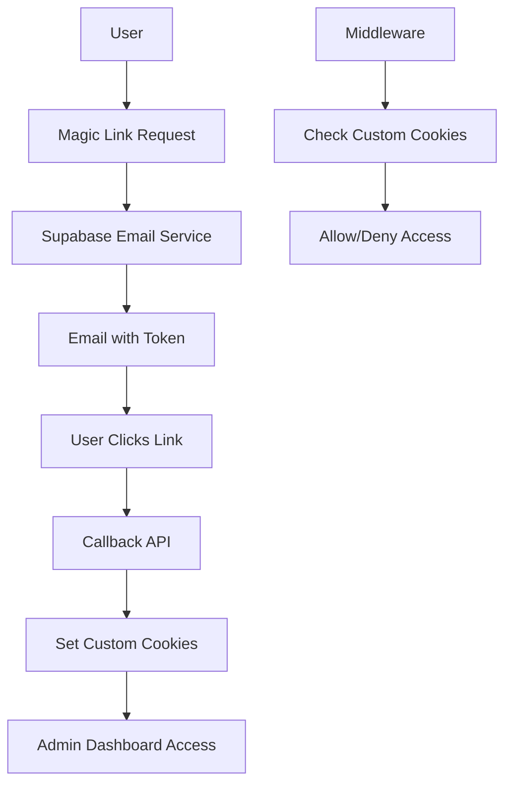

# Authentication Architecture Explanation

## Why We Chose Magic Link Only

### Current System Architecture

Our YEC Day Registration system uses a **hybrid authentication approach**:



### Custom Cookie System

We use custom cookies for authentication:
```typescript
// Authentication cookies set by our system
{
  'admin-email': 'user@example.com',
  'sb-access-token': 'supabase_access_token',
  'sb-refresh-token': 'supabase_refresh_token'
}
```

### Why Password Auth Doesn't Work

Supabase's `signInWithPassword()` creates different session cookies:
```typescript
// Supabase password auth creates these cookies
{
  'sb-wvwzhpyvogwypmqgvtjv-auth-token': 'supabase_session_token'
}
```

**Problem**: Our middleware only recognizes our custom cookies, not Supabase's session cookies.

## Security Best Practices Comparison

### Magic Link Authentication ✅

**Advantages**:
- ✅ **No password storage** - eliminates password database
- ✅ **Time-limited tokens** - automatic expiration
- ✅ **Email verification** - built-in 2FA
- ✅ **No credential reuse** - can't be used on other sites
- ✅ **Simplified security** - fewer attack vectors
- ✅ **No password resets** - reduces support burden

**Disadvantages**:
- ❌ **Requires email access** - can't login without email
- ❌ **Slight delay** - waiting for email delivery
- ❌ **Email dependency** - relies on email service

### Password Authentication ❌

**Advantages**:
- ✅ **Immediate access** - no email wait
- ✅ **Works offline** - can login without email
- ✅ **Familiar UX** - users expect passwords

**Disadvantages**:
- ❌ **Password storage** - requires secure password database
- ❌ **Password attacks** - brute force, dictionary attacks
- ❌ **Credential reuse** - users reuse passwords across sites
- ❌ **Password resets** - complex reset flow
- ❌ **Security complexity** - password policies, hashing, etc.

## Industry Examples

### Companies Using Magic Link

**Major applications using magic link authentication**:
- **Slack** - Magic link for passwordless login
- **Discord** - Magic link option for login
- **Linear** - Magic link for team invites
- **Notion** - Magic link for sharing
- **GitHub** - Magic link for some operations
- **Many SaaS apps** - Magic link for admin access

### When Magic Link is Preferred

Magic link is ideal for:
- **Admin/Internal systems** (like YEC Day)
- **Low-frequency logins** (admin dashboards)
- **High-security requirements** (no password storage)
- **Simplified user management** (no password policies)

## Alternative Architectures

### Option 1: Magic Link Only (Current) ✅
```typescript
// Simple, secure, single authentication method
const handleAuth = async (email: string) => {
  await supabase.auth.signInWithOtp({ email });
  // User clicks email link
  // Sets our custom cookies
  // Redirects to admin dashboard
};
```

### Option 2: Password + Magic Link (Complex)
```typescript
// Would require dual authentication systems
const handlePasswordAuth = async (email: string, password: string) => {
  const { data } = await supabase.auth.signInWithPassword({ email, password });
  // Need to convert Supabase session to our custom cookies
  // Complex session management
  // Two different authentication flows
};

const handleMagicLinkAuth = async (email: string) => {
  await supabase.auth.signInWithOtp({ email });
  // Existing magic link flow
};
```

### Option 3: Supabase Session Only (Different Architecture)
```typescript
// Would require rewriting middleware and all auth logic
const handleAuth = async (email: string, password: string) => {
  const { data } = await supabase.auth.signInWithPassword({ email, password });
  // Use Supabase session cookies directly
  // Rewrite middleware to check Supabase session
  // Different architecture entirely
};
```

## Security Analysis

### Attack Vector Comparison

| Attack Vector | Magic Link | Password Auth |
|---------------|------------|---------------|
| **Brute Force** | ❌ Not possible | ✅ Vulnerable |
| **Dictionary Attack** | ❌ Not possible | ✅ Vulnerable |
| **Credential Stuffing** | ❌ Not possible | ✅ Vulnerable |
| **Password Reuse** | ❌ Not possible | ✅ Vulnerable |
| **Email Interception** | ✅ Possible | ✅ Possible |
| **Session Hijacking** | ✅ Possible | ✅ Possible |

### Security Score: Magic Link Wins

**Magic Link Security Score**: 8/10
- ✅ Eliminates password-based attacks
- ✅ Time-limited tokens
- ✅ Email verification required
- ❌ Still vulnerable to email interception

**Password Auth Security Score**: 4/10
- ❌ Vulnerable to password attacks
- ❌ Requires secure password storage
- ❌ Complex password policies needed
- ✅ Immediate access

## User Experience Analysis

### Magic Link UX

**Pros**:
- ✅ No passwords to remember
- ✅ No password resets
- ✅ Works on any device
- ✅ Secure by default

**Cons**:
- ❌ Requires email access
- ❌ Slight delay for email
- ❌ Can't login without email

### Password UX

**Pros**:
- ✅ Immediate access
- ✅ Familiar interface
- ✅ Works without email

**Cons**:
- ❌ Passwords to remember
- ❌ Password resets needed
- ❌ Password policies to follow

## Recommendation

**Magic Link Only is the Best Choice** for YEC Day because:

1. **Security**: Eliminates password-based vulnerabilities
2. **Simplicity**: Single authentication method
3. **Maintenance**: Easier to maintain and secure
4. **User Experience**: No password management needed
5. **Industry Standard**: Used by major applications

## Implementation Notes

### Current Implementation
```typescript
// Disabled password authentication
const handleLogin = async (e: React.FormEvent) => {
  e.preventDefault();
  setError('Password authentication is disabled for security. Please use "Send Magic Link" instead.');
  return;
};
```

### UI Changes
- Password field shows as disabled
- Clear messaging about security policy
- Magic link button is primary action
- Helpful error messages

## Conclusion

**Magic link authentication is a security best practice** for admin systems like YEC Day. It provides:

- **Better security** than password authentication
- **Simpler architecture** than dual authentication
- **Industry-standard approach** used by major companies
- **Reduced maintenance** and security complexity

The decision to disable password authentication follows modern security best practices and provides a more secure, maintainable authentication system.
