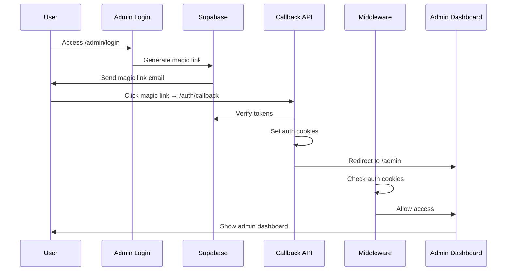

# Authentication System Documentation

## Overview

The YEC Day Registration system uses a hybrid authentication approach combining Supabase authentication with custom cookie-based session management for admin users.

## Architecture

### Authentication Flow



### Cookie Management

The system uses multiple cookies for authentication:

| Cookie Name | Purpose | Set By | Cleared By |
|-------------|---------|--------|------------|
| `admin-email` | Primary admin authentication | Callback API | Logout route |
| `sb-access-token` | Supabase access token | Callback API | Logout route |
| `sb-refresh-token` | Supabase refresh token | Callback API | Logout route |
| `dev-user-email` | Development fallback | Direct login API | Logout route |

### Cookie Properties

All authentication cookies use consistent properties:

```typescript
{
  httpOnly: true,           // Not accessible via JavaScript
  secure: isProd(),         // HTTPS only in production
  sameSite: 'lax',          // CSRF protection
  path: '/',                // Available site-wide
  maxAge: 7 * 24 * 60 * 60  // 7 days
}
```

## Components

### 1. Authentication Utilities

**File**: `app/lib/auth-utils.server.ts`

#### Key Functions

- `getCurrentUser()`: Gets current authenticated user with fallback support
- `isAuthenticatedAdmin()`: Checks if user is authenticated admin
- `serverLogout()`: Server-side logout with cookie clearing
- `cookieOptions()`: Consistent cookie configuration

#### Fallback Mechanism

The `getCurrentUser()` function implements a fallback mechanism:

1. **Primary**: Check Supabase session cookies
2. **Fallback**: Check custom `admin-email` cookie
3. **Query**: Get user details from `admin_users` table

```typescript
export async function getCurrentUser(): Promise<AuthenticatedUser | null> {
  // First try Supabase session
  const session = await supabase.auth.getSession();
  if (session.data.session) {
    // Get user from admin_users table using Supabase session
  }
  
  // Fallback: Check for custom admin-email cookie
  const adminEmail = cookieStore.get('admin-email')?.value;
  if (adminEmail) {
    // Get user from admin_users table using email
  }
  
  return null;
}
```

### 2. Authentication Callback

**File**: `app/api/auth/callback/route.ts`

Handles OAuth callback from Supabase magic links:

1. Receives tokens from client
2. Verifies tokens with Supabase
3. Checks if user is admin
4. Sets authentication cookies
5. Redirects to admin dashboard

### 3. Admin Logout

**File**: `app/admin/logout/route.ts`

Comprehensive logout functionality:

1. Signs out from Supabase
2. Clears all authentication cookies
3. Redirects to login page

**Cookies Cleared**:
- `admin-email`
- `sb-access-token`
- `sb-refresh-token`
- `dev-user-email`

### 4. Middleware Protection

**File**: `middleware.ts`

Protects admin routes and manages authentication:

```typescript
// Check for admin authentication
const adminEmail = request.cookies.get('admin-email')?.value;
if (!adminEmail || !isAdmin(adminEmail)) {
  return NextResponse.redirect(new URL('/admin/login?next=' + encodeURIComponent(pathname), request.url));
}
```

## User Interface Components

### 1. Authentication Status Display

**File**: `app/admin/_components/AdminUserInfoClient.tsx`

Displays current authentication status:

- **Authenticated**: Shows "Admin" badge with user email
- **Not Authenticated**: Shows "Not Authenticated" indicator

### 2. Login Form

**File**: `app/admin/login/page.tsx`

Provides multiple authentication methods:

- Email/password login
- Magic link authentication
- Development direct login

## Development Tools

### 1. Direct Login API

**File**: `app/api/test/direct-login/route.ts`

Development-only endpoint for quick authentication:

```bash
curl "http://localhost:8080/api/test/direct-login?email=admin@example.com"
```

### 2. Authentication Status API

**File**: `app/api/whoami/route.ts`

Returns current authentication status:

```bash
curl http://localhost:8080/api/whoami
```

### 3. E2E Testing

**File**: `tests/e2e/auth.e2e.spec.ts`

Comprehensive authentication flow testing:

```bash
npm run e2e tests/e2e/auth.e2e.spec.ts
```

## Security Considerations

### 1. Cookie Security

- **httpOnly**: Prevents XSS attacks
- **secure**: HTTPS only in production
- **sameSite**: CSRF protection
- **maxAge**: Automatic expiration

### 2. Admin Allowlist

Only emails in `ADMIN_EMAILS` environment variable can authenticate:

```bash
ADMIN_EMAILS=admin@example.com,admin2@example.com
```

### 3. Token Verification

All authentication tokens are verified with Supabase before setting cookies.

### 4. Logout Security

All authentication cookies are properly cleared on logout to prevent session hijacking.

## Environment Variables

### Required Variables

```bash
# Supabase Configuration
NEXT_PUBLIC_SUPABASE_URL=your_supabase_url
SUPABASE_SERVICE_ROLE_KEY=your_service_role_key

# Application URL
NEXT_PUBLIC_APP_URL=http://localhost:8080

# Admin Access Control
ADMIN_EMAILS=admin@example.com,admin2@example.com
```

### Optional Variables

```bash
# Debug Authentication
AUTH_TRACE=1

# Test Email (for E2E tests)
TEST_ADMIN_EMAIL=test@example.com
```

## Troubleshooting

### Common Issues

1. **Authentication Status Not Updating**
   - Check if `getCurrentUser()` fallback is working
   - Verify custom cookies are being set

2. **Logout Not Working**
   - Ensure all authentication cookies are being cleared
   - Check logout route implementation

3. **Magic Link Not Working**
   - Verify Supabase redirect URLs configuration
   - Check origin consistency

### Debug Commands

```bash
# Check authentication status
curl -s http://localhost:8080/api/whoami | jq .

# Test with cookies
curl -s http://localhost:8080/api/whoami -H "Cookie: admin-email=test@example.com" | jq .

# Test logout
curl -I http://localhost:8080/admin/logout -b cookies.txt

# Run E2E tests
npm run e2e tests/e2e/auth.e2e.spec.ts
```

## Best Practices

1. **Always use the centralized `cookieOptions()` function** for consistent cookie configuration
2. **Test authentication flows** with E2E tests before deployment
3. **Monitor authentication logs** in production
4. **Regularly rotate admin emails** in the allowlist
5. **Use HTTPS in production** for secure cookie transmission

## API Reference

### Authentication Endpoints

| Endpoint | Method | Purpose |
|----------|--------|---------|
| `/api/auth/callback` | POST | Handle OAuth callback |
| `/api/whoami` | GET | Get current user status |
| `/admin/logout` | GET/POST | Logout user |
| `/api/test/direct-login` | GET | Development login |

### Response Formats

#### Whoami Response
```json
{
  "email": "admin@example.com",
  "isAdmin": true,
  "source": "cookie",
  "debug": {
    "hasTokens": true,
    "userError": null,
    "devEmail": null
  }
}
```

#### Logout Response
```http
HTTP/1.1 307 Temporary Redirect
Location: /admin/login
Set-Cookie: admin-email=; Path=/; Expires=Thu, 01 Jan 1970 00:00:00 GMT; Max-Age=0; HttpOnly; SameSite=lax
Set-Cookie: sb-access-token=; Path=/; Expires=Thu, 01 Jan 1970 00:00:00 GMT; Max-Age=0; HttpOnly; SameSite=lax
Set-Cookie: sb-refresh-token=; Path=/; Expires=Thu, 01 Jan 1970 00:00:00 GMT; Max-Age=0; HttpOnly; SameSite=lax

---

## 🚨 Critical Knowledge Base

**IMPORTANT**: This authentication system includes Magic Link authentication which can have critical issues. For complete implementation guidance and troubleshooting:

**[🚨 CRITICAL] Magic Link Authentication Knowledge Base](MAGIC_LINK_AUTHENTICATION_KNOWLEDGE_BASE.md)**

This Knowledge Base document contains:
- **Root cause analysis** of a critical 20+ hour debugging issue
- **Complete solution** for 303 redirect handling
- **Implementation guide** with working code examples
- **Testing strategies** for Magic Link authentication
- **Common pitfalls** and how to avoid them
- **Debugging tools** and troubleshooting checklist

**Use this Knowledge Base as your primary reference for Magic Link authentication to avoid critical issues.**
