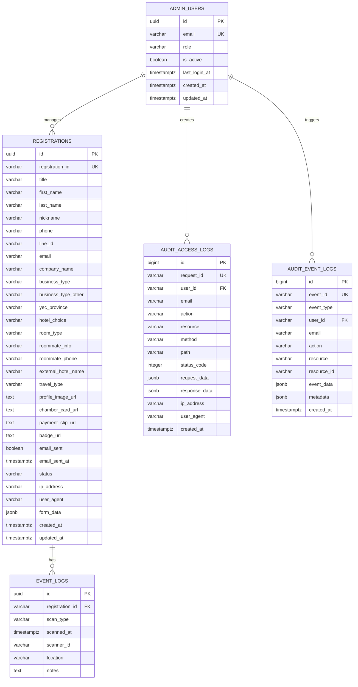

# YEC Registration System - Database Design

## 📋 Overview

The YEC Registration System uses Supabase (PostgreSQL) as its primary database with comprehensive schema design for managing registrations, file storage, administrative functions, and audit logging. The database is designed with proper relationships, constraints, and indexing for optimal performance and security compliance.

## 🏗️ Database Architecture

### Technology Stack
- **Database**: PostgreSQL 15 (via Supabase)
- **Storage**: Supabase Storage for file management
- **Authentication**: Supabase Auth with role-based access control
- **Audit System**: Dual-layer audit logging (access + event logs)
- **Real-time**: Supabase real-time subscriptions (future)

### Database Schema Overview



## 📊 Core Tables

### Registrations Table

The main table for storing all registration data.

```sql
CREATE TABLE registrations (
    id BIGSERIAL PRIMARY KEY,
    registration_id VARCHAR(50) UNIQUE NOT NULL,
    title VARCHAR(10) NOT NULL,
    first_name VARCHAR(100) NOT NULL,
    last_name VARCHAR(100) NOT NULL,
    nickname VARCHAR(100) NOT NULL,
    phone VARCHAR(20) NOT NULL,
    line_id VARCHAR(50) NOT NULL,
    email VARCHAR(255) NOT NULL,
    company_name VARCHAR(200) NOT NULL,
    business_type VARCHAR(100) NOT NULL,
    business_type_other VARCHAR(200),
    yec_province VARCHAR(100) NOT NULL,
    hotel_choice VARCHAR(20) NOT NULL CHECK (hotel_choice IN ('in-quota', 'out-of-quota')),
    room_type VARCHAR(20) CHECK (room_type IN ('single', 'double', 'suite', 'no-accommodation')),
    roommate_info TEXT,
    roommate_phone VARCHAR(20),
    external_hotel_name VARCHAR(200),
    travel_type VARCHAR(20) NOT NULL CHECK (travel_type IN ('private-car', 'van')),
    profile_image_url TEXT,
    chamber_card_url TEXT,
    payment_slip_url TEXT,
    badge_url TEXT,
    email_sent BOOLEAN DEFAULT FALSE,
    email_sent_at TIMESTAMPTZ,
    status VARCHAR(20) DEFAULT 'pending' CHECK (status IN ('pending', 'waiting_for_review', 'approved', 'rejected')),
    ip_address VARCHAR(45),
    user_agent TEXT,
    form_data JSONB,
    created_at TIMESTAMPTZ DEFAULT NOW(),
    updated_at TIMESTAMPTZ DEFAULT NOW()
);
```

#### Indexes
```sql
-- Performance indexes
CREATE INDEX idx_registrations_email ON registrations(email);
CREATE INDEX idx_registrations_status ON registrations(status);
CREATE INDEX idx_registrations_province ON registrations(yec_province);
CREATE INDEX idx_registrations_created_at ON registrations(created_at);
CREATE INDEX idx_registrations_registration_id ON registrations(registration_id);

-- Composite indexes for filtering
CREATE INDEX idx_registrations_status_province ON registrations(status, yec_province);
CREATE INDEX idx_registrations_created_status ON registrations(created_at, status);
```

### Admin Users Table

Table for managing administrative access with role-based permissions.

```sql
CREATE TABLE admin_users (
    id UUID PRIMARY KEY DEFAULT gen_random_uuid(),
    email VARCHAR(255) UNIQUE NOT NULL,
    role VARCHAR(20) DEFAULT 'admin' CHECK (role IN ('admin', 'super_admin')),
    is_active BOOLEAN DEFAULT TRUE,
    last_login_at TIMESTAMPTZ,
    created_at TIMESTAMPTZ DEFAULT NOW(),
    updated_at TIMESTAMPTZ DEFAULT NOW()
);
```

#### Indexes
```sql
CREATE INDEX idx_admin_users_email ON admin_users(email);
CREATE INDEX idx_admin_users_role ON admin_users(role);
CREATE INDEX idx_admin_users_active ON admin_users(is_active);
CREATE INDEX idx_admin_users_last_login ON admin_users(last_login_at);
```

### Audit Access Logs Table

Table for tracking all API access and user interactions.

```sql
CREATE TABLE audit_access_logs (
    id BIGSERIAL PRIMARY KEY,
    request_id VARCHAR(100) UNIQUE NOT NULL,
    user_id UUID REFERENCES admin_users(id),
    email VARCHAR(255),
    action VARCHAR(100) NOT NULL,
    resource VARCHAR(100),
    method VARCHAR(10) NOT NULL,
    path VARCHAR(500) NOT NULL,
    status_code INTEGER NOT NULL,
    request_data JSONB,
    response_data JSONB,
    ip_address VARCHAR(45),
    user_agent TEXT,
    created_at TIMESTAMPTZ DEFAULT NOW()
);
```

#### Indexes
```sql
CREATE INDEX idx_audit_access_logs_request_id ON audit_access_logs(request_id);
CREATE INDEX idx_audit_access_logs_user_id ON audit_access_logs(user_id);
CREATE INDEX idx_audit_access_logs_action ON audit_access_logs(action);
CREATE INDEX idx_audit_access_logs_created_at ON audit_access_logs(created_at);
CREATE INDEX idx_audit_access_logs_path ON audit_access_logs(path);
CREATE INDEX idx_audit_access_logs_status_code ON audit_access_logs(status_code);
```

### Audit Event Logs Table

Table for tracking business events and system activities.

```sql
CREATE TABLE audit_event_logs (
    id BIGSERIAL PRIMARY KEY,
    event_id VARCHAR(100) UNIQUE NOT NULL,
    event_type VARCHAR(100) NOT NULL,
    user_id UUID REFERENCES admin_users(id),
    email VARCHAR(255),
    action VARCHAR(100) NOT NULL,
    resource VARCHAR(100),
    resource_id VARCHAR(100),
    event_data JSONB,
    metadata JSONB,
    created_at TIMESTAMPTZ DEFAULT NOW()
);
```

#### Indexes
```sql
CREATE INDEX idx_audit_event_logs_event_id ON audit_event_logs(event_id);
CREATE INDEX idx_audit_event_logs_event_type ON audit_event_logs(event_type);
CREATE INDEX idx_audit_event_logs_user_id ON audit_event_logs(user_id);
CREATE INDEX idx_audit_event_logs_action ON audit_event_logs(action);
CREATE INDEX idx_audit_event_logs_created_at ON audit_event_logs(created_at);
CREATE INDEX idx_audit_event_logs_resource ON audit_event_logs(resource, resource_id);
```

### Event Logs Table

Table for tracking event attendance and QR code scans.

```sql
CREATE TABLE event_logs (
    id UUID PRIMARY KEY DEFAULT gen_random_uuid(),
    registration_id VARCHAR(50) REFERENCES registrations(registration_id),
    scan_type VARCHAR(20) NOT NULL CHECK (scan_type IN ('entry', 'exit')),
    scanned_at TIMESTAMPTZ DEFAULT NOW(),
    scanner_id VARCHAR(50),
    location VARCHAR(100),
    notes TEXT,
    created_at TIMESTAMPTZ DEFAULT NOW()
);
```

#### Indexes
```sql
CREATE INDEX idx_event_logs_registration_id ON event_logs(registration_id);
CREATE INDEX idx_event_logs_scanned_at ON event_logs(scanned_at);
CREATE INDEX idx_event_logs_scan_type ON event_logs(scan_type);
```

## 🔗 Relationships

### Foreign Key Constraints
```sql
-- Event logs reference registrations
ALTER TABLE event_logs 
ADD CONSTRAINT fk_event_logs_registration 
FOREIGN KEY (registration_id) REFERENCES registrations(registration_id) 
ON DELETE CASCADE;

-- Audit logs reference admin users
ALTER TABLE audit_access_logs 
ADD CONSTRAINT fk_audit_access_logs_user 
FOREIGN KEY (user_id) REFERENCES admin_users(id) 
ON DELETE SET NULL;

ALTER TABLE audit_event_logs 
ADD CONSTRAINT fk_audit_event_logs_user 
FOREIGN KEY (user_id) REFERENCES admin_users(id) 
ON DELETE SET NULL;
```

### Referential Integrity
- **Event Logs → Registrations**: Cascade delete when registration is removed
- **Audit Logs → Admin Users**: Set NULL when admin user is deleted (preserve audit trail)
- **Admin Users**: Independent table with email-based authentication

## 📝 Data Types and Constraints

### String Fields
- **VARCHAR(50)**: Short identifiers (registration_id, line_id)
- **VARCHAR(100)**: Standard text fields (names, provinces)
- **VARCHAR(200)**: Longer text fields (company names, hotel names)
- **VARCHAR(255)**: Email addresses
- **TEXT**: URLs and longer content

### Enumerated Values
```sql
-- Hotel choice options
CHECK (hotel_choice IN ('in-quota', 'out-of-quota'))

-- Room type options
CHECK (room_type IN ('single', 'double', 'suite', 'no-accommodation'))

-- Travel type options
CHECK (travel_type IN ('private-car', 'van'))

-- Status options
CHECK (status IN ('pending', 'waiting_for_review', 'approved', 'rejected'))

-- Scan type options
CHECK (scan_type IN ('entry', 'exit'))

-- Admin role options
CHECK (role IN ('admin', 'super_admin'))
```

### Timestamps
- **created_at**: Automatic timestamp on record creation
- **updated_at**: Automatic timestamp on record updates
- **email_sent_at**: Timestamp when email was sent
- **last_login_at**: Admin user last login time
- **scanned_at**: Event scan timestamp

## 🔄 Triggers and Functions

### Updated At Trigger
```sql
CREATE OR REPLACE FUNCTION update_updated_at_column()
RETURNS TRIGGER AS $$
BEGIN
    NEW.updated_at = NOW();
    RETURN NEW;
END;
$$ language 'plpgsql';

CREATE TRIGGER update_registrations_updated_at 
    BEFORE UPDATE ON registrations 
    FOR EACH ROW EXECUTE FUNCTION update_updated_at_column();

CREATE TRIGGER update_admin_users_updated_at 
    BEFORE UPDATE ON admin_users 
    FOR EACH ROW EXECUTE FUNCTION update_updated_at_column();
```

### Registration ID Generator
```sql
CREATE OR REPLACE FUNCTION generate_registration_id()
RETURNS TRIGGER AS $$
BEGIN
    NEW.registration_id := 'YEC-' || 
                          EXTRACT(EPOCH FROM NOW())::BIGINT || '-' || 
                          SUBSTRING(MD5(RANDOM()::TEXT) FROM 1 FOR 8);
    RETURN NEW;
END;
$$ LANGUAGE plpgsql;

CREATE TRIGGER generate_registration_id_trigger
    BEFORE INSERT ON registrations
    FOR EACH ROW
    WHEN (NEW.registration_id IS NULL)
    EXECUTE FUNCTION generate_registration_id();
```

### Audit Logging Functions
```sql
-- Function to log access events
CREATE OR REPLACE FUNCTION log_access_event(
    p_request_id VARCHAR,
    p_user_id UUID,
    p_email VARCHAR,
    p_action VARCHAR,
    p_resource VARCHAR,
    p_method VARCHAR,
    p_path VARCHAR,
    p_status_code INTEGER,
    p_request_data JSONB,
    p_response_data JSONB,
    p_ip_address VARCHAR,
    p_user_agent TEXT
)
RETURNS VOID AS $$
BEGIN
    INSERT INTO audit_access_logs (
        request_id, user_id, email, action, resource, method, path,
        status_code, request_data, response_data, ip_address, user_agent
    ) VALUES (
        p_request_id, p_user_id, p_email, p_action, p_resource, p_method, p_path,
        p_status_code, p_request_data, p_response_data, p_ip_address, p_user_agent
    );
END;
$$ LANGUAGE plpgsql;

-- Function to log business events
CREATE OR REPLACE FUNCTION log_business_event(
    p_event_id VARCHAR,
    p_event_type VARCHAR,
    p_user_id UUID,
    p_email VARCHAR,
    p_action VARCHAR,
    p_resource VARCHAR,
    p_resource_id VARCHAR,
    p_event_data JSONB,
    p_metadata JSONB
)
RETURNS VOID AS $$
BEGIN
    INSERT INTO audit_event_logs (
        event_id, event_type, user_id, email, action, resource, resource_id,
        event_data, metadata
    ) VALUES (
        p_event_id, p_event_type, p_user_id, p_email, p_action, p_resource, p_resource_id,
        p_event_data, p_metadata
    );
END;
$$ LANGUAGE plpgsql;
```

## 🗄️ Supabase Storage

### Storage Buckets
```sql
-- Profile images bucket
INSERT INTO storage.buckets (id, name, public) 
VALUES ('profile-images', 'profile-images', true);

-- Chamber cards bucket
INSERT INTO storage.buckets (id, name, public) 
VALUES ('chamber-cards', 'chamber-cards', true);

-- Payment slips bucket
INSERT INTO storage.buckets (id, name, public) 
VALUES ('payment-slips', 'payment-slips', true);

-- Badges bucket
INSERT INTO storage.buckets (id, name, public) 
VALUES ('yec-badges', 'yec-badges', true);
```

### Storage Policies
```sql
-- Public read access for all buckets
CREATE POLICY "Public read access" ON storage.objects
FOR SELECT USING (bucket_id IN ('profile-images', 'chamber-cards', 'payment-slips', 'yec-badges'));

-- Authenticated upload access
CREATE POLICY "Authenticated upload access" ON storage.objects
FOR INSERT WITH CHECK (bucket_id IN ('profile-images', 'chamber-cards', 'payment-slips', 'yec-badges'));
```

## 🔍 Query Optimization

### Common Queries
```sql
-- Get registrations with filters
SELECT * FROM registrations 
WHERE status = ANY($1) 
  AND yec_province = ANY($2)
  AND created_at >= $3
  AND created_at <= $4
ORDER BY created_at DESC
LIMIT $5 OFFSET $6;

-- Get status counts
SELECT 
    COUNT(*) as total,
    COUNT(*) FILTER (WHERE status = 'pending') as pending,
    COUNT(*) FILTER (WHERE status = 'waiting_for_review') as waiting_for_review,
    COUNT(*) FILTER (WHERE status = 'approved') as approved,
    COUNT(*) FILTER (WHERE status = 'rejected') as rejected
FROM registrations
WHERE status = ANY($1) 
  AND yec_province = ANY($2);

-- Get provinces list
SELECT DISTINCT yec_province 
FROM registrations 
WHERE yec_province IS NOT NULL 
ORDER BY yec_province;

-- Get audit logs with filtering
SELECT * FROM audit_access_logs 
WHERE created_at >= $1 
  AND created_at <= $2
  AND action = ANY($3)
  AND user_id = $4
ORDER BY created_at DESC
LIMIT $5 OFFSET $6;

-- Get admin users with activity
SELECT 
    au.*,
    COUNT(aal.id) as access_count,
    MAX(aal.created_at) as last_activity
FROM admin_users au
LEFT JOIN audit_access_logs aal ON au.id = aal.user_id
WHERE au.is_active = true
GROUP BY au.id
ORDER BY last_activity DESC;
```

### Performance Considerations
- **Indexed columns**: All frequently queried columns are indexed
- **Composite indexes**: Optimized for common filter combinations
- **Partial indexes**: Status-based filtering optimization
- **Query planning**: Regular analysis of query performance
- **Audit optimization**: Efficient audit log querying and storage

## 🔒 Security and Access Control

### Row Level Security (RLS)
```sql
-- Enable RLS on registrations table
ALTER TABLE registrations ENABLE ROW LEVEL SECURITY;

-- Admin users can access all registrations
CREATE POLICY "Admin access" ON registrations
FOR ALL USING (
    EXISTS (
        SELECT 1 FROM admin_users 
        WHERE email = current_setting('request.jwt.claims', true)::json->>'email'
        AND is_active = true
    )
);

-- Public read access for verification
CREATE POLICY "Public verification access" ON registrations
FOR SELECT USING (true);

-- Enable RLS on admin_users table
ALTER TABLE admin_users ENABLE ROW LEVEL SECURITY;

-- Super admins can access all admin users
CREATE POLICY "Super admin access" ON admin_users
FOR ALL USING (
    EXISTS (
        SELECT 1 FROM admin_users 
        WHERE email = current_setting('request.jwt.claims', true)::json->>'email'
        AND role = 'super_admin'
        AND is_active = true
    )
);

-- Users can read their own data
CREATE POLICY "Self access" ON admin_users
FOR SELECT USING (
    email = current_setting('request.jwt.claims', true)::json->>'email'
);

-- Enable RLS on audit tables
ALTER TABLE audit_access_logs ENABLE ROW LEVEL SECURITY;
ALTER TABLE audit_event_logs ENABLE ROW LEVEL SECURITY;

-- Admin users can access audit logs
CREATE POLICY "Admin audit access" ON audit_access_logs
FOR SELECT USING (
    EXISTS (
        SELECT 1 FROM admin_users 
        WHERE email = current_setting('request.jwt.claims', true)::json->>'email'
        AND is_active = true
    )
);

CREATE POLICY "Admin event audit access" ON audit_event_logs
FOR SELECT USING (
    EXISTS (
        SELECT 1 FROM admin_users 
        WHERE email = current_setting('request.jwt.claims', true)::json->>'email'
        AND is_active = true
    )
);
```

### Data Encryption
- **At rest**: Supabase handles database encryption
- **In transit**: TLS encryption for all connections
- **Sensitive data**: Passwords hashed using bcrypt
- **Audit data**: Encrypted audit trail for compliance

## 📊 Data Migration and Maintenance

### Backup Strategy
- **Automated backups**: Daily automated backups via Supabase
- **Point-in-time recovery**: 7-day retention period
- **Manual exports**: CSV exports for data analysis
- **Audit retention**: 7-year audit log retention for compliance

### Data Cleanup
```sql
-- Clean up old event logs (older than 1 year)
DELETE FROM event_logs 
WHERE scanned_at < NOW() - INTERVAL '1 year';

-- Archive old audit logs (older than 7 years)
-- Implementation depends on archiving strategy

-- Clean up inactive admin users (older than 90 days)
UPDATE admin_users 
SET is_active = false 
WHERE last_login_at < NOW() - INTERVAL '90 days' 
  AND is_active = true;
```

### Audit Log Management
```sql
-- Partition audit tables by date for better performance
CREATE TABLE audit_access_logs_2025_01 PARTITION OF audit_access_logs
FOR VALUES FROM ('2025-01-01') TO ('2025-02-01');

-- Create indexes on partitions
CREATE INDEX idx_audit_access_logs_2025_01_created_at 
ON audit_access_logs_2025_01(created_at);
```

## 🔗 Related Documentation

- **[Project Overview](architecture/project-overview.md)** - System architecture
- **[Admin User Management Guide](ADMIN_USER_MANAGEMENT_GUIDE.md)** - Admin user management
- **[API Documentation](API_DOCUMENTATION.md)** - API endpoints and usage
- **[Security & Access Control](security/security-access.md)** - Security implementation
- **[Operational Configuration](ops/operational-config.md)** - Deployment guide
- **[System Workflow](logic/System_Workflow.md)** - Business logic flows

## 🆕 Recent Updates

- **2025-01-27**: ✅ **AUDIT SYSTEM** - Dual-layer audit logging implemented
- **2025-01-27**: ✅ **ADMIN USER MANAGEMENT** - Role-based access control with admin/super_admin roles
- **2025-01-27**: ✅ **SECURITY ENHANCEMENTS** - Comprehensive RLS policies and data protection
- **2025-01-27**: ✅ **PERFORMANCE OPTIMIZATION** - Enhanced indexing and query optimization
- **2025-01-27**: ✅ **COMPLIANCE** - PDPA-compliant audit trail and data retention
- **2025-01-27**: ✅ **PRODUCTION READY** - All database features complete and tested

---

*Last updated: 2025-01-27*
*Database version: 2.0.0*

**Related Links:**
- [Project Overview](architecture/project-overview.md)
- [Admin User Management Guide](ADMIN_USER_MANAGEMENT_GUIDE.md)
- [API Documentation](API_DOCUMENTATION.md)
- [Security & Access Control](security/security-access.md)
- [System Workflow](logic/System_Workflow.md) 