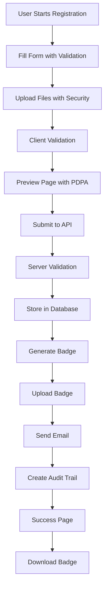
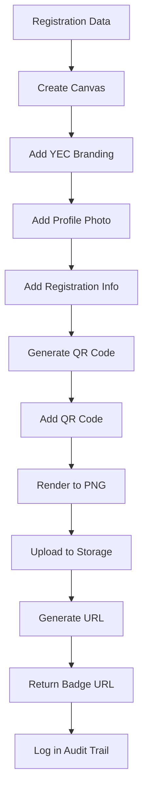
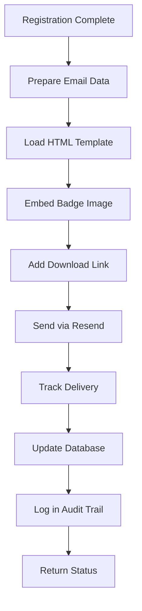
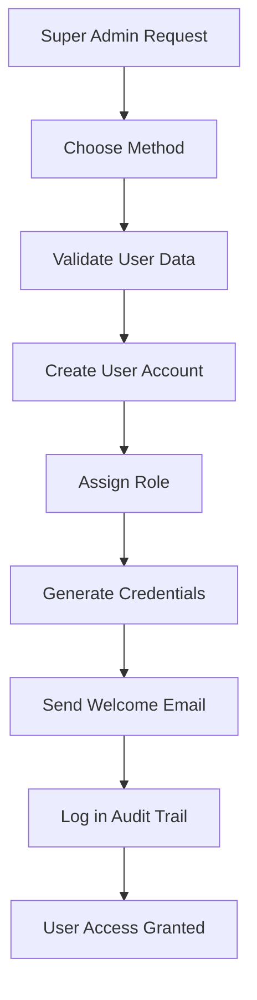
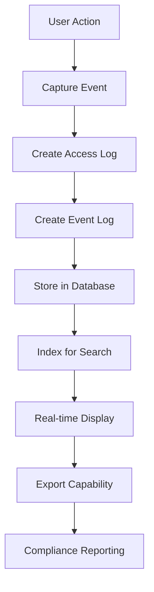

# YEC Registration System - Feature Business Logic Documentation
*Version: 2.0*
*Last Updated: 2025-01-27*

## Executive Summary

This document outlines the comprehensive business logic and feature specifications for the YEC Registration System. The system provides a complete registration workflow including form submission, file uploads, badge generation with QR codes, email delivery with inline badge images, comprehensive data management with Thailand timezone support, dual-layer audit logging, role-based access control, and a fully operational CI/CD pipeline.

## Core Features Overview

### 1. Complete Registration System
- **Multi-step Form**: Progressive form with conditional field logic and real-time validation
- **File Upload Security**: Comprehensive file validation with type and size checking
- **Preview System**: Form review with PDPA consent and data verification
- **Success Confirmation**: Registration completion with badge display and download

### 2. Badge Generation System
- **Dynamic PNG Generation**: Canvas-based badge creation with high resolution
- **QR Code Integration**: Registration data encoding for verification
- **Profile Photo Embedding**: User photos in badge design with fallback handling
- **YEC Branding**: Official logo and styling with consistent design
- **High Resolution**: 300 DPI output for professional printing

### 3. Email Delivery System
- **Resend Integration**: Professional email service with delivery tracking
- **Inline Badge Images**: Badge images embedded in emails for immediate access
- **HTML Templates**: Rich formatting with YEC branding and responsive design
- **Thai Language Support**: Bilingual email content with proper encoding
- **Delivery Tracking**: Email status monitoring and retry mechanisms

### 4. File Management System
- **Supabase Storage**: Cloud-based file storage with CDN integration
- **Multiple File Types**: Images and documents support with validation
- **Public URLs**: Direct access to uploaded files with security controls
- **Security Validation**: File type, size, and content validation
- **Metadata Storage**: File information in database with audit trail

### 5. Timezone Support
- **Thailand Timezone**: Asia/Bangkok (GMT+7) throughout the system
- **Automatic Conversion**: UTC to Thailand time conversion for all timestamps
- **Display Format**: DD/MM/YYYY HH:MM:SS format for user-friendly display
- **Database Storage**: Timezone-aware timestamps with proper handling

### 6. Audit System
- **Dual-layer Logging**: Access logs and event logs for comprehensive tracking
- **Real-time Monitoring**: Live audit log viewing with filtering and search
- **Export Capabilities**: CSV export for audit analysis and compliance
- **Security Compliance**: PDPA-compliant audit trail with 7-year retention
- **Performance Optimization**: Efficient querying and indexing for large datasets

### 7. Admin User Management
- **Four Methods**: Environment variables, direct API, Supabase dashboard, development testing
- **Role-based Access**: admin and super_admin roles with granular permissions
- **Security Best Practices**: Password policies, access control, user lifecycle management
- **Troubleshooting**: Comprehensive troubleshooting guide and debugging tools

### 8. CI/CD Pipeline
- **Quality Gates**: Linting, TypeScript, security tests, and comprehensive testing
- **Error Classification**: 3-tier error classification framework (Critical/Warning/Ignorable)
- **Pre-deployment Checks**: Automated pre-CI/CD validation script
- **Deployment Safety**: Comprehensive error handling and decision-making framework

---

## User Roles and Permissions

### Primary Users
- **Event Registrants**: Entrepreneurs and business professionals
- **Age Range**: 18+ years old
- **Technical Level**: Basic to intermediate computer skills
- **Language**: Thai and English speakers

### Secondary Users
- **Event Organizers**: YEC staff and administrators
- **Technical Level**: Intermediate to advanced
- **Access Level**: Full system access with role-based permissions

### User Capabilities

#### Registrants
- **Registration**: Complete registration form submission with validation
- **File Upload**: Upload profile images and documents with security validation
- **Preview**: Review registration data before submission with PDPA consent
- **Badge Access**: Download generated badges with QR code verification
- **Email**: Receive confirmation emails with inline badge images

#### Administrators (admin role)
- **Registration Management**: View and manage registrations with filtering
- **Data Export**: Export registration data in CSV format
- **Badge Management**: Generate and distribute badges
- **System Monitoring**: Monitor system performance and audit logs
- **Limited User Management**: View admin users (read-only)

#### Super Administrators (super_admin role)
- **All Admin Permissions**: Complete access to all admin features
- **User Management**: Add, modify, and manage admin users
- **Role Management**: Assign and change user roles
- **System Configuration**: Access to system configuration and settings
- **Full Audit Access**: Complete audit log access and management

---

## Use Cases and User Stories

### Primary Use Cases

#### UC-001: Complete Registration Process
**Actor**: Event Registrant
**Goal**: Register for YEC Day event with complete information and security validation

**Preconditions**:
- User has valid email address
- User has required documents (profile photo, chamber card, payment slip)
- System is operational with all services available

**Main Flow**:
1. User accesses registration form with responsive design
2. User fills out personal information with real-time validation
3. User provides business information with conditional field logic
4. User selects accommodation preferences with validation
5. User uploads required documents with security validation
6. User reviews information on preview page with PDPA consent
7. User submits registration with comprehensive validation
8. System generates badge with QR codes and high resolution
9. System sends confirmation email with inline badge images
10. User receives success confirmation with badge download
11. System creates comprehensive audit trail for all actions

**Postconditions**:
- Registration is stored in database with audit trail
- Badge is generated and stored with public URL
- Confirmation email is delivered with tracking
- User can download badge with QR code verification
- All actions are logged in audit system

#### UC-002: Badge Generation and Delivery
**Actor**: System
**Goal**: Generate personalized badge and deliver via email with comprehensive tracking

**Preconditions**:
- Registration data is complete and valid
- Profile image is uploaded (optional with fallback handling)
- Email service is operational

**Main Flow**:
1. System receives registration data with validation
2. System generates QR code with registration information
3. System creates canvas with YEC branding and high resolution
4. System embeds profile photo with error handling
5. System adds registration details to badge with proper formatting
6. System renders badge as PNG image with 300 DPI
7. System uploads badge to Supabase Storage with CDN
8. System generates public URL for badge access
9. System sends email with inline badge images and tracking
10. System updates database with badge and email status
11. System logs all actions in audit trail

**Postconditions**:
- Badge is generated and stored with public access
- Email is delivered with inline images and tracking
- Database is updated with comprehensive status
- All actions are logged in audit system

#### UC-003: File Upload and Management
**Actor**: Event Registrant
**Goal**: Upload required documents securely with comprehensive validation

**Preconditions**:
- User has valid files to upload
- Files meet size and type requirements
- Storage system is operational

**Main Flow**:
1. User selects file for upload with drag-and-drop interface
2. System validates file type and size with security checks
3. System generates unique filename with sanitization
4. System uploads file to Supabase Storage with CDN
5. System generates public URL with access controls
6. System stores file metadata in database with audit trail
7. System displays file preview with validation status
8. User can view and manage uploaded files with options
9. System logs all file operations in audit trail

**Postconditions**:
- File is securely stored with public access
- Public URL is generated with security controls
- File metadata is tracked in database
- All operations are logged in audit system

#### UC-004: Admin User Management
**Actor**: Super Administrator
**Goal**: Add and manage admin users with role-based access control

**Preconditions**:
- User is authenticated as super_admin
- System has admin user management capabilities
- Email service is operational for notifications

**Main Flow**:
1. Super admin chooses method for adding user (4 options available)
2. System validates user email and role assignment
3. System creates user account with appropriate permissions
4. System generates temporary password or sends invitation
5. System adds user to admin_users table with audit trail
6. System sends welcome email with login instructions
7. System logs all user management actions
8. New admin can access system with assigned permissions

**Postconditions**:
- Admin user is created with proper role assignment
- User receives login credentials or invitation
- User can access system with appropriate permissions
- All actions are logged in audit system

#### UC-005: Audit System Monitoring
**Actor**: Administrator
**Goal**: Monitor system activity and access patterns through audit logs

**Preconditions**:
- User is authenticated as admin or super_admin
- Audit system is operational with dual-layer logging
- User has access to audit dashboard

**Main Flow**:
1. Admin accesses audit dashboard with filtering options
2. System displays access logs and event logs with real-time updates
3. Admin applies filters for specific time periods, users, or actions
4. System provides detailed audit information with context
5. Admin can export audit data in CSV format
6. System tracks all audit access in audit trail
7. Admin can investigate specific events or patterns
8. System provides compliance reporting for PDPA requirements

**Postconditions**:
- Admin has comprehensive view of system activity
- Audit data is available for compliance and security analysis
- Export capabilities provide data for external analysis
- All audit access is logged for security compliance

### Secondary Use Cases

#### UC-006: CI/CD Pipeline Management
**Actor**: Developer/Administrator
**Goal**: Deploy system updates safely with comprehensive quality checks

**Preconditions**:
- Code changes are ready for deployment
- CI/CD pipeline is configured and operational
- Pre-deployment checks are available

**Main Flow**:
1. Developer runs pre-CI/CD checks with automated script
2. System validates code quality, security, and functionality
3. System classifies any issues using error framework
4. Developer addresses critical issues before deployment
5. System proceeds with CI/CD pipeline execution
6. Quality gates ensure deployment safety
7. System provides comprehensive deployment feedback
8. All deployment actions are logged in audit system

**Postconditions**:
- System is deployed with quality assurance
- All critical issues are resolved before deployment
- Deployment process is documented and audited
- System maintains operational stability

---

## Business Rules and Validation

### Registration Validation Rules

#### Required Fields
- **Personal Information**: Title, first name, last name, nickname
- **Contact Information**: Phone, Line ID, email
- **Business Information**: Company name, business type, YEC province
- **Accommodation**: Hotel choice, travel type
- **Documents**: Profile image, chamber card, payment slip

#### Conditional Fields
- **Business Type Other**: Required if business type is "other"
- **Room Type**: Required if hotel choice is "in-quota"
- **Roommate Information**: Required if room type is "double"
- **External Hotel Name**: Required if hotel choice is "out-of-quota"

#### Format Validation
- **Phone**: Thai format (0XXXXXXXXX or +66XXXXXXXX)
- **Line ID**: Alphanumeric with dots, underscores, hyphens only
- **Email**: Valid email format with domain validation
- **Hotel Choice**: Must be "in-quota" or "out-of-quota"
- **Travel Type**: Must be "private-car" or "van"

### File Upload Rules

#### Supported File Types
- **Profile Images**: JPG, PNG, WebP (max 5MB)
- **Chamber Cards**: JPG, PNG, PDF (max 10MB)
- **Payment Slips**: JPG, PNG, PDF (max 10MB)

#### File Validation
- **Size Limits**: Enforced on client and server side
- **Type Validation**: MIME type checking with security validation
- **Security**: Malware scanning and content validation
- **Naming**: Unique filename generation with sanitization

### Badge Generation Rules

#### Badge Content
- **Personal Information**: Name, nickname, company
- **Registration ID**: Unique identifier with QR code
- **QR Code**: Registration data for verification
- **Profile Photo**: User's uploaded image with fallback
- **YEC Branding**: Official logo and styling
- **Event Details**: YEC Day information with date

#### Generation Process
- **Canvas Size**: 300 DPI for high-quality printing
- **Font Support**: Thai and English fonts with proper rendering
- **Image Quality**: High-resolution output with compression
- **File Format**: PNG with transparency support
- **Error Handling**: Fallback mechanisms for failed generation

### Email Delivery Rules

#### Email Content
- **Subject**: Registration confirmation with event details
- **Body**: HTML template with YEC branding and responsive design
- **Badge Image**: Inline image attachment with fallback
- **Download Link**: Direct badge download with security
- **Language**: Thai and English content with proper encoding

#### Delivery Process
- **Service**: Resend for reliable delivery with tracking
- **Tracking**: Delivery status monitoring and reporting
- **Retry**: Automatic retry for failed deliveries
- **Fallback**: Alternative delivery methods for reliability

### Admin User Management Rules

#### User Creation
- **Email Validation**: Valid email format and domain
- **Role Assignment**: admin or super_admin with proper permissions
- **Password Policy**: Secure password requirements
- **Access Control**: Role-based permissions and restrictions

#### User Lifecycle
- **Account Activation**: Immediate activation with proper setup
- **Access Monitoring**: Login tracking and activity monitoring
- **Account Deactivation**: Inactive account management
- **Audit Trail**: Complete audit trail for all user actions

### Audit System Rules

#### Logging Requirements
- **Access Logs**: All API access and user interactions
- **Event Logs**: Business events and system activities
- **Data Retention**: 7-year retention for compliance
- **Security**: Encrypted storage and access controls

#### Compliance Requirements
- **PDPA Compliance**: Personal data protection compliance
- **Data Minimization**: Only necessary data collection
- **Access Control**: Role-based access to audit data
- **Export Capabilities**: Compliance reporting and data export

---

## Data Flow and Processing

### Registration Flow



### Badge Generation Flow



### Email Delivery Flow



### Admin User Management Flow



### Audit System Flow



---

## Business Logic Implementation

### Form Validation Logic

#### Client-Side Validation
```typescript
// Real-time validation with comprehensive error handling
const validateField = (field: string, value: any, formData?: any) => {
  switch (field) {
    case 'phone':
      return /^0[0-9]{9}$|^\+66[0-9]{8}$/.test(value);
    case 'email':
      return /^[^\s@]+@[^\s@]+\.[^\s@]+$/.test(value);
    case 'lineId':
      return /^[a-zA-Z0-9._-]+$/.test(value);
    case 'hotelChoice':
      return ['in-quota', 'out-of-quota'].includes(value);
    case 'travelType':
      return ['private-car', 'van'].includes(value);
    // ... other validations with comprehensive error handling
  }
};
```

#### Server-Side Validation
```typescript
// Comprehensive server-side validation with security checks
const validateRegistration = (data: RegistrationData) => {
  const errors: string[] = [];
  
  // Required field validation with security checks
  const requiredFields = ['title', 'firstName', 'lastName', ...];
  requiredFields.forEach(field => {
    if (!data[field] || data[field].trim() === '') {
      errors.push(`Missing required field: ${field}`);
    }
  });
  
  // Conditional field validation with business logic
  if (data.hotelChoice === 'out-of-quota' && !data.external_hotel_name) {
    errors.push('External hotel name required for out-of-quota choice');
  }
  
  // Security validation for file uploads
  if (data.profileImage && !isValidFileType(data.profileImage)) {
    errors.push('Invalid profile image format');
  }
  
  return errors;
};
```

### Badge Generation Logic

#### Canvas Creation with Error Handling
```typescript
const generateBadge = async (registrationData: RegistrationData) => {
  try {
    // Create canvas with high resolution
    const canvas = createCanvas(1200, 800);
    const ctx = canvas.getContext('2d');
    
    // Set background and branding
    ctx.fillStyle = '#ffffff';
    ctx.fillRect(0, 0, 1200, 800);
    
    // Add YEC logo with error handling
    try {
      const logo = await loadImage('path/to/yec-logo.png');
      ctx.drawImage(logo, 50, 50, 200, 100);
    } catch (error) {
      console.warn('Logo loading failed, continuing without logo');
    }
    
    // Add registration information with Thai font support
    ctx.font = '48px NotoSansThai';
    ctx.fillStyle = '#000000';
    ctx.fillText(`${registrationData.firstName} ${registrationData.lastName}`, 300, 150);
    
    // Generate and add QR code with error handling
    try {
      const qrCode = await QRCode.toDataURL(JSON.stringify(registrationData));
      const qrImage = await loadImage(qrCode);
      ctx.drawImage(qrImage, 900, 50, 200, 200);
    } catch (error) {
      console.error('QR code generation failed:', error);
      // Continue without QR code
    }
    
    return canvas.toBuffer('image/png');
  } catch (error) {
    console.error('Badge generation failed:', error);
    throw new Error('Failed to generate badge');
  }
};
```

### Email Delivery Logic

#### Email Template with Responsive Design
```typescript
const createEmailTemplate = (registrationData: RegistrationData, badgeUrl: string) => {
  return `
    <html>
      <head>
        <meta charset="UTF-8">
        <meta name="viewport" content="width=device-width, initial-scale=1.0">
        <style>
          .email-container { 
            max-width: 600px; 
            margin: 0 auto; 
            font-family: 'Noto Sans Thai', Arial, sans-serif;
          }
          .badge-image { 
            max-width: 100%; 
            height: auto; 
            border-radius: 8px;
            box-shadow: 0 4px 12px rgba(0, 0, 0, 0.1);
          }
          .download-button {
            display: inline-block;
            padding: 12px 24px;
            background: #1E40AF;
            color: white;
            text-decoration: none;
            border-radius: 6px;
            margin: 16px 0;
          }
        </style>
      </head>
      <body>
        <div class="email-container">
          <h1>ยินดีต้อนรับสู่ YEC Day!</h1>
          <p>ขอบคุณสำหรับการลงทะเบียน ${registrationData.firstName} ${registrationData.lastName}</p>
          <p>หมายเลขการลงทะเบียน: ${registrationData.registrationId}</p>
          
          <p>คุณสามารถดาวน์โหลดบัตรประจำตัวได้จากลิงก์ด้านล่าง</p>
          <a href="${badgeUrl}" download class="download-button">ดาวน์โหลดบัตรประจำตัว</a>
        </div>
      </body>
    </html>
  `;
};
```

### Audit Logging Logic

#### Dual-layer Audit Logging
```typescript
// Access log logging
const logAccessEvent = async (requestData: AccessLogData) => {
  try {
    const { request_id, user_id, email, action, resource, method, path, status_code, request_data, response_data, ip_address, user_agent } = requestData;
    
    await supabase
      .from('audit_access_logs')
      .insert({
        request_id,
        user_id,
        email,
        action,
        resource,
        method,
        path,
        status_code,
        request_data,
        response_data,
        ip_address,
        user_agent
      });
  } catch (error) {
    console.error('Failed to log access event:', error);
  }
};

// Business event logging
const logBusinessEvent = async (eventData: BusinessEventData) => {
  try {
    const { event_id, event_type, user_id, email, action, resource, resource_id, event_data, metadata } = eventData;
    
    await supabase
      .from('audit_event_logs')
      .insert({
        event_id,
        event_type,
        user_id,
        email,
        action,
        resource,
        resource_id,
        event_data,
        metadata
      });
  } catch (error) {
    console.error('Failed to log business event:', error);
  }
};
```

### Admin User Management Logic

#### User Creation with Multiple Methods
```typescript
// Environment variable method
const createAdminFromEnvironment = async () => {
  const adminEmails = process.env.ADMIN_EMAILS?.split(',').map(e => e.trim().toLowerCase()).filter(Boolean) || [];
  
  for (const email of adminEmails) {
    try {
      // Create user in Supabase Auth
      const { data: newUser, error: createError } = await supabase.auth.admin.createUser({
        email,
        password: generateTemporaryPassword(),
        email_confirm: true,
      });

      if (newUser.user) {
        // Add to admin_users table
        await upsertAdminUser({
          id: newUser.user.id,
          email: newUser.user.email!,
          role: 'admin',
        });
      }
    } catch (error) {
      console.error(`Failed to create admin user ${email}:`, error);
    }
  }
};

// Direct API method
const createAdminViaAPI = async (email: string, role: 'admin' | 'super_admin') => {
  try {
    // Validate user permissions
    if (!await hasRole('super_admin')) {
      throw new Error('Insufficient permissions');
    }
    
    // Create user in Supabase Auth
    const { data: newUser, error: createError } = await supabase.auth.admin.createUser({
      email,
      password: generateTemporaryPassword(),
      email_confirm: true,
    });

    if (newUser.user) {
      // Add to admin_users table
      await upsertAdminUser({
        id: newUser.user.id,
        email: newUser.user.email!,
        role,
      });
      
      // Send welcome email
      await sendWelcomeEmail(email, role);
      
      // Log in audit trail
      await logBusinessEvent({
        event_id: generateEventId(),
        event_type: 'admin_user_created',
        user_id: currentUser.id,
        email: currentUser.email,
        action: 'create_admin_user',
        resource: 'admin_users',
        resource_id: newUser.user.id,
        event_data: { email, role },
        metadata: { method: 'api' }
      });
    }
  } catch (error) {
    console.error('Failed to create admin user via API:', error);
    throw error;
  }
};
```

---

## Error Handling and Edge Cases

### Common Error Scenarios

#### File Upload Errors
- **File Too Large**: Show size limit message with retry option
- **Invalid File Type**: Display supported formats with examples
- **Upload Failure**: Retry mechanism with exponential backoff
- **Network Issues**: Offline handling and retry with user feedback

#### Badge Generation Errors
- **Canvas Creation Failure**: Fallback to text-only badge with error logging
- **Image Processing Error**: Skip profile photo with graceful degradation
- **QR Code Generation Failure**: Use registration ID only with error handling
- **Storage Upload Failure**: Retry with exponential backoff and user notification

#### Email Delivery Errors
- **Invalid Email Address**: Validation before sending with user feedback
- **Service Unavailable**: Queue for retry with status tracking
- **Delivery Failure**: Alternative delivery methods with notification
- **Rate Limiting**: Respect service limits with user feedback

#### Admin User Management Errors
- **Duplicate Email**: Check for existing users with appropriate messaging
- **Invalid Role**: Validate role assignment with error feedback
- **Permission Denied**: Clear error messages for insufficient permissions
- **Service Unavailable**: Retry mechanisms with status tracking

### Error Recovery Strategies

#### Graceful Degradation
- **Badge Generation**: Continue without profile photo if image fails
- **Email Delivery**: Store badge URL for manual download
- **File Upload**: Allow registration without optional files
- **Validation**: Provide clear error messages with suggestions

#### Retry Mechanisms
- **File Upload**: Automatic retry with progress indication
- **Badge Generation**: Retry with simplified content
- **Email Delivery**: Exponential backoff retry
- **Database Operations**: Transaction rollback and retry

#### User Feedback
- **Clear Messages**: User-friendly error messages with solutions
- **Progress Indicators**: Real-time feedback for long operations
- **Recovery Options**: Clear next steps for error resolution
- **Support Information**: Contact information for unresolved issues

---

## Performance Considerations

### Optimization Strategies

#### Frontend Performance
- **Lazy Loading**: Load components on demand with code splitting
- **Image Optimization**: Compress and resize images with CDN
- **Caching**: Browser and CDN caching with proper headers
- **Bundle Splitting**: Code splitting for faster loading

#### Backend Performance
- **Database Indexing**: Optimized queries with comprehensive indexing
- **Connection Pooling**: Efficient database connections with monitoring
- **Async Processing**: Non-blocking operations with proper error handling
- **Caching**: Redis caching for frequently accessed data

#### File Storage Performance
- **CDN Integration**: Global content delivery with edge caching
- **Image Compression**: Automatic optimization with quality preservation
- **Lazy Loading**: On-demand file loading with progress indicators
- **Storage Policies**: Efficient file organization with cleanup

#### Audit System Performance
- **Efficient Logging**: Optimized audit log storage with partitioning
- **Indexing Strategy**: Comprehensive indexing for audit queries
- **Real-time Processing**: Immediate log processing without performance impact
- **Export Optimization**: Efficient CSV export for large datasets

### Scalability Considerations

#### Horizontal Scaling
- **Load Balancing**: Multiple application instances with health checks
- **Database Sharding**: Partitioned data storage for large datasets
- **CDN Integration**: Global content delivery with edge caching
- **Microservices**: Service decomposition for independent scaling

#### Vertical Scaling
- **Resource Optimization**: Efficient memory and CPU usage with monitoring
- **Database Optimization**: Query optimization and indexing strategies
- **Caching Strategies**: Multi-level caching with invalidation
- **Connection Management**: Efficient connection pooling with monitoring

---

## Security and Privacy

### Data Protection

#### PDPA Compliance
- **Consent Management**: Explicit consent tracking with audit trail
- **Data Minimization**: Only necessary data collection with validation
- **Secure Storage**: Encrypted data storage with access controls
- **Access Control**: Role-based access control with audit logging

#### Security Measures
- **Input Validation**: Comprehensive validation on all inputs with sanitization
- **File Upload Security**: Type and size validation with malware scanning
- **SQL Injection Prevention**: Parameterized queries throughout
- **XSS Protection**: Input sanitization and output encoding
- **CSRF Protection**: Token-based protection for all forms

### Privacy Features

#### Data Handling
- **Encryption**: Data encrypted in transit and at rest
- **Access Logging**: Complete audit trail for all data access
- **Data Retention**: Configurable retention policies with cleanup
- **Data Export**: GDPR-compliant data export with formatting

#### User Control
- **Consent Management**: User can withdraw consent with immediate effect
- **Data Access**: Users can access their data with proper authentication
- **Data Deletion**: Right to be forgotten with complete data removal
- **Transparency**: Clear privacy policy with regular updates

---

## Monitoring and Analytics

### System Monitoring

#### Performance Metrics
- **Response Time**: API endpoint response times with alerting
- **Throughput**: Requests per second with capacity planning
- **Error Rates**: Error frequency by type with trend analysis
- **Resource Usage**: CPU, memory, and disk usage with thresholds

#### Business Metrics
- **Registration Rate**: Registrations per day/hour with trend analysis
- **Completion Rate**: Form completion percentage with drop-off analysis
- **Badge Generation**: Success rate and timing with performance tracking
- **Email Delivery**: Delivery success rate with bounce analysis

### User Analytics

#### User Behavior
- **Form Progress**: Step-by-step completion rates with optimization
- **Drop-off Points**: Where users abandon registration with improvements
- **File Upload**: Upload success rates by file type with optimization
- **Device Usage**: Mobile vs desktop usage with responsive design

#### Feature Usage
- **Hotel Choice**: Distribution of accommodation choices with insights
- **File Upload**: Usage of different file types with optimization
- **Badge Download**: Download frequency and timing with user behavior
- **Email Engagement**: Email open and click rates with optimization

### Audit Analytics

#### Security Monitoring
- **Access Patterns**: User access patterns with anomaly detection
- **Failed Logins**: Failed authentication attempts with security alerts
- **Data Access**: Sensitive data access with compliance monitoring
- **System Events**: System events and errors with trend analysis

#### Compliance Reporting
- **Data Access**: Complete audit trail for compliance reporting
- **User Activity**: User activity patterns for security analysis
- **System Health**: System health metrics for operational monitoring
- **Performance Trends**: Performance trends for capacity planning

---

## Future Enhancements

### Planned Features

#### Advanced Admin Dashboard
- **User Management**: Comprehensive user management with role assignment
- **Data Export**: Advanced data export with filtering and formatting
- **Badge Management**: Advanced badge management with customization
- **System Monitoring**: Advanced system monitoring with alerting

#### Advanced Analytics
- **Registration Analytics**: Detailed registration statistics with insights
- **User Behavior**: Advanced user behavior analysis with optimization
- **Performance Metrics**: System performance monitoring with alerting
- **Business Intelligence**: Data-driven insights with reporting

#### Mobile Application
- **Native Mobile App**: iOS and Android applications with offline support
- **QR Code Scanning**: Mobile badge verification with real-time updates
- **Offline Support**: Offline registration capability with sync
- **Push Notifications**: Real-time updates with user preferences

### Technical Improvements

#### Performance Optimization
- **Advanced Caching**: Multi-level caching with intelligent invalidation
- **CDN Integration**: Global content delivery with edge computing
- **Database Optimization**: Advanced query optimization with partitioning
- **Load Balancing**: Intelligent load distribution with health checks

#### Security Enhancements
- **Multi-factor Authentication**: Enhanced security with MFA support
- **API Gateway**: Centralized API management with rate limiting
- **Rate Limiting**: Advanced request throttling with user feedback
- **Audit Logging**: Comprehensive security auditing with analysis

#### Compliance Enhancements
- **Advanced PDPA**: Enhanced PDPA compliance with automation
- **Data Governance**: Advanced data governance with policies
- **Privacy Controls**: Enhanced privacy controls with user management
- **Compliance Reporting**: Automated compliance reporting with alerts

---

*This business logic documentation provides a comprehensive overview of the YEC Registration System's features, rules, and implementation details. The system is designed to provide a secure, scalable, and user-friendly registration experience while maintaining data integrity, privacy compliance, and comprehensive audit capabilities.* 