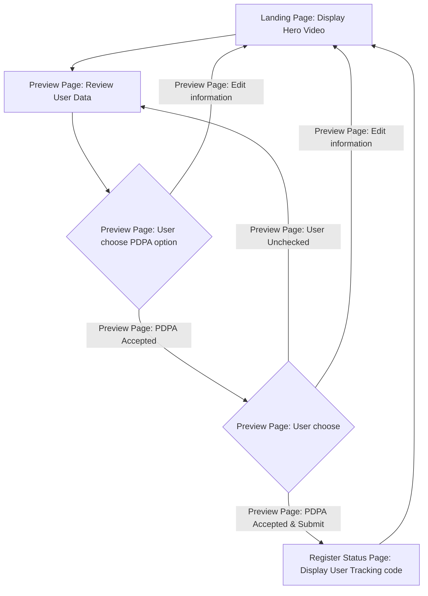
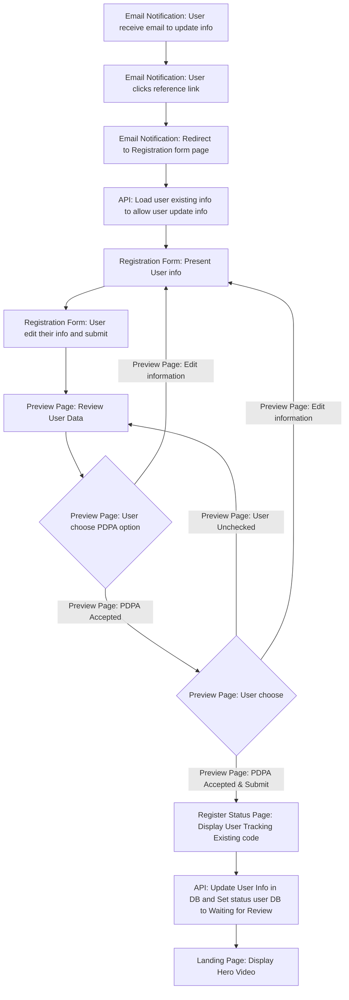
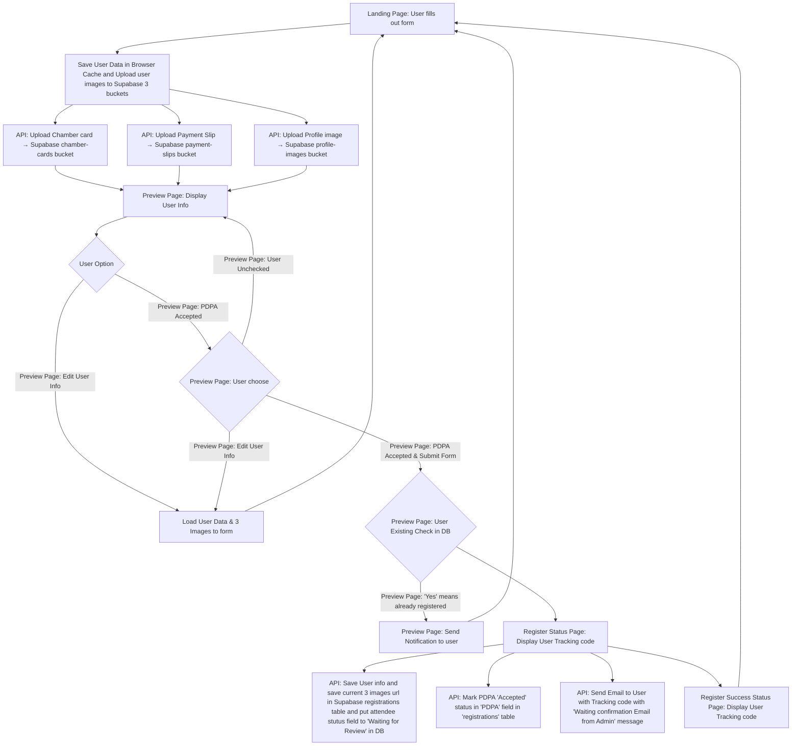
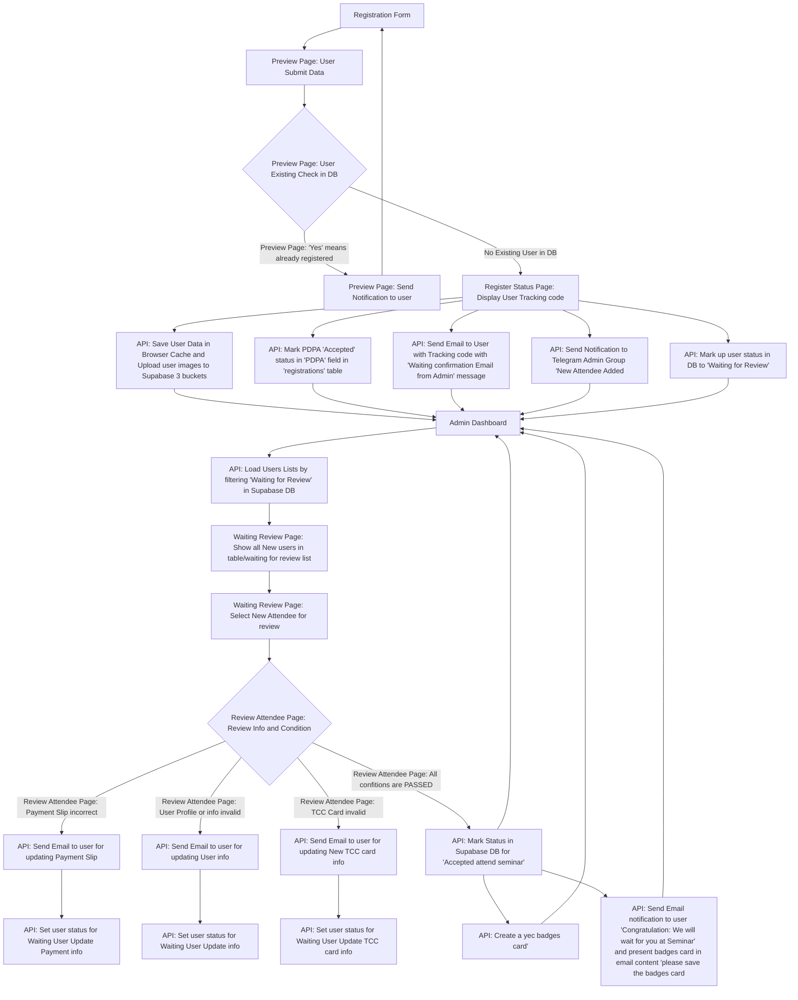

**Update: 9-AUG-25 [10:55]**

# 🧖 Frontend:Website

## USERS POV:
### 1️⃣ Users POV:  New Attendee Registered
#### Mermaid Code:

#### PNG File:
![[admin-dashbaord2 1.png]]
### 2️⃣ User POV: User Received System Email for Editing User Info:
#### Mermaid Code:

#### PNG File:
![[admin-dashbaord2 2.png]]

---
## SYSTEM POV:

### 1️⃣ System POV: New Attendee Registered/Revise Existing Users Info (Expectation):
#### Mermaid Code:

#### PNG File:
![[admin-dashbaord2 4.png]]

---
# 👨‍💼Backend: Admin Dashboard

## 1️⃣ Admin Team POV: New Attendee Register or Edit Users info
### Mermaid Code:

### PNG File:
![[admin-dashbaord2.png]]