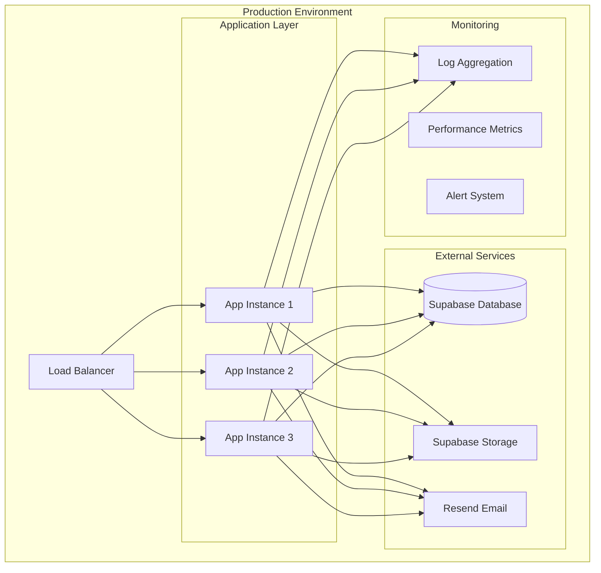

# YEC Registration System - Operational Configuration
*Version: 1.2*
*Last Updated: 2025-01-27*

## Executive Summary

This document outlines the comprehensive operational configuration and deployment procedures for the YEC Registration System. The system is designed for production deployment with Docker containerization, comprehensive monitoring, robust error handling, dual-layer audit logging, role-based access control, and a fully operational CI/CD pipeline with quality gates.

## System Architecture

### Deployment Architecture



### Technology Stack

| Component | Technology | Version | Purpose |
|-----------|------------|---------|---------|
| **Application** | Next.js | 15.4.5 | React framework with SSR |
| **Language** | TypeScript | 5.0 | Type-safe JavaScript |
| **Styling** | Tailwind CSS | 4.0 | Utility-first CSS framework |
| **Containerization** | Docker | Latest | Application containerization |
| **Database** | PostgreSQL | 15.0 | Primary data storage (via Supabase) |
| **File Storage** | Supabase Storage | 2.53.0 | File upload and management |
| **Email Service** | Resend | 4.8.0 | Transactional email delivery |
| **Badge Generation** | Canvas API | 3.1.2 | Dynamic image generation |
| **QR Codes** | qrcode | 1.5.3 | QR code generation |
| **Audit System** | Custom | - | Dual-layer audit logging |
| **Admin Management** | Custom | - | Role-based access control |
| **CI/CD Pipeline** | GitHub Actions | - | Automated deployment |
| **Monitoring** | Custom | - | Application monitoring |

---

## Environment Configuration

### Required Environment Variables

#### Supabase Configuration
```bash
# Supabase Database and Storage
SUPABASE_URL=https://your-project-id.supabase.co
SUPABASE_ANON_KEY=your_supabase_anon_key
SUPABASE_SERVICE_ROLE_KEY=your_service_role_key

# Supabase Storage Buckets
BADGE_STORAGE_BUCKET=yec-badges
PROFILE_IMAGES_BUCKET=profile-images
CHAMBER_CARDS_BUCKET=chamber-cards
PAYMENT_SLIPS_BUCKET=payment-slips
```

#### Email Configuration
```bash
# Resend Email Service
RESEND_API_KEY=your_resend_api_key
FROM_EMAIL=noreply@yourdomain.com
REPLY_TO_EMAIL=support@yourdomain.com

# Email Templates
EMAIL_TEMPLATE_PATH=/app/email-templates
```

#### Application Configuration
```bash
# Application Settings
NEXT_PUBLIC_APP_URL=https://yourdomain.com
NODE_ENV=production
PORT=3000

# Security
NEXTAUTH_SECRET=your_nextauth_secret
NEXTAUTH_URL=https://yourdomain.com

# Performance
NEXT_TELEMETRY_DISABLED=1
```

### Optional Environment Variables

#### Development Configuration
```bash
# Development Settings
NODE_ENV=development
DEBUG=true
LOG_LEVEL=debug

# Local Development
LOCAL_SUPABASE_URL=http://localhost:54321
LOCAL_SUPABASE_ANON_KEY=your_local_anon_key
```

#### Monitoring Configuration
```bash
# Monitoring and Logging
LOG_LEVEL=info
ENABLE_METRICS=true
METRICS_PORT=9090

# Error Tracking
SENTRY_DSN=your_sentry_dsn
```

---

## Docker Configuration

### Production Dockerfile

```dockerfile
# Multi-stage build for production
FROM node:18-alpine AS base

# Install dependencies only when needed
FROM base AS deps
RUN apk add --no-cache libc6-compat
WORKDIR /app

# Install dependencies based on the preferred package manager
COPY package.json package-lock.json* ./
RUN npm ci --only=production

# Rebuild the source code only when needed
FROM base AS builder
WORKDIR /app
COPY --from=deps /app/node_modules ./node_modules
COPY . .

# Next.js collects completely anonymous telemetry data about general usage.
# Learn more here: https://nextjs.org/telemetry
# Uncomment the following line in case you want to disable telemetry during the build.
ENV NEXT_TELEMETRY_DISABLED 1

RUN npm run build

# Production image, copy all the files and run next
FROM base AS runner
WORKDIR /app

ENV NODE_ENV production
ENV NEXT_TELEMETRY_DISABLED 1

RUN addgroup --system --gid 1001 nodejs
RUN adduser --system --uid 1001 nextjs

COPY --from=builder /app/public ./public

# Set the correct permission for prerender cache
RUN mkdir .next
RUN chown nextjs:nodejs .next

# Automatically leverage output traces to reduce image size
# https://nextjs.org/docs/advanced-features/output-file-tracing
COPY --from=builder --chown=nextjs:nodejs /app/.next/standalone ./
COPY --from=builder --chown=nextjs:nodejs /app/.next/static ./.next/static

USER nextjs

EXPOSE 3000

ENV PORT 3000
ENV HOSTNAME "0.0.0.0"

CMD ["node", "server.js"]
```

### Development Dockerfile

```dockerfile
# Development Dockerfile
FROM node:18-alpine

WORKDIR /app

# Install dependencies
COPY package.json package-lock.json* ./
RUN npm ci

# Copy source code
COPY . .

# Expose port
EXPOSE 3000

# Start development server
CMD ["npm", "run", "dev"]
```

### Docker Compose Configuration

#### Development Environment
```yaml
version: '3.8'

services:
  app:
    build:
      context: .
      dockerfile: Dockerfile.dev
    ports:
      - "8080:3000"
    volumes:
      - .:/app
      - /app/node_modules
    environment:
      - NODE_ENV=development
      - SUPABASE_URL=${SUPABASE_URL}
      - SUPABASE_ANON_KEY=${SUPABASE_ANON_KEY}
      - SUPABASE_SERVICE_ROLE_KEY=${SUPABASE_SERVICE_ROLE_KEY}
      - RESEND_API_KEY=${RESEND_API_KEY}
    env_file:
      - .env.local
    restart: unless-stopped

  # Optional: Local Supabase for development
  supabase:
    image: supabase/postgres:15.1.0.117
    ports:
      - "5432:5432"
    environment:
      - POSTGRES_PASSWORD=postgres
      - POSTGRES_DB=postgres
    volumes:
      - supabase_data:/var/lib/postgresql/data

volumes:
  supabase_data:
```

#### Production Environment
```yaml
version: '3.8'

services:
  app:
    build:
      context: .
      dockerfile: Dockerfile
    ports:
      - "3000:3000"
    environment:
      - NODE_ENV=production
      - SUPABASE_URL=${SUPABASE_URL}
      - SUPABASE_ANON_KEY=${SUPABASE_ANON_KEY}
      - SUPABASE_SERVICE_ROLE_KEY=${SUPABASE_SERVICE_ROLE_KEY}
      - RESEND_API_KEY=${RESEND_API_KEY}
      - FROM_EMAIL=${FROM_EMAIL}
      - REPLY_TO_EMAIL=${REPLY_TO_EMAIL}
    env_file:
      - .env.production
    restart: unless-stopped
    healthcheck:
      test: ["CMD", "curl", "-f", "http://localhost:3000/api/health"]
      interval: 30s
      timeout: 10s
      retries: 3

  nginx:
    image: nginx:alpine
    ports:
      - "80:80"
      - "443:443"
    volumes:
      - ./nginx.conf:/etc/nginx/nginx.conf
      - ./ssl:/etc/nginx/ssl
    depends_on:
      - app
    restart: unless-stopped
```

---

## Deployment Procedures

### Development Deployment

#### Local Development Setup
```bash
# Clone repository
git clone <repository-url>
cd yec-registration

# Install dependencies
npm install

# Set up environment variables
cp .env.example .env.local
# Edit .env.local with your configuration

# Start development server
npm run dev
```

#### Docker Development Setup
```bash
# Build and start development environment
docker-compose -f docker-compose.dev.yml up --build

# Access application at http://localhost:8080
```

### Production Deployment

#### Manual Deployment
```bash
# Build production image
docker build -t yec-registration:latest .

# Run production container
docker run -d \
  --name yec-registration \
  -p 3000:3000 \
  --env-file .env.production \
  yec-registration:latest
```

#### Automated Deployment
```bash
# Deploy with Docker Compose
docker-compose -f docker-compose.prod.yml up -d

# Check deployment status
docker-compose -f docker-compose.prod.yml ps

# View logs
docker-compose -f docker-compose.prod.yml logs -f app
```

### Deployment Checklist

#### Pre-deployment
- [ ] Environment variables configured
- [ ] Database migrations applied
- [ ] SSL certificates installed
- [ ] Domain DNS configured
- [ ] Backup procedures tested

#### Deployment
- [ ] Application built and tested
- [ ] Docker images built
- [ ] Containers deployed
- [ ] Health checks passing
- [ ] SSL certificates validated

#### Post-deployment
- [ ] Application accessible
- [ ] Email service tested
- [ ] Badge generation tested
- [ ] File upload tested
- [ ] Monitoring configured

---

## Monitoring and Logging

### Application Monitoring

#### Health Check Endpoint
```typescript
// Health check API endpoint
export async function GET() {
  try {
    // Check database connectivity
    const supabase = getSupabaseServiceClient();
    await supabase.from('registrations').select('count').limit(1);
    
    // Check email service
    const resendKey = process.env.RESEND_API_KEY;
    const emailServiceHealthy = !!resendKey;
    
    // Check file storage
    const storageHealthy = true; // Add actual check
    
    return Response.json({
      status: 'healthy',
      timestamp: new Date().toISOString(),
      services: {
        database: 'healthy',
        email: emailServiceHealthy ? 'healthy' : 'unhealthy',
        storage: storageHealthy ? 'healthy' : 'unhealthy'
      }
    });
  } catch (error) {
    return Response.json({
      status: 'unhealthy',
      timestamp: new Date().toISOString(),
      error: error.message
    }, { status: 500 });
  }
}
```

#### Performance Monitoring
```typescript
// Performance monitoring middleware
export function performanceMiddleware(handler: Function) {
  return async (req: Request, res: Response) => {
    const start = Date.now();
    
    try {
      const result = await handler(req, res);
      const duration = Date.now() - start;
      
      // Log performance metrics
      console.log(`API ${req.method} ${req.url} - ${duration}ms`);
      
      return result;
    } catch (error) {
      const duration = Date.now() - start;
      console.error(`API ${req.method} ${req.url} - ${duration}ms - ERROR: ${error.message}`);
      throw error;
    }
  };
}
```

### Logging Configuration

#### Log Levels
```typescript
// Logging configuration
const logLevels = {
  error: 0,
  warn: 1,
  info: 2,
  debug: 3
};

const currentLogLevel = process.env.LOG_LEVEL || 'info';

export function log(level: keyof typeof logLevels, message: string, data?: any) {
  if (logLevels[level] <= logLevels[currentLogLevel as keyof typeof logLevels]) {
    const timestamp = new Date().toISOString();
    const logEntry = {
      timestamp,
      level,
      message,
      data
    };
    
    console.log(JSON.stringify(logEntry));
  }
}
```

#### Error Logging
```typescript
// Error logging utility
export function logError(error: Error, context?: any) {
  log('error', error.message, {
    stack: error.stack,
    context,
    timestamp: new Date().toISOString()
  });
}
```

### Alert System

#### Email Alerts
```typescript
// Alert system for critical errors
export async function sendAlert(subject: string, message: string) {
  try {
    const resend = new Resend(process.env.RESEND_API_KEY);
    
    await resend.emails.send({
      from: process.env.FROM_EMAIL!,
      to: process.env.ALERT_EMAIL!,
      subject: `[YEC Registration Alert] ${subject}`,
      html: `
        <h2>System Alert</h2>
        <p><strong>Subject:</strong> ${subject}</p>
        <p><strong>Message:</strong> ${message}</p>
        <p><strong>Timestamp:</strong> ${new Date().toISOString()}</p>
      `
    });
  } catch (error) {
    console.error('Failed to send alert:', error);
  }
}
```

---

## Backup and Recovery

### Database Backup

#### Automated Backup Script
```bash
#!/bin/bash
# Database backup script

BACKUP_DIR="/backups"
DATE=$(date +%Y%m%d_%H%M%S)
BACKUP_FILE="yec_registration_${DATE}.sql"

# Create backup directory
mkdir -p $BACKUP_DIR

# Backup database
pg_dump $DATABASE_URL > $BACKUP_DIR/$BACKUP_FILE

# Compress backup
gzip $BACKUP_DIR/$BACKUP_FILE

# Remove backups older than 30 days
find $BACKUP_DIR -name "*.sql.gz" -mtime +30 -delete

echo "Backup completed: $BACKUP_DIR/$BACKUP_FILE.gz"
```

#### File Storage Backup
```bash
#!/bin/bash
# File storage backup script

BACKUP_DIR="/backups/storage"
DATE=$(date +%Y%m%d_%H%M%S)

# Create backup directory
mkdir -p $BACKUP_DIR

# Backup Supabase Storage buckets
supabase storage download --bucket yec-badges $BACKUP_DIR/badges_$DATE
supabase storage download --bucket profile-images $BACKUP_DIR/profiles_$DATE
supabase storage download --bucket chamber-cards $BACKUP_DIR/cards_$DATE
supabase storage download --bucket payment-slips $BACKUP_DIR/slips_$DATE

echo "Storage backup completed: $BACKUP_DIR"
```

### Recovery Procedures

#### Database Recovery
```bash
#!/bin/bash
# Database recovery script

BACKUP_FILE=$1
DATABASE_URL=$2

if [ -z "$BACKUP_FILE" ] || [ -z "$DATABASE_URL" ]; then
  echo "Usage: $0 <backup_file> <database_url>"
  exit 1
fi

# Restore database
gunzip -c $BACKUP_FILE | psql $DATABASE_URL

echo "Database recovery completed"
```

#### Application Recovery
```bash
#!/bin/bash
# Application recovery script

# Stop current application
docker-compose down

# Restore from backup
docker run --rm -v $(pwd):/backup -v yec_registration_data:/data \
  alpine tar -xzf /backup/app_backup.tar.gz -C /data

# Restart application
docker-compose up -d

echo "Application recovery completed"
```

---

## Security Configuration

### SSL/TLS Configuration

#### Nginx SSL Configuration
```nginx
server {
    listen 80;
    server_name yourdomain.com;
    return 301 https://$server_name$request_uri;
}

server {
    listen 443 ssl http2;
    server_name yourdomain.com;

    ssl_certificate /etc/nginx/ssl/cert.pem;
    ssl_certificate_key /etc/nginx/ssl/key.pem;
    
    ssl_protocols TLSv1.2 TLSv1.3;
    ssl_ciphers ECDHE-RSA-AES256-GCM-SHA512:DHE-RSA-AES256-GCM-SHA512:ECDHE-RSA-AES256-GCM-SHA384:DHE-RSA-AES256-GCM-SHA384;
    ssl_prefer_server_ciphers off;
    
    ssl_session_cache shared:SSL:10m;
    ssl_session_timeout 10m;

    location / {
        proxy_pass http://app:3000;
        proxy_set_header Host $host;
        proxy_set_header X-Real-IP $remote_addr;
        proxy_set_header X-Forwarded-For $proxy_add_x_forwarded_for;
        proxy_set_header X-Forwarded-Proto $scheme;
    }
}
```

### Security Headers

#### Next.js Security Configuration
```typescript
// next.config.ts
const nextConfig = {
  async headers() {
    return [
      {
        source: '/(.*)',
        headers: [
          {
            key: 'X-Frame-Options',
            value: 'DENY'
          },
          {
            key: 'X-Content-Type-Options',
            value: 'nosniff'
          },
          {
            key: 'Referrer-Policy',
            value: 'origin-when-cross-origin'
          },
          {
            key: 'Content-Security-Policy',
            value: "default-src 'self'; script-src 'self' 'unsafe-eval' 'unsafe-inline'; style-src 'self' 'unsafe-inline'; img-src 'self' data: https:; font-src 'self' data:;"
          }
        ]
      }
    ];
  }
};
```

### Rate Limiting

#### API Rate Limiting
```typescript
// Rate limiting middleware
import rateLimit from 'express-rate-limit';

const limiter = rateLimit({
  windowMs: 15 * 60 * 1000, // 15 minutes
  max: 100, // limit each IP to 100 requests per windowMs
  message: 'Too many requests from this IP, please try again later.',
  standardHeaders: true,
  legacyHeaders: false,
});

export default limiter;
```

---

## Performance Optimization

### Caching Strategy

#### Static Asset Caching
```nginx
# Nginx caching configuration
location ~* \.(js|css|png|jpg|jpeg|gif|ico|svg)$ {
    expires 1y;
    add_header Cache-Control "public, immutable";
}

location ~* \.(woff|woff2|ttf|eot)$ {
    expires 1y;
    add_header Cache-Control "public, immutable";
}
```

#### Application Caching
```typescript
// Redis caching for frequently accessed data
import Redis from 'ioredis';

const redis = new Redis(process.env.REDIS_URL);

export async function getCachedData(key: string) {
  const cached = await redis.get(key);
  if (cached) {
    return JSON.parse(cached);
  }
  return null;
}

export async function setCachedData(key: string, data: any, ttl: number = 3600) {
  await redis.setex(key, ttl, JSON.stringify(data));
}
```

### Database Optimization

#### Connection Pooling
```typescript
// Database connection pooling
import { Pool } from 'pg';

const pool = new Pool({
  connectionString: process.env.DATABASE_URL,
  max: 20,
  idleTimeoutMillis: 30000,
  connectionTimeoutMillis: 2000,
});

export default pool;
```

#### Query Optimization
```sql
-- Database indexes for performance
CREATE INDEX CONCURRENTLY idx_registrations_email ON registrations(email);
CREATE INDEX CONCURRENTLY idx_registrations_created_at ON registrations(created_at);
CREATE INDEX CONCURRENTLY idx_registrations_hotel_choice ON registrations(hotel_choice);
```

---

## Maintenance Procedures

### Regular Maintenance Tasks

#### Daily Tasks
- [ ] Check application health
- [ ] Review error logs
- [ ] Monitor disk space
- [ ] Verify backup completion

#### Weekly Tasks
- [ ] Update dependencies
- [ ] Review performance metrics
- [ ] Clean up old logs
- [ ] Test backup restoration

#### Monthly Tasks
- [ ] Security updates
- [ ] Performance optimization
- [ ] Capacity planning
- [ ] Disaster recovery testing

### Update Procedures

#### Application Updates
```bash
#!/bin/bash
# Application update script

# Pull latest changes
git pull origin main

# Build new image
docker build -t yec-registration:latest .

# Stop current container
docker-compose down

# Start with new image
docker-compose up -d

# Verify deployment
sleep 30
curl -f http://localhost:3000/api/health || exit 1

echo "Application update completed successfully"
```

#### Database Migrations
```bash
#!/bin/bash
# Database migration script

# Backup before migration
./backup_database.sh

# Run migrations
npm run migrate

# Verify migration
npm run migrate:status

echo "Database migration completed"
```

---

## Troubleshooting

### Common Issues

#### Application Won't Start
```bash
# Check container logs
docker-compose logs app

# Check environment variables
docker-compose exec app env

# Verify port availability
netstat -tulpn | grep :3000
```

#### Database Connection Issues
```bash
# Test database connectivity
docker-compose exec app npm run db:test

# Check database status
docker-compose exec app npm run db:status

# Verify environment variables
echo $DATABASE_URL
```

#### Email Service Issues
```bash
# Test email service
curl -X GET http://localhost:3000/api/test-email

# Check Resend API key
echo $RESEND_API_KEY

# Verify email configuration
docker-compose exec app npm run email:test
```

### Performance Issues

#### High Memory Usage
```bash
# Check memory usage
docker stats

# Analyze memory usage
docker-compose exec app npm run analyze

# Restart application
docker-compose restart app
```

#### Slow Response Times
```bash
# Check database performance
docker-compose exec app npm run db:analyze

# Monitor API response times
curl -w "@curl-format.txt" -o /dev/null -s http://localhost:3000/api/health

# Check external service latency
docker-compose exec app npm run services:test
```

---

## Disaster Recovery

### Recovery Scenarios

#### Complete System Failure
1. **Assess Damage**: Determine scope of failure
2. **Restore Infrastructure**: Rebuild server environment
3. **Restore Database**: Restore from latest backup
4. **Restore Application**: Deploy application from backup
5. **Verify Functionality**: Test all critical features
6. **Update DNS**: Point domain to new infrastructure

#### Data Corruption
1. **Stop Application**: Prevent further data corruption
2. **Identify Corruption**: Determine affected data
3. **Restore from Backup**: Restore clean data
4. **Verify Integrity**: Check data consistency
5. **Restart Application**: Resume normal operations
6. **Investigate Cause**: Prevent future corruption

#### Security Breach
1. **Isolate System**: Disconnect from network
2. **Assess Impact**: Determine scope of breach
3. **Contain Threat**: Stop ongoing attacks
4. **Eradicate Threat**: Remove malicious code/data
5. **Restore System**: Restore from clean backup
6. **Implement Fixes**: Patch security vulnerabilities

### Recovery Time Objectives

| Scenario | RTO | RPO |
|----------|-----|-----|
| Application Failure | 15 minutes | 5 minutes |
| Database Failure | 30 minutes | 1 minute |
| Complete System Failure | 2 hours | 1 hour |
| Data Center Failure | 4 hours | 1 hour |

---

*This operational configuration provides comprehensive deployment, monitoring, and maintenance procedures for the YEC Registration System. The system is designed for high availability, security, and maintainability in production environments.* 