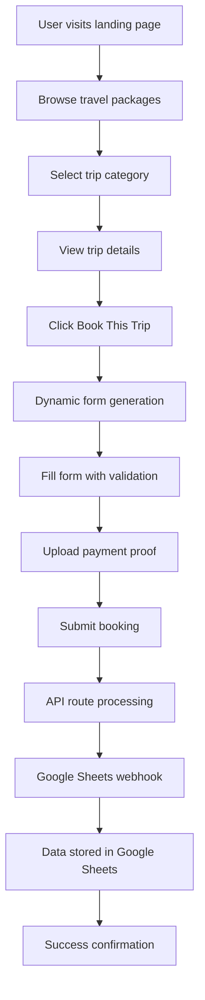
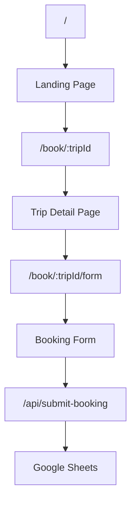

# Travel App Project Architecture Guide

## Table of Contents
1. [Overview and High Level Workflow](#overview-and-high-level-workflow)
2. [Flexible Data Modeling & Storage](#flexible-data-modeling--storage)
3. [Dynamic Form System Architecture](#dynamic-form-system-architecture)
4. [Validation Design System (UX/UI Level)](#validation-design-system-uxui-level)
5. [Configuration and Validation Methods](#configuration-and-validation-methods)
6. [Site Map and Routing Architecture](#site-map-and-routing-architecture)

---

## 1. Overview and High Level Workflow

### Project Purpose
A travel booking website for the Songkhla Chamber of Commerce, designed to sell and manage travel packages with a focus on responsive design and engaging UI/UX elements.

### Technology Stack
- **Frontend**: Next.js 14 (React) with TypeScript
- **Styling**: TailwindCSS for responsive design
- **Backend**: Next.js API routes (serverless functions)
- **Data Storage**: Google Sheets via Apps Script webhook
- **Deployment**: Vercel (production), Docker (development)
- **Development**: Cursor IDE with AI assistance

### High-Level Workflow



### Core User Journey
1. **Landing Page**: Hero section with video background, trip categories (One Day vs Multi-Day)
2. **Trip Selection**: Dynamic trip cards with images, pricing, and descriptions
3. **Trip Details**: Comprehensive trip information with timeline and booking CTA
4. **Booking Form**: Dynamic form generation based on trip requirements
5. **Form Validation**: Real-time validation with visual feedback
6. **Payment Upload**: Image upload for payment proof
7. **Submission**: API processing and Google Sheets storage
8. **Confirmation**: Success/error feedback to user

---

## 2. Flexible Data Modeling & Storage

### Trip Data Structure
Located in `src/data/trips.ts`:

```typescript
interface Trip {
  id: string;                    // Unique identifier
  name: string;                  // Trip name (Thai/English)
  category: "OneDay" | "MultiDay"; // Trip classification
  price: number;                 // Price in Thai Baht
  duration: string;              // Human-readable duration
  description: string;           // Trip description
  timeline: string[];            // Day-by-day itinerary
  formRequirements: FormRequirement[]; // Dynamic form fields
  image?: string;                // Optional image filename
  tripDate: string;              // Date(s) in Thai format
}

interface FormRequirement {
  name: string;                  // Field identifier
  label: string;                 // Display label
  required: boolean;             // Required field flag
}
```

### Data Storage Strategy
- **Static Data**: Trip information stored in TypeScript files
- **Dynamic Data**: Booking submissions stored in Google Sheets
- **Future Scalability**: Designed for easy migration to database

### Form Requirements Mapping
```typescript
const FORM_REQUIREMENT_MAP = {
  citizenId: { name: "citizenId", label: "เลขบัตรประชาชน", type: "citizenId", required: true },
  passportNumber: { name: "passportNumber", label: "หมายเลขพาสปอร์ต", type: "passport", required: true },
  passportExpiry: { name: "passportExpiry", label: "วันหมดอายุพาสปอร์ต", type: "date", required: true },
  roomType: { name: "roomType", label: "ประเภทห้องพัก", type: "text", required: true }
};
```

---

## 3. Dynamic Form System Architecture

### Form Schema Builder (`src/utils/formSchemaBuilder.ts`)

The form system uses a dynamic schema builder that combines:
- **Standard Fields**: Always required (name, phone, email, etc.)
- **Trip-Specific Fields**: Based on trip requirements
- **Dynamic Validation**: Date calculations for passport expiry

```typescript
// Standard fields always included
const STANDARD_FIELDS: FormField[] = [
  { name: "ccProvince", label: "สมาชิกหอการค้า / YEC จังหวัด?", type: "select", required: true },
  { name: "title", label: "คำนำหน้า", type: "select", required: true },
  { name: "firstName", label: "ชื่อ", type: "text", required: true },
  { name: "lastName", label: "นามสกุล", type: "text", required: true },
  { name: "phone", label: "เบอร์โทรศัพท์", type: "tel", required: true },
  { name: "email", label: "อีเมล", type: "email", required: true },
  { name: "note", label: "หมายเหตุเพิ่มเติม", type: "textarea", required: false },
  { name: "paymentProof", label: "แนบหลักฐานการชำระเงิน", type: "file", required: true }
];
```

### Dynamic Field Generation Process
1. **Schema Building**: `buildFormSchema()` combines standard + trip-specific fields
2. **Date Calculations**: Automatic passport expiry validation based on trip dates
3. **Field Configuration**: Type-specific validation and UI components
4. **Form Initialization**: `createInitialFormData()` creates empty form state

### Form Component Architecture (`app/components/TripFormFields.tsx`)

The form system supports multiple field types with specialized validation:

```typescript
interface FormField {
  name: string;
  label: string;
  type: string;           // text, email, tel, select, textarea, file, citizenId, passport, date
  required: boolean;
  options?: string[];     // For select fields
  minDate?: string;       // For date fields
  helperText?: string;    // For validation hints
}
```

---

## 4. Validation Design System (UX/UI Level)

### Real-Time Validation Feedback

#### Visual Feedback System
- **Green Border**: Valid input ✓
- **Yellow Border**: Incomplete but acceptable
- **Red Border**: Invalid input ✗
- **Helper Text**: Contextual validation messages

#### Field-Specific Validation

**Thai National ID (Citizen ID)**
```typescript
// Algorithm validation with real-time formatting
const validateThaiNationalID = (id: string): boolean => {
  if (id.length !== 13) return false;
  if (!/^\d{13}$/.test(id)) return false;
  
  let sum = 0;
  for (let i = 0; i < 12; i++) {
    sum += parseInt(id[i]) * (13 - i);
  }
  const checkDigit = (11 - (sum % 11)) % 10;
  return checkDigit === parseInt(id[12]);
};
```

**Thai Phone Number**
```typescript
// Format: XXX-XXX-XXXX with validation
const validateThaiPhoneNumber = (digits: string) => {
  if (!digits.startsWith('0')) return 'เบอร์โทรศัพท์ไทยต้องขึ้นต้นด้วยเลข 0';
  if (digits.length !== 10) return 'เบอร์โทรศัพท์ต้องมี 10 หลัก';
  if (!/^\d{10}$/.test(digits)) return 'เบอร์โทรศัพท์ต้องเป็นตัวเลขเท่านั้น';
  return null; // Valid
};
```

**Passport Number**
```typescript
// 6-15 alphanumeric characters, auto-uppercase
const passportRegex = /^[A-Z0-9]{6,15}$/i;
```

**Email Validation**
```typescript
// English-only email with domain validation
const emailRegex = /^[^\s@]+@[^\s@]+\.[^\s@]+$/;
```

### Searchable Select Component
For large datasets (like Thai provinces), a searchable select component provides:
- **Keyboard Navigation**: Arrow keys, Enter, Escape
- **Search Filtering**: Real-time filtering of options
- **Accessibility**: ARIA labels and screen reader support
- **Mobile Friendly**: Touch-friendly interface

---

## 5. Configuration and Validation Methods

### Input Field Types and Validation

| Field Type | Validation Rules | UI Features | Data Format |
|------------|------------------|-------------|-------------|
| `text` | Required if specified | Standard input | String |
| `email` | Email format, English only | Lowercase transform | String |
| `tel` | Thai phone format (0XXXXXXXXX) | Auto-formatting (XXX-XXX-XXXX) | String (digits only) |
| `select` | Required if specified | Dropdown or searchable | String |
| `textarea` | Optional | Resizable, min-height | String |
| `file` | Image files only, max 5MB | Drag & drop, preview | File object |
| `citizenId` | Thai National ID algorithm | Auto-formatting, real-time validation | String (13 digits) |
| `passport` | 6-15 alphanumeric | Auto-uppercase | String |
| `date` | Dynamic min date calculation | Date picker with constraints | ISO date string |

### Form Configuration Methods

**1. Schema Building**
```typescript
// Builds complete form schema
const schema = buildFormSchema(trip.formRequirements, trip.tripDate);
```

**2. Initial Data Creation**
```typescript
// Creates empty form state
const initialData = createInitialFormData(schema);
```

**3. Dynamic Validation**
```typescript
// Validates form on submission
const isValid = validateForm();
```

**4. File Processing**
```typescript
// Converts image to base64 for API submission
const base64String = await convertFileToBase64(file);
```

### Environment Configuration
```typescript
// Required environment variables
GOOGLE_SHEET_WEBHOOK_URL=https://script.google.com/macros/s/...
GOOGLE_SHEET_TOKEN=your_webhook_token
NODE_ENV=production
```

---

# 6. Site Map and Routing Architecture

  ### Next.js App Router Structure

  ```

app/

├── layout.tsx # Root layout with fonts and metadata

├── page.tsx # Landing page (/)

├── globals.css # Global styles

├── components/ # Reusable components

│ ├── TopMenuBar.tsx # Navigation header

│ ├── HeroSection.tsx # Video hero section

│ ├── TripCard.tsx # Individual trip cards

│ ├── TripTimeline.tsx # Trip itinerary display

│ ├── TripFormFields.tsx # Dynamic form fields

│ ├── Footer.tsx # Site footer

│ └── ...

├── book/ # Trip booking routes

│ ├── page.tsx # Trip listing (redirects to /)

│ └── [tripId]/ # Dynamic trip routes

│ ├── page.tsx # Trip detail page

│ └── form/ # Booking form routes

│ └── page.tsx # Dynamic booking form

└── api/ # API routes

└── submit-booking/ # Booking submission endpoint

└── route.ts # POST handler

```

  
### Routing Flow

  

### Route Parameters and Data Flow

  **1. Landing Page (`/`)**

- Displays trip categories (One Day vs Multi-Day)

- Dynamic trip cards with routing to detail pages

- Hero section with video background
  

**2. Trip Detail Page (`/book/[tripId]`)**

- Dynamic route based on trip ID

- Displays trip information, timeline, and booking CTA

- Links to booking form
  

**3. Booking Form (`/book/[tripId]/form`)**

- Dynamic form generation based on trip requirements

- Real-time validation and file upload

- Form submission to API route

  
**4. API Route (`/api/submit-booking`)**

- Processes form data and file uploads

- Validates required fields

- Forwards to Google Sheets webhook

- Returns success/error responses

  
### Navigation Patterns

**Top Menu Bar**

- Logo and branding

- Navigation links (if needed)

- Responsive mobile menu

  
**Trip Cards**

- Click to view trip details

- Visual hierarchy with images and pricing

- Category-based grouping

  
**Breadcrumb Navigation**

- Home → Trip Details → Booking Form

- Clear user orientation

  
**Form Navigation**

- Back to trip details

- Form validation feedback

- Success/error states

  
### SEO and Metadata

```typescript

// Root layout metadata

export const metadata: Metadata = {

title: "หอการค้า จังหวัดสงขลา",

description: "Generated by create next app",

};

```

  

### Performance Optimizations

- **Image Optimization**: Next.js Image component with WebP/AVIF

- **Code Splitting**: Automatic route-based code splitting

- **Static Generation**: Pre-rendered pages where possible

- **API Routes**: Serverless functions for scalability

  

---

  
## Implementation Best Practices
  
### 1. Type Safety

- Full TypeScript implementation

- Interface definitions for all data structures

- Strict type checking for form validation
  

### 2. Accessibility

- ARIA labels and roles

- Keyboard navigation support

- Screen reader compatibility

- Color contrast compliance

  
### 3. Responsive Design

- Mobile-first approach

- TailwindCSS responsive utilities

- Flexible grid systems

- Touch-friendly interfaces

  
### 4. Error Handling

- Comprehensive validation

- User-friendly error messages

- Graceful degradation

- Logging and monitoring

  
### 5. Security

- Environment variable protection

- Input sanitization

- File upload validation

- CORS configuration

  

This architecture provides a solid foundation for scalable travel booking applications with dynamic form generation, comprehensive validation, and flexible data management.

