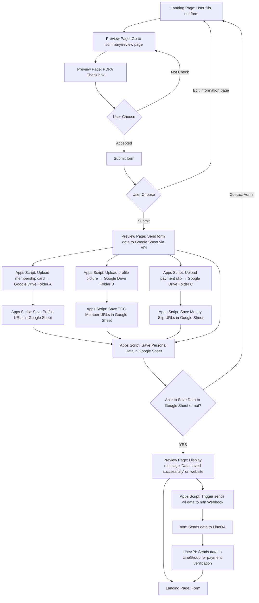

**Tech-stack:** Next.js (npm run dev: 3100), Docker (development mode: expose 8007+Git MCP), CI/CD (Git Action, Vercel: Production), n8n(Local running) และ Cursor AI (CursorRule, Connect Docker MCP)  
  
**ส่วนประกอบของเว็บไซต์:** Global Top Manu bar, Form, Global Footer แยกเว็บไซต์พัฒนาเป็นส่วน ๆ เพื่อความง่ายต่อการแก้ไข

**Website Color Theme:**  Blue white

**Responsive design**: PC and Mobile browser

**Compliance:** Small modular, ESLint, Flexible Data Modeling & Storage, Dynamic Form System Architecture, Validation Design System (UX/UI Level) และ WCAG 2.1

  
**Project Workflow:** 

📋 **คำอธิบาย Workflow ตาม Diagram ล่าสุด**
🟦 **Landing Page:**
- ผู้ใช้งานกรอกข้อมูลในแบบฟอร์ม
- เมื่อข้อมูลครบถ้วนแล้ว → ระบบนำไปยังหน้า Preview Page เพื่อสรุปข้อมูล

🟨 **Preview Page:**
1. แสดงข้อมูลที่ผู้สมัครกรอกไว้
2. มี **Checkbox ให้ผู้สมัครยืนยันยอมรับ PDPA**
3. หากผู้สมัครไม่ติ๊ก → กลับมายังหน้านี้เพื่อบังคับให้ติ๊กก่อนจึงจะดำเนินการต่อได้
4. หากติ๊กแล้ว:
- ระบบจะแสดงปุ่มให้ผู้ใช้งานเลือกว่าจะ:
	- ✅ **Submit** ส่งข้อมูล
	- ✏️ **กลับไปแก้ไข** ข้อมูลในฟอร์ม (กลับหน้า Landing Page)

🟨 **Preview Page (เมื่อเลือก Submit):**
- ระบบส่งข้อมูลฟอร์มทั้งหมด (รวมถึงรูปภาพ) ไปยัง **Google Sheet ผ่าน API ของ Apps Script**

🟩 **Apps Script (เบื้องหลัง):**
1. ดำเนินการอัปโหลดรูปภาพทั้งหมด (3 รูป):
- บัตรสมาชิก → Google Drive Folder A
- รูปโปรไฟล์ → Google Drive Folder B
- สลิปโอนเงิน → Google Drive Folder C

3. บันทึก URL ของรูปภาพแต่ละรายการกลับไปยัง Google Sheet
4. จากนั้นบันทึกข้อมูลฟอร์มทั้งหมดลง Google Sheet
5. เมื่อเสร็จสิ้น Apps Script ตรวจสอบ:
	- ✅ หากสามารถบันทึกได้ → เดินหน้าขั้นตอนถัดไป
	- ❌ หากมีปัญหา → ระบบ redirect ผู้ใช้กลับไปหน้า Landing Page พร้อมข้อความให้ “ติดต่อแอด มิน โทร 080-224-0008”
  
🟨 **Preview Page (เมื่อบันทึกข้อมูลสำเร็จ):**
- แสดงข้อความให้ผู้สมัครทราบ:  
    👉 **"Data saved successfully"**

🔁 **ระบบเบื้องหลัง (ต่อ):**
- Apps Script Trigger ทำงาน → ส่งข้อมูลทั้งหมดไปยัง n8n ผ่าน Webhook
- n8n รับข้อมูล → ส่งต่อไปยัง Line Official Account (LineOA)
- LineAPI (LineBot) ส่งข้อมูลต่อไปยัง **LineGroup** ของเจ้าหน้าที่เพื่อตรวจสอบสลิปโอนเงิน

🟦 **Landing Page (กลับมาอีกครั้ง):**
- ผู้ใช้งานจะถูกพากลับไปยังหน้า Landing Page เพื่อ:
	- กรอกฟอร์มใหม่ หรือ
	- แก้ไขข้อมูลเพิ่มเติมในกรณีผิดพลาด

🔄 **สรุปแต่ละขั้นตอน + ตำแหน่งที่ทำงาน**

| **ลำดับ** | **ขั้นตอน**                                         | **หน้า****/****ระบบ**                   |
| --------- | --------------------------------------------------- | --------------------------------------- |
| 1         | กรอกฟอร์ม                                           | Landing Page:                           |
| 2         | ไปยังหน้ายืนยัน                                     | Preview Page:                           |
| 3         | ติ๊ก PDPA Checkbox                                  | Preview Page:                           |
| 4         | ไม่ติ๊ก → ย้อนกลับ                                  | Preview Page:                           |
| 5         | ติ๊กแล้ว → เลือก Submit หรือ Edit                   | Preview Page: หรือ กลับไป Landing Page: |
| 6         | หาก Submit → ส่งข้อมูลไป API                        | Preview Page:                           |
| 7         | อัปโหลดรูป + บันทึกข้อมูล                           | Apps Script:                            |
| 8         | ตรวจสอบการบันทึก                                    | Apps Script:                            |
| 9         | ถ้าสำเร็จ → แสดงข้อความ                             | Preview Page:                           |
| 10        | ถ้าไม่สำเร็จ → กลับหน้า Landing Page พร้อมแจ้งเตือน | Landing Page:                           |
| 11        | Trigger ส่งข้อมูลไปยัง n8n → LineOA → LineGroup     | Apps Script: → n8n: → LineAPI:          |
| 12        | กลับหน้า Landing Page อีกครั้ง                      | Landing Page:                           |

**Mermaid diagram:**  
————————————————————————————————————————————————  

————————————————————————————————————————————————
**ชื่อเว็บไซต์:** "YEC Day Registration"

**ส่วนประกอบของหน้า:** Landing Page จะประกอบด้วย Global Top Menu Bar, และ Hero Section ซึ่งจะมี Youtube embedding โดยผมจะเตรียมลิงค์วิดีโอจาก youtube ให้คุณ ซึ่งจะเป็น Autoplay และเล่นวนไปเรื่อย ๆ และแสดงเต็มหน้าจอขนาดหน้าจอและสามารถแสดง control menu ของ YouTube ได้หากผู้เข้าเยี่ยมเว็บไซต์ต้องการเปิดเสียง โดย Global Top Menu bar จะแสดงอยู่บนวิดีโอแบบใส ๆ เพื่อไม่ให้บดบังวิดีโอของ Hero section และเมื่อใดก็ตามที่มีการเลื่อนลง ตัว Global Top Menu bar ก็จะปรับพื้นหลังเป็นสีขาวทันที และผูกติดอยู่ด้านบนของจอตลอด และเมื่อเลื่อนหน้าจอกลับไปบนสุดของเว็บ ก็จะแสดงในลักษณะโปร่งใสอีกครั้ง, Main logo ส่วนนี้ผมจะเตรียมให้คุณเองในภายหลังเมื่อคุณต้องการ, บน Hero video จะแสดงปุ่ม CTA (Call to action) สีเหลือง และใช้ข้อความว่า “จองเลย!”  ในส่วนของด้านล่างจากวิดีโอจะแสดงรูป YEC Day Banner (จะมีรายละเอียดกำหนดการกิจกรรมต่าง ๆ แต่ละวันให้ผู้สมัครทราบ) ซึ่งผมจะเตรียมให้คุณเมื่อคุณต้องการมัน และด้านล่างรูป จะแสดงตัวฟอร์ม และประกอบด้วย Field ในหัวข้อด้านล่าง และ ในส่วนท้ายจะแสดงตัว Global Footer โดยไม่ต้องผูกกับหน้าจอตลอดเวลาเหมือน Global Top Menu Bar โดยคุณสามารถออกแบบได้ตามความเหมาะสมของธีมเว็บไซต์จากประสบการณ์ออกแบบ UX/UI เว็บไซต์มากกว่า 20 ปี ของคุณได้เลย ดังนั้น เมื่อเปลี่ยนไปใช้งานหน้าใดก็ตาม Global Top Menu และ Global Footer จะตามไปเสมอและทำงานตาม Concept ตามที่ผมได้แจ้งไว้
  
  **Field สำหรับกรอกข้อมูลและเรียงลำดับในฟอร์มมีดังนี้:**

1. **Form Page:** อัพโหลดรูปภาพ สลิปโอนเงิน และแสดงพรีวิว ภาพสลิปโอนเงินภายใต้ Field และรับภาพประเภท jpg, jpeg และ png เท่านั้น ขนาดรูปไม่เกิน 10 mb (Required Field*)
  
2. **Form Page:** สมาชิกหอการค้า / YEC จังหวัด?: เป็น Drop down list ที่มีข้อมูลจังหวัดทั้งหมดในประเทศไทย และสามารถ รองรับการ search ได้ (Required Field*)
  
3. **Form Page:** อัพโหลดรูปภาพ บัตรสมาชิกหอการค้า / YEC จังหวัด และแสดงพรีวิว ภาพสลิปโอนเงินภายใต้ Field และรับภาพประเภท jpg, jpeg และ png เท่านั้น ขนาดรูปไม่เกิน 10 mb (Required Field*)

4. **Form Page:** คำนำหน้า (title): มีตัวเลือก 'นาย, 'นางสาว', 'นาง', 'Mr.', Mrs.' และ 'Ms.' เป็น Drop down list (Required Field*)

5. **Form Page:** ชื่อ (firstName): เป็นช่องกรอก text string (Required Field*)
  
6. **Form Page:** นามสกุล (lastName): เป็นช่องกรอก text string (Required Field*)

7. **Form Page:** ชื่อเล่น (nickName): เป็นช่องกรอก text string (Required Field*)
  
8. **Form Page:** เบอร์โทรศัพท์ผู้สมัคร: เป็นช่องกรอก tel กรอกตัวเลขได้อย่างเดียวและกรอกได้ไม่เกิน 10 หลัก (Required Field*)
  
9. **Form Page:** Line ID: เป็นช่องกรอก text string สามารถกรอกได้แต่ภาษาอังกฤษอย่างเดียว (Required Field*)  
  
10.  **Form Page:** อีเมล​(eMail): เป็นช่องกรอก text string สามารถกรอกได้แต่ภาษาอังกฤษอย่างเดียว และมีการทำ validation รูปแบบการ (Required Field*)  
11. ชื่อกิจการ/บริษัท: เป็นช่องกรอก text string (Required Field*)  

12. **Form Page:** ประเภทกิจการ: ช่องนี้ทำเป็น Dropdown list แสดงเป็นภาษาไทย โดยให้คุณพิจารณาและวิเคราะห์ว่า โดยทั่วไปช่องนี้ควรจะมีประเภทอะไรบ้างที่นิยมใส่กัน ผมขอไม่เกิน 20 ประเภท และประเภทที่ 21 ให้ใส่คำว่า อื่น ๆ และเมื่อเลือกเป็น ‘อื่น ๆ’ แล้ว ให้ปรากฏ field เพื่ออัตโนมัติเป็น text string (Required Field*)

13. **Form Page:** อัพโหลดรูปภาพโปรไฟล์ผู้สมัคร และแสดงพรีวิว ภาพสลิปโอนเงินภายใต้ Field และรับภาพประเภท jpg, jpeg และ png เท่านั้น ขนาดรูปไม่เกิน 10 mb (Required Field*)  

14. **Form Page:** ประเภทห้องพัก: มีตัวเลือก '1,999 บาท (รวมที่พัก) - พักคู่, '2,699 บาท (รวมที่พัก) พักเดี่ยว', '1,199 บาท (ไม่รวมที่พัก)' และ '1,499 บาท (ไม่รวมที่พัก) เป็น Selection list  (Required Field*)

15. **Form Page:** หากมีการเลือก ตัวเลือก '1,999 บาท (รวมที่พัก) - พักคู่' ในข้อที่ 14 ให้แสดง ฟอร์มเพิ่มในหน้าอัตโนมัติ คือ

		- ชื่อ นามสกุล ผู้พักร่วม: เป็นช่องกรอก text string (Required Field*)
		-  เบอร์โทรผู้เข้าพักร่วม: เป็นช่องกรอก tel กรอกตัวเลขได้อย่างเดียวและกรอกได้ไม่เกิน 10 หลัก (Required Field*)  
  
16. **Form Page:** ประเภทการเดินทาง: เป็น selection list 2 รายการคือ ‘รถยนต์ส่วนตัว’ และ ‘รถตู้รับ - ส่ง จากส่วนกลาง ถึงเวลา 00:00 น.’ <—(Defalut checked*)  
  
17. **Preview page:** จะแสดง check box และแสดงข้อความประกอบ check box ประมาณว่า ยินยอมให้เผยแพร่ข้อมูลตามกฎหมาย PDPA ซึ่งในส่วนนี้ผมต้องให้คุณช่วยคิดข้อความที่เหมาะสม  ด้วยครับ (Required Field*)

**UI Theme** : ต้องการใช้หน้าเว็บไซต์เหมือนเว็บไซต์แบบนี้ครับ https://sfchamber.com/ (และรูปที่แนบมา) แต่เป็นสีของเว็บไซต์หลักเราจะใช้สีน้ำเงิน และสีขาวเป็นธีมสีหลักของเว็บ

**Web Hosting:** ใช้ Vercel ที่ผูกกับ CI/CD Github Action